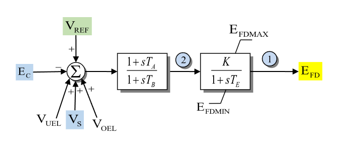

# **Simplified Excitation System Model (SEXS-PTI)**

## Block Diagram

Simplified excitation system model.

<div align="center">
   

  Figure 1: Exciter SEXS-PTI model. Figure courtesy of [PowerWorld](https://www.powerworld.com/WebHelp/)
</div>

## Model Parameters

Symbol          | Units  | Description                                   | Typical Value | Note
----------------|--------|-----------------------------------------------|---------------|------
$T_A$           | [sec]  | Numerator time constant of lag-lead block     |               |
$T_B$           | [sec]  | Denominator time constant of lag-lead block   |               |
$T_E$           | [sec]  | Exciter field time constant                   |               |
$K$             | [p.u.] | Voltage regulator gain                        |               |
$E_{fd,\max}$   | [p.u.] | Maximum excitation output                     |               |
$E_{fd,\min}$   | [p.u.] | Minimum excitation output                     |               |

PowerWorld/PSS/E SEXS_PTI data often gives $T_A/T_B$ as a ratio. GridKit stores
$T_A$ and $T_B$ separately, so convert ratio-format data with
$T_A = (T_A/T_B)T_B$ before passing parameters to the model.

## Model Variables

### Internal Variables

#### Differential

Symbol    | Units  | Description                       | Note
----------|--------|-----------------------------------|-----
$V_R$     | [p.u.] | Lag-lead block state              |
$E_{fd}$  | [p.u.] | Exciter field voltage output      |

#### Algebraic

Symbol    | Units  | Description                       | Note
----------|--------|-----------------------------------|-----
$V_{tr}$  | [p.u.] | Terminal voltage error signal     |

### External Variables

#### Differential

None.

#### Algebraic

Symbol          | Units  | Description                                  | Note
----------------|--------|----------------------------------------------|-----
$E_C$           | [p.u.] | Compensated machine terminal voltage magnitude | Computed from bus voltage
$V_{ref}$       | [p.u.] | Reference voltage                            | Set during initialization
$V_S$           | [p.u.] | Stabilizer output                            | Optional, defaults to zero
$V_{OEL}$       | [p.u.] | Over-excitation limiter signal               | Constant zero until modeled
$V_{UEL}$       | [p.u.] | Under-excitation limiter signal              | Constant zero until modeled

## Model Equations

### Differential Equations

Define $g = -E_{fd} + \dfrac{K}{T_B}(-V_R+T_A V_{tr})$ for readability.

```math
\begin{aligned}
  \dot V_R &=
    -V_{tr} + \dfrac{1}{T_B}(-V_R + T_A V_{tr}) \\
  \dot E_{fd} &=
    \dfrac{\chi(E_{fd}, g)}{T_E}g
\end{aligned}
```

$\chi(E_{fd}, g)$ is the smooth anti-windup indicator used by the GridKit
limiter utilities. The implementation passes a bounded, sign-preserving
direction for $g$ into the smooth gate, while the differential equation still
uses the physical $g$ term. The limiter attenuates the derivative when
$E_{fd}$ is at a limit and $g$ would push it farther beyond that limit.

### Algebraic Equations

```math
\begin{aligned}
0&=-V_{tr}-E_C+V_{ref}+V_S+V_{OEL}+V_{UEL}
\end{aligned}
```

## Initialization

The generator initializes the EFD signal first. SEXS-PTI then reads that value
as $E_{fd,0}$ and assumes steady state with $V_S=V_{OEL}=V_{UEL}=0$:

```math
\begin{aligned}
E_C &= \sqrt{V_r^2+V_i^2} \\
V_{tr,0} &= \dfrac{E_{fd,0}}{K} \\
V_{R,0} &= (T_A - T_B)V_{tr,0} \\
V_{ref} &= E_C + V_{tr,0}
\end{aligned}
```

All derivatives initialize to zero.
