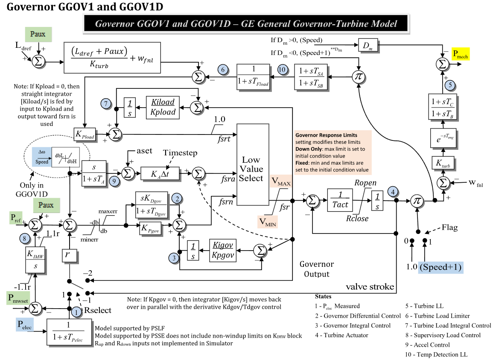

# **Governor Model (GGOV1)**

## Block Diagram

Standard model of the GGOV1 Governor.

<div align="center">
   

  Figure 1: Governor GGOV1 model.
</div>

## Model Parameters

Symbol | Units | Description | Typical Value | Note
-------|-------|-------------|---------------|-----

### Model Derived Parameters

## Model Variables

### Internal Variables

#### Differential

Symbol | Units | Description | Note
-------|-------|-------------|-----

#### Algebraic

Symbol | Units | Description | Note
-------|-------|-------------|-----

### External Variables

#### Differential

Symbol | Units | Description | Note
-------|-------|-------------|-----

#### Algebraic

Symbol | Units | Description | Note
-------|-------|-------------|-----

## Model Equations

### Differential Equations

```math
\begin{aligned}
\end{aligned}
```

### Algebraic Equations

```math
\begin{aligned}
\end{aligned}
```

## Initialization

```math
\begin{aligned}
\end{aligned}
```

## Model Outputs
