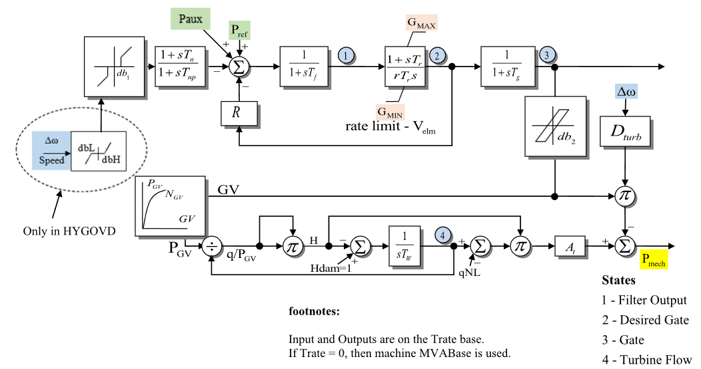

# **Hydro Turbine-Governor Model (HYGOV)**

HYGOV is a hydro turbine-governor model with temporary droop, a gate servo, and
a nonlinear single-penstock turbine.

## Notes

- Power signals and the `pmech` monitor output are on system base.
- Internal load-reference, gate, flow, and head quantities are on HYGOV
  component base.
- HYGOV uses $T^\mathrm{rate}$, loaded from `Trate`, as its component power base.
- PowerWorld uses the connected machine base when `Trate = 0`; GridKit requires
  `Trate` to be set explicitly.
- HYGOVD `dbL`/`dbH`, `db2` backlash, and Kaplan blade-servo fields are not
  modeled. The `db2` JSON field is accepted only for source-format compatibility.

## Block Diagram

Standard HYGOV block diagram.



Figure 1: HYGOV block diagram. Figure courtesy of [PowerWorld](https://www.powerworld.com/WebHelp/)

## Model Parameters

Symbol                          | Units    | JSON     | Description                                  | Typical Value | Note
--------------------------------|----------|----------|----------------------------------------------|---------------|------
$T^\mathrm{rate}$               | [MW]     | `Trate` | Turbine-rating power base                    | 100.0         | Required positive value
$R_{\mathrm{perm}}$             | [p.u.]   | `Rperm`  | Permanent droop                              | 0.04          | Source diagram label: `R`
$R_{\mathrm{temp}}$             | [p.u.]   | `Rtemp`  | Temporary droop                              | 0.3           | Source diagram label: `r`
$T_r$                           | [sec]    | `Tr`     | Temporary-droop reset time constant          | 5.0           |
$T_f$                           | [sec]    | `Tf`     | Governor error filter time constant          | 0.05          | State 1
$T_g$                           | [sec]    | `Tg`     | Gate servo time constant                     | 0.5           | State 3
$V_{\mathrm{elm}}$              | [p.u./s] | `Velm`   | Maximum desired-gate velocity magnitude      | 0.2           | Symmetric rate limit on State 2
$G^{\max}$                      | [p.u.]   | `Gmax`   | Maximum desired-gate position                | 1.0           |
$G^{\min}$                      | [p.u.]   | `Gmin`   | Minimum desired-gate position                | 0.0           |
$T_w$                           | [sec]    | `Tw`     | Water inertia time constant                  | 1.0           | State 4
$A_t$                           | [p.u.]   | `At`     | Turbine gain                                 | 1.2           |
$D_{\mathrm{turb}}$             | [p.u.]   | `Dturb`  | Turbine damping coefficient                  | 0.5           | Multiplied by speed deviation and gate
$q_{\mathrm{NL}}$               | [p.u.]   | `Qnl`    | No-load flow at nominal head                 | 0.05          |
$T_n$                           | [sec]    | `Tn`     | Speed lead-lag numerator time constant       | 0.0           |
$T_{np}$                        | [sec]    | `Tnp`    | Speed lead-lag denominator time constant     | 0.0           |
$D_{\omega}$                    | [p.u.]   | `db1`    | Type 1 speed deadband threshold              | 0.0           | Uses CommonMath `deadband1`
$H_{\mathrm{dam}}$              | [p.u.]   | `Hdam`   | Head available at dam                        | 1.0           |
$G_V^{(k)}$                     | [p.u.]   | `Gv0`-`Gv5`   | Gate point $k$ of the gain curve             | 0.0           | $k=0,\ldots,5$
$P_{\mathrm{GV}}^{(k)}$         | [p.u.]   | `Pgv0`-`Pgv5` | Power point $k$ of the gain curve            | 0.0           | $k=0,\ldots,5$

All-zero `Gv` and `Pgv` source points select the identity curve.

### Parameter Validation

Invalid HYGOV parameter sets are rejected by the following checks. The
displayed equations use effective time constants with $\epsilon_T=10^{-3}$.

```math
\begin{aligned}
  T &\leftarrow \max\!\left(T, \epsilon_T\right)
    \quad T\in\{T_r,T_f,T_g,T_w,T_{np}\} \\
  T^\mathrm{rate}, H_{\mathrm{dam}}, A_t
    &> 0 \\
  T_r, T_f, T_g, T_w, T_n, T_{np}
    &\ge 0 \\
  R_{\mathrm{temp}}
    &\ne 0 \\
  V_{\mathrm{elm}}, D_{\mathrm{turb}}, D_{\omega}
    &\ge 0 \\
  G^{\min}
    &\le G^{\max} \\
  G_V^{(k)}
    &< G_V^{(k+1)}
    \quad k\in\{0,\ldots,4\} \\
  P_{\mathrm{GV}}^{(k)}
    &\le P_{\mathrm{GV}}^{(k+1)}
    \quad k\in\{0,\ldots,4\}
\end{aligned}
```

Initialization also requires $N_{\mathrm{GV}}^{-1}$ to be single-valued at the
initial operating point.

### Model Derived Parameters

```math
\begin{aligned}
  k_{\mathrm{base}}
    &= \dfrac{S^\mathrm{sys}}{T^\mathrm{rate}} \\
  k_n
    &= \dfrac{T_n}{T_{np}} \\
  N_{\mathrm{GV}}(x)
    &=
      P_{\mathrm{GV}}^{(0)}
      + \sum_{k\in\{0,\ldots,4\}}
        \text{linseg}\!\left(
          x;\,
          G_V^{(k)},\,
          G_V^{(k+1)},\,
          P_{\mathrm{GV}}^{(k+1)} - P_{\mathrm{GV}}^{(k)}
        \right)
\end{aligned}
```

CommonMath defines the [linear segment](../../../../CommonMath.md#linseg)
helper used by $N_{\mathrm{GV}}$.

## Model Ports

Name    | Port   | Init    | Description
--------|--------|---------|------
`speed` | Input  | Known   | Machine speed deviation
`pref`  | Input  | Unknown | Active-power/load reference
`paux`  | Input  | Known   | Auxiliary power input
`pmech` | Output | Unknown | Mechanical power output

## Model Variables

### Internal Variables

#### Differential

Symbol                  | Units  | Description                         | Note
------------------------|--------|-------------------------------------|------
$x_n$                   | [p.u.] | Speed lead-lag denominator state    | Not circled in Fig. 1; realizes the `Tn`/`Tnp` block
$x_f$                   | [p.u.] | Governor error filter output        | State 1 in Fig. 1
$c$                     | [p.u.] | Desired-gate position               | State 2 in Fig. 1
$g$                     | [p.u.] | Gate position                       | State 3 in Fig. 1
$q$                     | [p.u.] | Turbine flow                        | State 4 in Fig. 1

#### Algebraic

Symbol                          | Units    | Description                         | Note
--------------------------------|----------|-------------------------------------|------
$\omega_{\mathrm{db}}$          | [p.u.]   | Type 1 deadbanded speed deviation   | Defined by CommonMath `deadband1`
$e_f$                           | [p.u.]   | Governor error into the filter      | Reference path less conditioned speed and permanent-droop feedback
$f_c$                           | [p.u./s] | Desired-gate derivative target      | Before rate and position limits
$r_c$                           | [p.u./s] | Rate-limited desired-gate derivative target | Limited by $\pm V_{\mathrm{elm}}$
$P_{\mathrm{GV}}$               | [p.u.]   | Nonlinear gate-to-power curve output | $N_{\mathrm{GV}}(g)$
$H$                             | [p.u.]   | Turbine head                        | Implicit water-column head
$P_{\text{m}}$                  | [p.u.]   | Mechanical power to generator       | System base; assigned to `pmech`

### External Variables

#### Differential
None.

#### Algebraic

Symbol                          | Units  | Description                 | Note
--------------------------------|--------|-----------------------------|------
$\omega$                        | [p.u.] | Machine speed deviation     | Defaults to zero
$P^\mathrm{ref}$                | [p.u.] | Active-power/load reference | System base
$P^\mathrm{aux}$                | [p.u.] | Auxiliary power input       | System base; defaults to zero

## Model Equations

### Differential Equations

The lag residuals are written in Hessenberg form using the effective time
constants defined in [Parameter Validation](#parameter-validation).

```math
\begin{aligned}
  0 &=
    -\dot{x}_n
    + \dfrac{1}{T_{np}}
      \left(\omega_{\mathrm{db}} - x_n\right) \\
  0 &=
    -\dot{x}_f
    + \dfrac{1}{T_f}
      \left(e_f - x_f\right) \\
  0 &=
    -\dot{c}
    + \text{antiwindup}
      \left(c, r_c;\, G^{\min}, G^{\max}\right) \\
  0 &=
    -\dot{g}
    + \dfrac{1}{T_g}
      \left(c - g\right) \\
  0 &=
    -\dot{q}
    + \dfrac{1}{T_w}
      \left(H_{\mathrm{dam}} - H\right)
\end{aligned}
```

CommonMath defines the [Anti-Windup](../../../../CommonMath.md#anti-windup-indicator)
target and smooth approximation.

### Algebraic Equations

```math
\begin{aligned}
  0 &=
    -\omega_{\mathrm{db}}
    + \text{deadband1}
      \left(\omega;\, -D_{\omega}, D_{\omega}\right) \\
  0 &=
    -e_f
    + k_{\mathrm{base}}P^\mathrm{ref}
    + k_{\mathrm{base}}P^\mathrm{aux}
    - x_n
    - k_n\left(\omega_{\mathrm{db}} - x_n\right)
    - R_{\mathrm{perm}}c \\
  0 &=
    -f_c
    + \dfrac{1}{R_{\mathrm{temp}}}
      \left[
        \dfrac{x_f}{T_r}
        + \dfrac{e_f - x_f}{T_f}
      \right] \\
  0 &=
    -r_c
    + \text{clamp}
      \left(f_c;\, -V_{\mathrm{elm}}, V_{\mathrm{elm}}\right) \\
  0 &=
    -P_{\mathrm{GV}}
    + N_{\mathrm{GV}}(g) \\
  0 &=
    -q^2
    + H P_{\mathrm{GV}}^2 \\
  0 &=
    -k_{\mathrm{base}}P_{\text{m}}
    + A_t H\left(q - q_{\mathrm{NL}}\right)
    - D_{\mathrm{turb}}\omega g
\end{aligned}
```

CommonMath defines helper targets and smooth approximations for
[deadband1](../../../../CommonMath.md#deadband1) and
[clamp](../../../../CommonMath.md#clamp).

## Initialization

### Input Initialization

```math
\begin{aligned}
  \omega
    &\leftarrow \text{machine speed deviation} \\
  P_{\text{m}}
    &\leftarrow \text{machine mechanical-power start on system base} \\
  P^\mathrm{aux}
    &\leftarrow \text{auxiliary power input on system base}
\end{aligned}
```

### Internal Initialization

Initialization is performed by evaluating the steady-state residuals in
dependency order:

```math
\begin{aligned}
  H
    &= H_{\mathrm{dam}} \\
  q
    &= q_{\mathrm{NL}}
       + \dfrac{k_{\mathrm{base}}P_{\text{m},0}}{A_tH_0} \\
  P_{\mathrm{GV}}
    &= \dfrac{q_0}{\sqrt{H_0}} \\
  g
    &= N_{\mathrm{GV}}^{-1}\!\left(P_{\mathrm{GV},0}\right) \\
  c
    &= g_0 \\
  \omega_{\mathrm{db}}
    &= \text{deadband1}\!\left(\omega_0;\, -D_{\omega}, D_{\omega}\right) \\
  x_n
    &= \omega_{\mathrm{db},0} \\
  x_f
    &= 0 \\
  e_f
    &= 0 \\
  f_c
    &= 0 \\
  r_c
    &= 0
\end{aligned}
```

### Output Initialization

```math
\begin{aligned}
  P^\mathrm{ref}
    &\leftarrow
      \dfrac{1}{k_{\mathrm{base}}}
      \left[
        e_{f,0}
        - k_{\mathrm{base}}P^\mathrm{aux}_0
        + x_{n,0}
        + k_n\left(\omega_{\mathrm{db},0} - x_{n,0}\right)
        + R_{\mathrm{perm}}c_0
      \right]
\end{aligned}
```

HYGOV writes the resolved active-power/load reference to an attached `pref`
signal input. If no controller is connected, that value is used as a constant
reference input.

## Monitorable Outputs

Output         | Units  | Description                         | Note
---------------|--------|-------------------------------------|------
`pmech`        | [p.u.] | Mechanical-power output             | $P_{\text{m}}$ (system base)
`filter`       | [p.u.] | Governor error filter output        | $x_f$
`desiredgate`  | [p.u.] | Desired-gate position               | $c$
`gate`         | [p.u.] | Gate position                       | $g$
`flow`         | [p.u.] | Turbine flow                        | $q$
`head`         | [p.u.] | Turbine head                        | $H$
