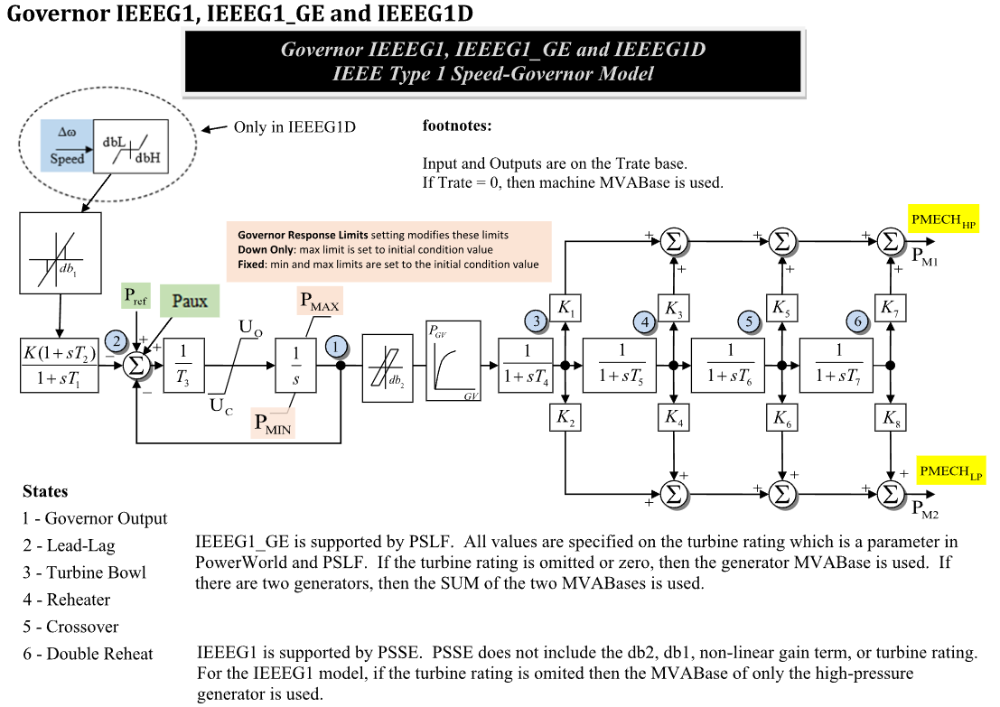

# **IEEE Type 1 Speed-Governor Model (IEEEG1)**

IEEEG1 is a steam turbine-governor model with speed deadband, a governor
lead-lag, rate- and position-limited governor output, optional nonlinear
governor gain, turbine bowl and reheat stages, and separate high-pressure and
low-pressure mechanical-power outputs.

Notes:
- Input and output powers are on the turbine-rating base when `Trate > 0`;
  otherwise the connected machine MVA base is used.
- The dashed `dbL/dbH` speed deadband block is only for IEEEG1D. IEEEG1 uses
  the Type 1 no-offset `db1` block documented with CommonMath `deadband1`.
- Source governor-response settings may modify $U_o$, $U_c$, $P^{\max}$, and
  $P^{\min}$ before the equations are evaluated.
- PSSE IEEEG1 source data may omit `db1`, `db2`, nonlinear-gain points, and
  turbine rating; those omitted features must be documented as inactive rather
  than silently dropped.

## Block Diagram

Standard model of the IEEEG1 Governor.



Figure 1: Governor IEEEG1 model. Figure courtesy of [PowerWorld](https://www.powerworld.com/WebHelp/)

## Model Parameters

Symbol                          | Units    | JSON       | Description                                  | Typical Value | Note
--------------------------------|----------|------------|----------------------------------------------|---------------|------
$K$                             | [p.u.]   | `K`        | Governor speed-control gain                  | 20.0          | Block name: `K`
$T_1$                           | [sec]    | `T1`       | Governor lead-lag denominator time constant  | 0.0           | Block name: `T1`
$T_2$                           | [sec]    | `T2`       | Governor lead-lag numerator time constant    | 0.0           | Block name: `T2`
$T_3$                           | [sec]    | `T3`       | Governor output servo time constant          | 0.1           | Block name: `T3`
$U_o$                           | [p.u./s] | `Uo`       | Maximum opening rate                         | 0.1           | Source label: `UO`
$U_c$                           | [p.u./s] | `Uc`       | Maximum closing rate                         | -0.1          | Source label: `UC`
$P^{\max}$                      | [p.u.]   | `Pmax`     | Maximum governor output                      | 1.0           | Block name: `PMAX`
$P^{\min}$                      | [p.u.]   | `Pmin`     | Minimum governor output                      | 0.0           | Block name: `PMIN`
$T_4$                           | [sec]    | `T4`       | Turbine bowl time constant                   | 0.3           | State 3 in Fig. 1
$K_1$                           | [p.u.]   | `K1`       | High-pressure fraction from turbine bowl     | 0.2           | Top output branch
$K_2$                           | [p.u.]   | `K2`       | Low-pressure fraction from turbine bowl      | 0.0           | Bottom output branch
$T_5$                           | [sec]    | `T5`       | Reheater time constant                       | 5.0           | State 4 in Fig. 1
$K_3$                           | [p.u.]   | `K3`       | High-pressure fraction from reheater         | 0.3           | Top output branch
$K_4$                           | [p.u.]   | `K4`       | Low-pressure fraction from reheater          | 0.0           | Bottom output branch
$T_6$                           | [sec]    | `T6`       | Crossover time constant                      | 0.5           | State 5 in Fig. 1
$K_5$                           | [p.u.]   | `K5`       | High-pressure fraction from crossover        | 0.5           | Top output branch
$K_6$                           | [p.u.]   | `K6`       | Low-pressure fraction from crossover         | 0.0           | Bottom output branch
$T_7$                           | [sec]    | `T7`       | Double-reheat time constant                  | 0.5           | State 6 in Fig. 1
$K_7$                           | [p.u.]   | `K7`       | High-pressure fraction from double reheat    | 0.0           | Top output branch
$K_8$                           | [p.u.]   | `K8`       | Low-pressure fraction from double reheat     | 0.0           | Bottom output branch
$D_{\omega}$                    | [p.u.]   | `db1`      | Type 1 speed deadband threshold              | 0.0           | Block name: `db1`; uses CommonMath `deadband1`
$\epsilon$                      | [p.u.]   | `Eps`      | Nonlinear gain smoothing/curve tolerance     | 0.0           | Source nonlinear gain setting
$D_{\mathrm{gv}}$               | [p.u.]   | `db2`      | Governor-output backlash/deadband width      | 0.0           | Block name: `db2`; nonzero support must be explicit
$P^{\mathrm{rate}}$             | [MW]     | `Trate`    | Optional turbine-rating power base           | 0.0           | `Trate > 0` defines the governor base

The optional nonlinear governor gain curve is represented by source points:

Symbol                          | Units  | JSON       | Description                                  | Typical Value | Note
--------------------------------|--------|------------|----------------------------------------------|---------------|------
$G_V^{(k)}$                     | [p.u.] | `Gv1`-`Gv6` | Governor-output curve input point $k$       | 0.0           | Source labels: `Gv1` through `Gv6`
$P_{\mathrm{GV}}^{(k)}$         | [p.u.] | `Pgv1`-`Pgv6` | Governor-output curve value point $k$     | 0.0           | Source labels: `Pgv1` through `Pgv6`

### Parameter Validation

Invalid IEEEG1 parameter sets are rejected by the following checks. If source
governor-response settings adjust limits, apply these checks to the effective
values used by the equations.

```math
\begin{aligned}
  &T_1,T_2,T_3,T_4,T_5,T_6,T_7 \ge 0,\quad T_3>0 \\
  &T_1 > 0\quad\text{or}\quad(T_1 = 0\ \text{and}\ T_2 = 0) \\
  &U_c < 0 < U_o,\quad P^{\min}\le P^{\max} \\
  &D_{\omega}\ge 0,\quad D_{\mathrm{gv}}\ge 0,\quad P^{\mathrm{rate}}\ge 0 \\
  &G_V^{(1)} < G_V^{(2)} < \cdots < G_V^{(6)} \\
  &0 \le P_{\mathrm{GV}}^{(1)} \le P_{\mathrm{GV}}^{(2)} \le \cdots \le P_{\mathrm{GV}}^{(6)}
\end{aligned}
```

### Model Derived Parameters

The governor component base and nonlinear governor-output curve are:

```math
\begin{aligned}
  S_{\mathrm{gov}}^{\mathrm{base}}
    &=
    \begin{cases}
      P^{\mathrm{rate}} & P^{\mathrm{rate}} > 0 \\
      S^{\mathrm{machine}} & \text{otherwise}
    \end{cases} \\
  N_{\mathrm{GV}}(x)
    &=
      P_{\mathrm{GV}}^{(1)}
      + \sum_{k=1}^{5}
        \text{linseg}\!\left(
          x;\,
          G_V^{(k)},\,
          G_V^{(k+1)},\,
          P_{\mathrm{GV}}^{(k+1)} - P_{\mathrm{GV}}^{(k)}
        \right)
\end{aligned}
```

CommonMath defines the [linear segment](../../../../CommonMath.md#derived-functions)
helper used by $N_{\mathrm{GV}}$.

## Model Variables

### Internal Variables

#### Differential

Symbol                  | Units  | Description                         | Note
------------------------|--------|-------------------------------------|------
$P_{\mathrm{GV}}$       | [p.u.] | Governor output                     | State 1 in Fig. 1
$x_{\mathrm{ll}}$       | [p.u.] | Governor lead-lag state             | State 2 in Fig. 1
$x_4$                   | [p.u.] | Turbine bowl state                  | State 3 in Fig. 1; denominator $T_4$
$x_5$                   | [p.u.] | Reheater state                      | State 4 in Fig. 1; denominator $T_5$
$x_6$                   | [p.u.] | Crossover state                     | State 5 in Fig. 1; denominator $T_6$
$x_7$                   | [p.u.] | Double-reheat state                 | State 6 in Fig. 1; denominator $T_7$

#### Algebraic

Symbol                          | Units    | Description                         | Note
--------------------------------|----------|-------------------------------------|------
$\omega_{\mathrm{db}}$          | [p.u.]   | Deadbanded speed deviation          | Defined by CommonMath `deadband1`
$y_{\omega}$                    | [p.u.]   | Lead-lag-conditioned speed signal   | Output of $K(1+sT_2)/(1+sT_1)$
$e_G$                           | [p.u.]   | Governor command error              | Sum of references minus speed and output feedback
$r_G$                           | [p.u./s] | Rate-limited governor derivative target | Limited by $U_c$ and $U_o$
$P_{\mathrm{GV}}^{\mathrm{nl}}$ | [p.u.]   | Nonlinear governor gain output      | Output of `db2`/curve branch
$P_m^{\mathrm{HP}}$             | [p.u.]   | High-pressure mechanical-power output | Source label: `PMECH_HP`
$P_m^{\mathrm{LP}}$             | [p.u.]   | Low-pressure mechanical-power output | Source label: `PMECH_LP`

### External Variables

#### Differential

None.

#### Algebraic

Symbol                          | Units  | Description                    | Note
--------------------------------|--------|--------------------------------|------
$\omega$                        | [p.u.] | Machine speed deviation        | Source label: `Speed`
$P_{\mathrm{ref}}$              | [p.u.] | Governor reference             | Source label: `Pref`
$P_{\mathrm{aux}}$              | [p.u.] | Auxiliary power input          | Source label: `Paux`; optional, defaults to zero

## Model Equations

### Differential Equations

```math
\begin{aligned}
  0 &= -T_1\dot x_{\mathrm{ll}} - x_{\mathrm{ll}} + K\omega_{\mathrm{db}} \\
  0 &=
    -\dot P_{\mathrm{GV}}
    + \text{antiwindup}\!\left(
        P_{\mathrm{GV}},
        r_G,
        P^{\min},
        P^{\max}
      \right) \\
  0 &= -T_4\dot x_4 - x_4 + P_{\mathrm{GV}}^{\mathrm{nl}} \\
  0 &= -T_5\dot x_5 - x_5 + x_4 \\
  0 &= -T_6\dot x_6 - x_6 + x_5 \\
  0 &= -T_7\dot x_7 - x_7 + x_6
\end{aligned}
```

CommonMath defines the [Anti-Windup](../../../../CommonMath.md#antiwindup)
target and smooth approximation.

### Algebraic Equations

```math
\begin{aligned}
  0 &= -\omega_{\mathrm{db}} + \text{deadband1}(\omega,\ -D_{\omega},\ D_{\omega}) \\
  0 &= -y_{\omega}
       +
       \begin{cases}
         K\omega_{\mathrm{db}}, & T_1 = T_2 = 0 \\
         x_{\mathrm{ll}} + \dfrac{T_2}{T_1}\left(K\omega_{\mathrm{db}}-x_{\mathrm{ll}}\right), & T_1 > 0
       \end{cases} \\
  0 &= -e_G + P_{\mathrm{ref}} + P_{\mathrm{aux}} - y_{\omega} - P_{\mathrm{GV}} \\
  0 &= -r_G + \text{clamp}\!\left(\dfrac{e_G}{T_3}, U_c, U_o\right) \\
  0 &= -P_{\mathrm{GV}}^{\mathrm{nl}} + N_{\mathrm{GV}}\!\left(\text{deadband2}(P_{\mathrm{GV}}, -D_{\mathrm{gv}}, D_{\mathrm{gv}})\right) \\
  0 &= -P_m^{\mathrm{HP}} + K_1x_4 + K_3x_5 + K_5x_6 + K_7x_7 \\
  0 &= -P_m^{\mathrm{LP}} + K_2x_4 + K_4x_5 + K_6x_6 + K_8x_7
\end{aligned}
```

CommonMath defines helper targets and smooth approximations for
[deadband1, deadband2, clamp, and linseg](../../../../CommonMath.md#derived-functions).
When $T_1=T_2=0$, the governor lead-lag block is bypassed so
$y_{\omega}=K\omega_{\mathrm{db}}$.

## Initialization

Initialization is performed by evaluating the steady-state residuals in
dependency order. Let subscript $0$ denote initial values and set all internal
derivatives to zero. For a standard power-flow start:

```math
\begin{aligned}
  \omega_0 &= 0 \\
  P_{\mathrm{aux},0} &= 0 \\
  \omega_{\mathrm{db},0} &= \text{deadband1}(0,\ -D_{\omega},\ D_{\omega}) \\
  x_{\mathrm{ll},0} &= K\omega_{\mathrm{db},0} \\
  y_{\omega,0} &= x_{\mathrm{ll},0}
\end{aligned}
```

Given initialized high- and low-pressure mechanical powers, solve the turbine
chain by choosing $P_{\mathrm{GV},0}$ so that the turbine fractions reproduce
the connected machine operating point:

```math
\begin{aligned}
  P_{\mathrm{GV},0}^{\mathrm{nl}}
    &= N_{\mathrm{GV}}\!\left(\text{deadband2}(P_{\mathrm{GV},0}, -D_{\mathrm{gv}}, D_{\mathrm{gv}})\right) \\
  x_{4,0}=x_{5,0}=x_{6,0}=x_{7,0} &= P_{\mathrm{GV},0}^{\mathrm{nl}} \\
  P_{m,0}^{\mathrm{HP}} &= (K_1+K_3+K_5+K_7)P_{\mathrm{GV},0}^{\mathrm{nl}} \\
  P_{m,0}^{\mathrm{LP}} &= (K_2+K_4+K_6+K_8)P_{\mathrm{GV},0}^{\mathrm{nl}} \\
  P_{\mathrm{ref},0} &= P_{\mathrm{GV},0} + y_{\omega,0} - P_{\mathrm{aux},0}
\end{aligned}
```

This closed-form start requires the effective governor output to lie inside
$P^{\min}$ and $P^{\max}$ and the opening/closing rate limits to be inactive.
Starts where governor response limits fix the limits to the initial condition
must document those effective limits before applying the residuals.

## Model Outputs

Output          | Units  | Description                         | Note
----------------|--------|-------------------------------------|------
`pmech_hp`      | [p.u.] | High-pressure mechanical-power output | $P_m^{\mathrm{HP}}$
`pmech_lp`      | [p.u.] | Low-pressure mechanical-power output | $P_m^{\mathrm{LP}}$
`pgv`           | [p.u.] | Governor output                     | State 1
`leadlag`       | [p.u.] | Governor lead-lag state             | State 2
`bowl`          | [p.u.] | Turbine bowl state                  | State 3
`reheater`      | [p.u.] | Reheater state                      | State 4
`crossover`     | [p.u.] | Crossover state                     | State 5
`double_reheat` | [p.u.] | Double-reheat state                 | State 6
