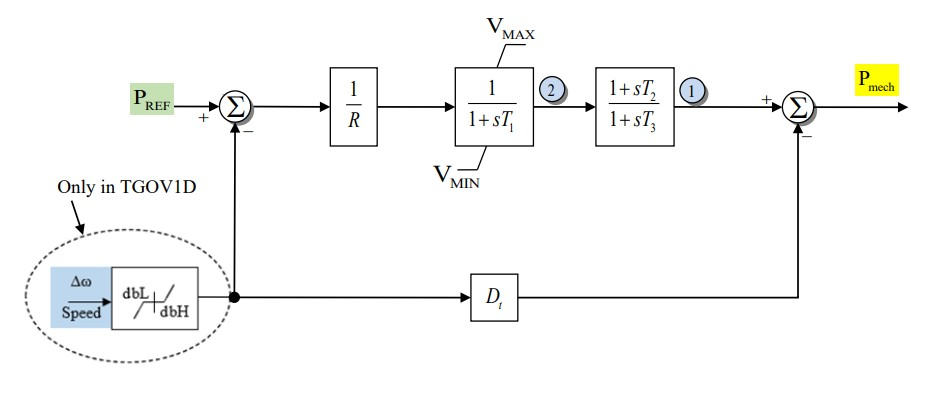

# **Steam Turbine-Governor Model (TGOV1)**

## Block Diagram

Standard model of the stream turbine



Figure 1: Governor TGOV1 model. Figure courtesy of [PowerWorld](https://www.powerworld.com/WebHelp/)

## Model Parameters

Symbol      | Units  | Description                       | Typical Value | Note
------------|--------|-----------------------------------|---------------| ------
$T_{\mathrm{rate}}$ | [MW] | Turbine rating                    | 100.0 |
$R$         | [p.u.] | Droop Constant                    | 0.05 |
$T_1$       | [sec]  | Valve Time Delay                  | 0.5  |
$T_2$       | [sec]  | Turbine Numerator Time Constant   | 2.5  |
$T_3$       | [sec]  | Turbine Delay                     | 7.5  |
$P_v^{\max}$ | [p.u.] | Max Valve Position                | 1    |
$P_v^{\min}$ | [p.u.] | Min Valve Position                | 0    |
$D_t$       | [p.u.] | Turbine Damping Coefficient       | 0    | 

## Model Variables 

### Internal Variables

#### Differential

Symbol    | Units  | Description                       | Note
----------|--------|-----------------------------------|-------
$P_{tx}$  | [p.u.] | Turbine Power (State 1 in Fig. 1) |
$P_v$     | [p.u.] | Valve Position (State 2 in Fig. 1)|

#### Algebraic
Symbol          | Units  | Description                       | Note
----------------|--------|-----------------------------------|-------
$P_m$           | [p.u.] | Mechnical Power to Generator      | Read by a Machine Model

### External Variables

#### Differential
Symbol          | Units  | Description                       | Note
----------------|--------|-----------------------------------|-------
$\omega$  | [p.u.] | Machine Speed Deviation                   | Read from a Machine Model

#### Algebraic
Symbol          | Units  | Description                       | Note
----------------|--------|-----------------------------------|-------
$P_{ref}$       | [p.u.] | Reference Power                   | Either a constant parameter or external variable

## Model Equations

For readability, define:
```math
f = -P_v + \dfrac{1}{R}(P_{ref} - \omega)
```

### Differential Equations
The TGOV1 differential equations, as derived from the model diagram.

```math
\begin{aligned}
   0 &= -T_3 \dot P_{tx} - P_{tx} + (T_3 - T_2)P_v \\
   0 &= -T_1 \dot P_v
        + \text{antiwindup}(
            P_v,
            f,
            P_v^{\min},
            P_v^{\max}
          )
\end{aligned}
```

CommonMath defines the [Anti-Windup](../../../../CommonMath.md#antiwindup)
target and smooth approximation.

### Algebraic Equations
The algebraic equation dictating the mechnical power output.
```math
\begin{aligned}
   0 &= -\dfrac{S_{\mathrm{sys}}}{T_{\mathrm{rate}}} P_m
        + \dfrac{1}{T_3}(P_{tx}+T_2P_v) - D_t \omega \\
\end{aligned}
```

In simulation the piecewise form above is replaced with a smooth approximation where $\phi$ is GridKit's smooth anti-windup indicator. See [CommonMath: Anti-Windup Indicator](../../../../CommonMath.md#antiwindup) for its definition, behavior, and design rationale.

## Initialization
At steady state we assume that $P_v$ is at or within its limits. This implies the initial conditions are a function of the initial mechanical power converted to the TGOV1 component base.
```math
\begin{aligned}
   P^{\mathrm{tgov1}}_{m,0}
      &= \dfrac{S_{\mathrm{sys}}}{T_{\mathrm{rate}}}P_{m,0} \\
   P_{tx,0}
      &= (T_3 - T_2)P^{\mathrm{tgov1}}_{m,0} \\
   P_{v,0}
      &= P^{\mathrm{tgov1}}_{m,0} \\
   \dot P_{tx,0}
      &= 0 \\
   \dot P_{v,0}
      &= 0
\end{aligned}
```

And if the reference power is a constant parameter, we can determine the value by solving the steady state equations.
```math
\begin{aligned}
   P_{ref,0}
      &= R P^{\mathrm{tgov1}}_{m,0}
\end{aligned}
```
