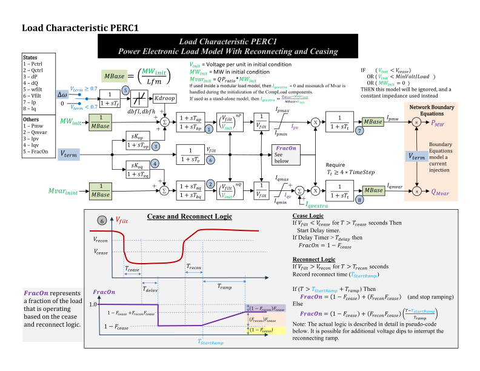

# PERC1

PERC1 is a power-electronic load model with voltage and frequency response,
current limits, and load cessation and reconnection for aggregated
devices.[^powerworld][^background]

## Notes

Internal power and current quantities use component base. Terminal currents
use system base and are positive for injection into the connected bus.

## Block Diagram



Figure 1: PERC1 load model. Figure courtesy of PowerWorld.[^powerworld]

## Model Parameters

Symbol             | Units       | JSON      | Description                                        | Typical Value | Note
-------------------|-------------|-----------|----------------------------------------------------|---------------|-------------------------------------------------------------------------
$P_\mathrm{nom}$   | [p.u.]      | `Pnom`    | Initial consumed active power                      | 0.0           | System base; required initialization source
$Q_\mathrm{nom}$   | [p.u.]      | `Qnom`    | Initial consumed reactive power                    | 0.0           | System base; required initialization source; positive for inductive load
$L_\mathrm{fm}$    | [-]         | `Lfm`     | Loading factor defining component base             | 0.80          | Values below 0.001 select 0.80
$K_\mathrm{qp}$    | [-]         | `QPratio` | Controlled reactive-to-active power ratio          | 0.66          |
$D_f^{\min}$       | [p.u.]      | `Dbfl`    | Lower frequency deadband threshold                 | 0.00          |
$D_f^{\max}$       | [p.u.]      | `Dbfh`    | Upper frequency deadband threshold                 | 0.00          |
$K_\mathrm{droop}$ | [p.u./p.u.] | `Kdroop`  | Active-power gain on frequency deviation           | 0.00          | Positive gain increases consumption with frequency
$K_\mathrm{vp}$    | [s]         | `Kvp`     | Active-power voltage-washout coefficient           | 0.00          | Component-base power per voltage rate
$T_\mathrm{vp}$    | [s]         | `Tvp`     | Active-power washout time constant                 | 0.10          |
$K_\mathrm{vq}$    | [s]         | `Kvq`     | Reactive-power voltage-washout coefficient         | 0.00          | Component-base power per voltage rate
$T_\mathrm{vq}$    | [s]         | `Tvq`     | Reactive-power washout time constant               | 0.10          |
$T_\mathrm{ap}$    | [s]         | `Tap`     | Active-power lead time constant                    | 0.00          |
$T_\mathrm{bp}$    | [s]         | `Tbp`     | Active-power lag time constant                     | 0.00          |
$T_\mathrm{aq}$    | [s]         | `Taq`     | Reactive-power lead time constant                  | 0.00          |
$T_\mathrm{bq}$    | [s]         | `Tbq`     | Reactive-power lag time constant                   | 0.00          |
$n_P$              | [-]         | `nP`      | Active-power voltage exponent                      | 0.00          | 0, 1, 2 give constant power, current, impedance before limits
$n_Q$              | [-]         | `nQ`      | Reactive-power voltage exponent                    | 1.00          | Applies to the controlled reactive-power path
$I_p^{\max}$       | [p.u.]      | `Ipmax`   | Upper active-current limit                         | 1.00          | Component base; before the connected-load multiplier
$I_p^{\min}$       | [p.u.]      | `Ipmin`   | Lower active-current limit                         | 0.00          | Component base
$I_q^{\max}$       | [p.u.]      | `Iqmax`   | Upper controlled reactive-current limit            | 0.66          | Component base; before extra current and the multiplier
$I_q^{\min}$       | [p.u.]      | `Iqmin`   | Lower controlled reactive-current limit            | -0.66         | Component base
$F_\mathrm{cease}$ | [-]         | `Fcease`  | Fraction subject to cessation                      | 1.00          | Zero disables the history equations
$V_\mathrm{cease}$ | [p.u.]      | `Vcease`  | Undervoltage detection threshold                   | 0.50          | Filtered voltage
$T_\mathrm{cease}$ | [s]         | `Tcease`  | Required undervoltage duration                     | 0.01          |
$T_\mathrm{delay}$ | [s]         | `Tdelay`  | Delay after cessation is committed                 | 0.00          | Voltage recovery does not cancel this delay
$V_\mathrm{recon}$ | [p.u.]      | `Vrecon`  | Voltage recovery threshold                         | 0.60          | Filtered voltage
$T_\mathrm{recon}$ | [s]         | `Trecon`  | Required recovery duration                         | 0.05          |
$T_\mathrm{ramp}$  | [s]         | `Tramp`   | Duration of the reconnection ramp                  | 1.00          | Zero selects an immediate recovery target
$F_\mathrm{recon}$ | [-]         | `Frecon`  | Reconnected amount relative to the ceased fraction | 1.00          | Values greater than one are allowed
$T_\mathrm{t}$     | [s]         | `Tt`      | Output-current lag time constant                   | 0.02          | Shared by both current paths
$T_\mathrm{v}$     | [s]         | `Tv`      | Voltage measurement time constant                  | 0.02          |
$T_\mathrm{f}$     | [s]         | `Tf`      | Frequency measurement time constant                | 0.02          |

Parameters other than `Pnom` and `Qnom` are optional and default to the listed values.

### Parameter Validation

A valid PERC1 parameter set must satisfy the following conditions:

```math
\begin{aligned}
  P_\mathrm{nom} & \ge 0 \\
  S^\mathrm{sys} & > 0 \\
  D_f^{\min} & \le 0 \le D_f^{\max} \\
  T_\mathrm{v}, T_\mathrm{f}, T_\mathrm{t}, T_\mathrm{vp}, T_\mathrm{vq}, T_\mathrm{ap}, T_\mathrm{bp}, T_\mathrm{aq}, T_\mathrm{bq} & \ge 0 \\
  I_p^{\min} & \le I_p^{\max} \\
  I_q^{\min} & \le I_q^{\max} \\
  0 & \le F_\mathrm{cease} \le 1 \\
  F_\mathrm{recon} & \ge 0 \\
  0 & \le V_\mathrm{cease} \le V_\mathrm{recon} \\
  T_\mathrm{cease}, T_\mathrm{delay}, T_\mathrm{recon}, T_\mathrm{ramp} & \ge 0
\end{aligned}
```

All parameters, inputs, and derived quantities must be finite. Dynamic power
bases and their conversion ratio must be positive. Initialization requires a
nonzero bus-voltage magnitude and feasible controlled-current targets.

### Model Derived Parameters

Let $\epsilon_T = 10^{-3}\ \mathrm{s}$. Electrical denominator time constants
are floored in place, including zero values, to preserve a fixed Hessenberg
form. When initialization selects PERC1, use

```math
\begin{aligned}
  T_x &\leftarrow \max(T_x, \epsilon_T),
    \quad x \in \{\mathrm{bp}, \mathrm{bq}, \mathrm{vp}, \mathrm{vq}, \mathrm{v}, \mathrm{f}, \mathrm{t}\} \\
  L_\mathrm{fm} &\leftarrow
    \begin{cases}
      0.80 & L_\mathrm{fm} < 0.001 \\
      L_\mathrm{fm} & L_\mathrm{fm} \ge 0.001
    \end{cases} \\
  S^\mathrm{base} &= \dfrac{S^\mathrm{sys}P_\mathrm{nom}}{L_\mathrm{fm}} \\
  k_\mathrm{base} &= \dfrac{S^\mathrm{sys}}{S^\mathrm{base}} \\
  F^{\min} &= 1 - F_\mathrm{cease} \\
  s_\mathrm{cease} &= \begin{cases}
    1 & F_\mathrm{cease} > 0 \\
    0 & F_\mathrm{cease} = 0
  \end{cases} \\
  \mu &= 240 \\
  \tau &= \dfrac{1\ \mathrm{s}}{\mu^2} \\
  \epsilon_V &= 10^{-6}\ \mathrm{p.u.} \\
  V^{\min} &= 0.01\ \mathrm{p.u.}
\end{aligned}
```

$k_\mathrm{base}$ converts system base to component base; both bases are in VA.
$\mu$ is the CommonMath smoothing scale.
$\tau$ regularizes the memory transitions and clock resets;
$\epsilon_V$ and $V^{\min}$ regularize voltage magnitude and division.
The latch requires $\mu > 4$.

## Model Ports

Name   | Port  | Init  | Description
-------|-------|-------|------------------------------------------------------
`bus`  | Bus   | Known | Connected bus
`freq` | Input | Known | Optional absolute per-unit frequency; defaults to 1.0

The bus is required; attached inputs must be linked. `Known` values are seeded
before initialization and preserved.

## Model Variables

### Internal Variables

#### Differential

Symbol                   | Units  | Description                         | Note
-------------------------|--------|-------------------------------------|-----------------------------------------------------------
$x_P^\mathrm{lag}$       | [p.u.] | Active-power lead–lag state         | State 1 in Fig. 1
$x_Q^\mathrm{lag}$       | [p.u.] | Reactive-power lead–lag state       | State 2 in Fig. 1
$x_P^\mathrm{wo}$        | [p.u.] | Active-path voltage-washout state   | State 3 in Fig. 1
$x_Q^\mathrm{wo}$        | [p.u.] | Reactive-path voltage-washout state | State 4 in Fig. 1
$\Delta f^\mathrm{meas}$ | [p.u.] | Filtered frequency deviation        | State 5 in Fig. 1
$V^\mathrm{meas}$        | [p.u.] | Filtered terminal voltage           | State 6 in Fig. 1
$I_p$                    | [p.u.] | Active-current output state         | State 7 in Fig. 1; positive for consumption
$I_q$                    | [p.u.] | Reactive-current output state       | State 8 in Fig. 1; positive for inductive consumption
$x_\mathrm{D}$           | [-]    | Committed-delay memory              | Set by sustained undervoltage; reset by cessation
$x_\mathrm{C}$           | [-]    | Ceased-load memory                  | Set at delay completion; reset by reconnection release
$x_\mathrm{R}$           | [-]    | Reconnection-release memory         | Held after ramp completion; reset by a new committed delay
$x_\mathrm{H}$           | [-]    | First-cessation memory              | Set on the first cessation and retained thereafter
$t_c$                    | [s]    | Undervoltage qualification clock    | Resets when qualification is interrupted
$t_d$                    | [s]    | Committed-delay clock               | Independent of subsequent voltage recovery
$t_r$                    | [s]    | Recovery qualification clock        | Resets when qualification is interrupted
$t_a$                    | [s]    | Reconnection ramp clock             | Held during a committed delay; resets while ceased

Memory states lie in $[0, 1]$; clocks are nonnegative.

#### Algebraic

Symbol                          | Units  | Description                                       | Note
--------------------------------|--------|---------------------------------------------------|---------------------------------------------
$V$                             | [p.u.] | Regularized terminal-voltage magnitude            | Positive branch
$V_\mathrm{safe}^\mathrm{meas}$ | [p.u.] | Measured voltage used by power and divider blocks | Smooth lower bound
$s_f$                           | [-]    | Frequency-input voltage gate                      | Source switch at 0.7 p.u.
$\Delta P$                      | [p.u.] | Active-power washout output                       | Source label: `dP`
$\Delta Q$                      | [p.u.] | Reactive-power washout output                     | Source label: `dQ`
$u_P$                           | [p.u.] | Active-power lead–lag input                       | Reference, droop, and washout sum
$u_Q$                           | [p.u.] | Reactive-power lead–lag input                     | Reference and washout sum
$P^\mathrm{ctrl}$               | [p.u.] | Active-power lead–lag output                      | Source label: `Pctrl`
$Q^\mathrm{ctrl}$               | [p.u.] | Reactive-power lead–lag output                    | Source label: `Qctrl`
$I_p^\mathrm{v}$                | [p.u.] | Limited voltage-dependent active current          | Source label: `Ipv`
$I_q^\mathrm{v}$                | [p.u.] | Limited voltage-dependent reactive current        | Source label: `Iqv`
$s_\mathrm{D}$                  | [-]    | Committed-delay gate                              |
$s_\mathrm{C}$                  | [-]    | Ceased-load gate                                  |
$s_\mathrm{R}$                  | [-]    | Reconnection-release gate                         |
$s_\mathrm{H}$                  | [-]    | First-cessation gate                              |
$F^\mathrm{on}$                 | [-]    | Connected-load multiplier                         | Source label: `FracOn`
$I_r$                           | [p.u.] | Terminal current, real component                  | System base; added to connected bus residual
$I_i$                           | [p.u.] | Terminal current, imaginary component             | System base; added to connected bus residual

### External Variables

#### Differential

None.

#### Algebraic

Symbol | Units  | Description                           | Note
-------|--------|---------------------------------------|-----------------------------------------
$V_r$  | [p.u.] | Terminal voltage, real component      | Owned by connected bus
$V_i$  | [p.u.] | Terminal voltage, imaginary component | Owned by connected bus
$f$    | [p.u.] | Absolute frequency                    | Signal port `freq`; deviation is $f - 1$

## Model Equations

Smooth functions: [`above`](../../../../CommonMath.md#above), [`clamp`](../../../../CommonMath.md#clamp), [`deadband2`](../../../../CommonMath.md#type-ii-deadband), [`max`](../../../../CommonMath.md#maximum), [$\sigma$](../../../../CommonMath.md#logistic-function).

[Appendix A](#appendix-a-latch) defines `latch`.

The power references $P^\mathrm{ref}, Q^\mathrm{ref}$, extra current
$I_q^\mathrm{extra}$, and voltage anchor $V_\mathrm{nom}^\mathrm{safe}$ are
fixed under [Internal Initialization](#internal-initialization).

Define the history gates and clock rates. At finite $\mu$, timer qualification
and reconnection fractions approximate the source logic.[^timers]

```math
\begin{aligned}
  s_c^V &= \sigma(V_\mathrm{cease} - V^\mathrm{meas}) \\
  s_r^V &= \sigma(V^\mathrm{meas} - V_\mathrm{recon}) \\
  s_j^\mathrm{done} &= \begin{cases}
    \sigma(t_j/T_j - 1) & T_j > 0 \\
    1 & T_j = 0
  \end{cases}, \qquad
  (j, T_j) \in \{(c, T_\mathrm{cease}), (d, T_\mathrm{delay}), (r, T_\mathrm{recon})\} \\
  s_\mathrm{reset} &= \sigma(1 - t_a/\tau) \\
  r^\mathrm{recon} &= \begin{cases}
    \text{clamp}(t_a/T_\mathrm{ramp};\,0, 1) & T_\mathrm{ramp} > 0 \\
    1 & T_\mathrm{ramp} = 0
  \end{cases} \\
  s_c^\mathrm{run} &= (1 - s_\mathrm{C})[1 - \sigma(x_\mathrm{D} - 3/4)]s_c^V \\
  s_d^\mathrm{run} &= s_\mathrm{D} \\
  s_r^\mathrm{run} &= s_\mathrm{C}(1 - s_\mathrm{D})s_\mathrm{H}s_r^V s_\mathrm{reset} \\
  s_\mathrm{D}^\mathrm{set} &= s_c^\mathrm{run} s_c^\mathrm{done} \\
  s_\mathrm{C}^\mathrm{set} &= s_\mathrm{D} s_d^\mathrm{done} \\
  s_\mathrm{R}^\mathrm{set} &= s_r^\mathrm{run} s_r^\mathrm{done} \\
  f_j &= \begin{cases}
    s_j^\mathrm{run} - \dfrac{1}{\tau} (1 - s_j^\mathrm{run})t_j & T_j > 0 \\
    -\dfrac{1}{\tau} t_j & T_j = 0
  \end{cases}, \qquad j \in \{c, d, r\} \\
  f_a &= \begin{cases}
    s_\mathrm{R}(1 - s_\mathrm{C})(1 - s_\mathrm{D})
      [1 - \sigma(t_a/T_\mathrm{ramp} - 1)]
      - \dfrac{1}{\tau} s_\mathrm{C}t_a & T_\mathrm{ramp} > 0 \\
    -\dfrac{1}{\tau} t_a & T_\mathrm{ramp} = 0
  \end{cases}
\end{aligned}
```

### Internal Equations

#### Differential

```math
\begin{aligned}
  0 &= -\dot{x}_P^\mathrm{lag} + \dfrac{1}{T_\mathrm{bp}} (u_P - x_P^\mathrm{lag}) \\
  0 &= -\dot{x}_Q^\mathrm{lag} + \dfrac{1}{T_\mathrm{bq}} (u_Q - x_Q^\mathrm{lag}) \\
  0 &= -\dot{x}_P^\mathrm{wo} + \dfrac{1}{T_\mathrm{vp}} (V - x_P^\mathrm{wo}) \\
  0 &= -\dot{x}_Q^\mathrm{wo} + \dfrac{1}{T_\mathrm{vq}} (V - x_Q^\mathrm{wo}) \\
  0 &= -\dot{\Delta f}^\mathrm{meas} + \dfrac{1}{T_\mathrm{f}} (s_f(f - 1) - \Delta f^\mathrm{meas}) \\
  0 &= -\dot{V}^\mathrm{meas} + \dfrac{1}{T_\mathrm{v}} (V - V^\mathrm{meas}) \\
  0 &= -\dot{I}_p + \dfrac{1}{T_\mathrm{t}} (F^\mathrm{on}I_p^\mathrm{v} - I_p) \\
  0 &= -\dot{I}_q + \dfrac{1}{T_\mathrm{t}} (F^\mathrm{on}(I_q^\mathrm{v} + I_q^\mathrm{extra}) - I_q) \\
  0 &= -\dot{x}_\mathrm{D} + \dfrac{1}{\tau} (s_\mathrm{cease}\,\text{latch}(x_\mathrm{D}, s_\mathrm{D}^\mathrm{set}, s_\mathrm{C})) \\
  0 &= -\dot{x}_\mathrm{C} + \dfrac{1}{\tau} (s_\mathrm{cease}\,\text{latch}(x_\mathrm{C}, s_\mathrm{C}^\mathrm{set}, s_\mathrm{R})) \\
  0 &= -\dot{x}_\mathrm{R} + \dfrac{1}{\tau} (s_\mathrm{cease}\,\text{latch}(x_\mathrm{R}, s_\mathrm{R}^\mathrm{set}, s_\mathrm{D})) \\
  0 &= -\dot{x}_\mathrm{H} + \dfrac{1}{\tau} (s_\mathrm{cease}\,\text{latch}(x_\mathrm{H}, s_\mathrm{C}, 0)) \\
  0 &= -\dot{t}_c + s_\mathrm{cease} f_c \\
  0 &= -\dot{t}_d + s_\mathrm{cease} f_d \\
  0 &= -\dot{t}_r + s_\mathrm{cease} f_r \\
  0 &= -\dot{t}_a + s_\mathrm{cease} f_a
\end{aligned}
```

#### Algebraic

```math
\begin{aligned}
  0 &= -V^2 + V_r^2 + V_i^2 + \epsilon_V^2 \\
  0 &= -V_\mathrm{safe}^\mathrm{meas} + \text{max}(V^\mathrm{meas}, V^{\min}) \\
  0 &= -s_f + \text{above}(V;\,0.7) \\
  0 &= -\Delta P + \dfrac{K_\mathrm{vp}}{T_\mathrm{vp}} (V - x_P^\mathrm{wo}) \\
  0 &= -\Delta Q + \dfrac{K_\mathrm{vq}}{T_\mathrm{vq}} (V - x_Q^\mathrm{wo}) \\
  0 &= -u_P + P^\mathrm{ref} + \Delta P
    + K_\mathrm{droop}\text{deadband2}(\Delta f^\mathrm{meas};\,D_f^{\min}, D_f^{\max}) \\
  0 &= -u_Q + Q^\mathrm{ref} + \Delta Q \\
  0 &= -P^\mathrm{ctrl} + x_P^\mathrm{lag} + \dfrac{T_\mathrm{ap}}{T_\mathrm{bp}} (u_P - x_P^\mathrm{lag}) \\
  0 &= -Q^\mathrm{ctrl} + x_Q^\mathrm{lag} + \dfrac{T_\mathrm{aq}}{T_\mathrm{bq}} (u_Q - x_Q^\mathrm{lag}) \\
  0 &= -I_p^\mathrm{v} + \text{clamp}(\dfrac{P^\mathrm{ctrl}}{V_\mathrm{safe}^\mathrm{meas}}
    (\dfrac{V_\mathrm{safe}^\mathrm{meas}}{V_\mathrm{nom}^\mathrm{safe}})^{n_P};\,
    I_p^{\min}, I_p^{\max}) \\
  0 &= -I_q^\mathrm{v} + \text{clamp}(\dfrac{Q^\mathrm{ctrl}}{V_\mathrm{safe}^\mathrm{meas}}
    (\dfrac{V_\mathrm{safe}^\mathrm{meas}}{V_\mathrm{nom}^\mathrm{safe}})^{n_Q};\,
    I_q^{\min}, I_q^{\max}) \\
  0 &= -s_\mathrm{D} + \sigma(x_\mathrm{D} - 1/2) \\
  0 &= -s_\mathrm{C} + \sigma(x_\mathrm{C} - 1/2) \\
  0 &= -s_\mathrm{R} + \sigma(x_\mathrm{R} - 1/2) \\
  0 &= -s_\mathrm{H} + \sigma(x_\mathrm{H} - 1/2) \\
  0 &= -F^\mathrm{on} + F^{\min}
    + F_\mathrm{cease}[(1 - s_\mathrm{H}) + s_\mathrm{H}(1 - s_\mathrm{C})F_\mathrm{recon}r^\mathrm{recon}] \\
  0 &= -k_\mathrm{base}V I_r - V_r I_p - V_i I_q \\
  0 &= -k_\mathrm{base}V I_i - V_i I_p + V_r I_q
\end{aligned}
```

Use the positive branch $V \ge \epsilon_V$.

### External Equations

```math
\begin{aligned}
  I_r^{\mathrm{bus}} &\leftarrow I_r^{\mathrm{bus}} + I_r \\
  I_i^{\mathrm{bus}} &\leftarrow I_i^{\mathrm{bus}} + I_i
\end{aligned}
```

## Initialization

Initialization starts from power-flow consumption with no prior cessation.
If $P_\mathrm{nom} = Q_\mathrm{nom} = 0$, the load contributes no current.
Otherwise, select [LoadZ](../LoadZ/README.md) when $P_\mathrm{nom} = 0$ or the
initial voltage magnitude $V_\mathrm{nom}$ is below $V_\mathrm{cease}$.[^powerworld]
Set $R = V_\mathrm{nom}^2 P_\mathrm{nom}/(P_\mathrm{nom}^2 + Q_\mathrm{nom}^2)$
and $X = V_\mathrm{nom}^2 Q_\mathrm{nom}/(P_\mathrm{nom}^2 + Q_\mathrm{nom}^2)$.
For the remaining operating points, initialize PERC1 as follows.

### Input Initialization

```math
\begin{aligned}
  V_r, V_i &\leftarrow \text{terminal-bus voltage} \\
  P_\mathrm{nom}, Q_\mathrm{nom} &\leftarrow \text{power-flow consumption on system base} \\
  f &\leftarrow \text{absolute per-unit frequency, or }1
\end{aligned}
```

### Internal Initialization

Electrical derivatives initialize to zero; history derivatives follow the
differential equations. [Appendix B](#appendix-b-iclamp) defines the inverse
CommonMath clamp `iclamp`.

```math
\begin{aligned}
  V_\mathrm{nom} &\leftarrow \sqrt{V_r^2 + V_i^2} \\
  V, V^\mathrm{meas}, x_P^\mathrm{wo}, x_Q^\mathrm{wo} &\leftarrow \sqrt{V_r^2 + V_i^2 + \epsilon_V^2} \\
  V_\mathrm{safe}^\mathrm{meas}, V_\mathrm{nom}^\mathrm{safe} &\leftarrow \text{max}(V, V^{\min}) \\
  s_f &\leftarrow \text{above}(V;\,0.7) \\
  \Delta f^\mathrm{meas} &\leftarrow s_f(f - 1) \\
  \Delta P, \Delta Q &\leftarrow 0 \\
  x_\mathrm{D}, x_\mathrm{C}, x_\mathrm{R}, x_\mathrm{H} &\leftarrow 0 \\
  t_c, t_d, t_r, t_a &\leftarrow 0 \\
  s_\mathrm{D}, s_\mathrm{C}, s_\mathrm{R}, s_\mathrm{H} &\leftarrow \sigma(-1/2) \\
  F^\mathrm{on} &\leftarrow F^{\min}
    + F_\mathrm{cease}[(1 - s_\mathrm{H}) + s_\mathrm{H}(1 - s_\mathrm{C})F_\mathrm{recon}r^\mathrm{recon}] \\
  I_p &\leftarrow \dfrac{k_\mathrm{base}P_\mathrm{nom}V}{V_\mathrm{nom}^2} \\
  I_q &\leftarrow \dfrac{k_\mathrm{base}Q_\mathrm{nom}V}{V_\mathrm{nom}^2} \\
  I_p^\mathrm{v} &\leftarrow \dfrac{I_p}{F^\mathrm{on}} \\
  I_q^\mathrm{v} &\leftarrow K_\mathrm{qp}I_p^\mathrm{v} \\
  I_q^\mathrm{extra} &\leftarrow \dfrac{I_q}{F^\mathrm{on}} - I_q^\mathrm{v} \\
  u_P, x_P^\mathrm{lag}, P^\mathrm{ctrl} &\leftarrow V_\mathrm{safe}^\mathrm{meas}\text{iclamp}(I_p^\mathrm{v};\,I_p^{\min}, I_p^{\max}) \\
  u_Q, x_Q^\mathrm{lag}, Q^\mathrm{ctrl}, Q^\mathrm{ref} &\leftarrow V_\mathrm{safe}^\mathrm{meas}\text{iclamp}(I_q^\mathrm{v};\,I_q^{\min}, I_q^{\max}) \\
  P^\mathrm{ref} &\leftarrow u_P - K_\mathrm{droop}\text{deadband2}(\Delta f^\mathrm{meas};\,D_f^{\min}, D_f^{\max}) \\
  I_r &\leftarrow -\dfrac{V_rP_\mathrm{nom} + V_iQ_\mathrm{nom}}{V_\mathrm{nom}^2} \\
  I_i &\leftarrow \dfrac{V_rQ_\mathrm{nom} - V_iP_\mathrm{nom}}{V_\mathrm{nom}^2}
\end{aligned}
```

Noncollapsed limits require
$I_p^{\min} < I_p^\mathrm{v} < I_p^{\max}$ and
$I_q^{\min} < I_q^\mathrm{v} < I_q^{\max}$ at initialization.
A collapsed interval requires its target to equal the bound; infeasible
targets are rejected.
In a composite load, use
$Q_\mathrm{nom} = K_\mathrm{qp}P_\mathrm{nom}$ and assign the reactive mismatch to
the surrounding assembly.[^initialization]

## Monitors

Monitor  | Units  | Description                                  | Note
---------|--------|----------------------------------------------|------------------------------------------
`ir`     | [p.u.] | Terminal current, real component             | System base
`ii`     | [p.u.] | Terminal current, imaginary component        | System base
`im`     | [p.u.] | Terminal current magnitude                   | $\sqrt{I_r^2 + I_i^2}$
`p`      | [p.u.] | Active power at the connected bus terminal   | $V_rI_r + V_iI_i$; positive for injection
`q`      | [p.u.] | Reactive power at the connected bus terminal | $V_iI_r - V_rI_i$; positive for injection
`ip`     | [p.u.] | Active-current output state                  | $I_p$; component base
`iq`     | [p.u.] | Reactive-current output state                | $I_q$; component base
`fracon` | [-]    | Connected-load multiplier                    | $F^\mathrm{on}$

## Appendix A: `latch`

For $x, a, b \in [0, 1]$ and $\mu > 4$, define the memory rate

```math
\text{latch}(x, a, b) = (1 - b)[a + (1 - a)\sigma(x - 1/2)] - x
```

Here $x$ is the stored state, $a$ the set drive, and $b$ the reset drive.
Full reset has priority. With both drives zero, the stable states lie on
either side of $1/2$ and approach zero and one as $\mu$ increases.

## Appendix B: `iclamp`

For $\ell < v < u$ and $\mu > 0$, the smooth inverse of the CommonMath clamp is

```math
\text{iclamp}(v;\,\ell, u) = v + \dfrac{1}{\mu}
    \left[
      \log\!\left(1 - \exp[-\mu(v - \ell)]\right)
      -\log\!\left(1 - \exp[-\mu(u - v)]\right)
    \right]
```

Evaluate $1 - \exp(-z)$ as $-\operatorname{expm1}(-z)$ near zero.
Noncollapsed clamp endpoints have no finite inverse. For $\ell = u = v$,
choose $\text{iclamp}(v;\,\ell, u) = v$.

[^powerworld]: PowerWorld, [*Load Characteristic Model: PERC1*](https://www.powerworld.com/WebHelp/Content/TransientModels_HTML/Load%20Characteristic%20PERC1.htm). PowerWorld floors `Tt` at four simulation time steps and selects constant impedance below `MinVoltLoad` at initialization.

[^initialization]: PowerWorld, [*February 11, 2026 Simulator patch*](https://www.powerworld.com/patch/february-11-2026): standalone `QPratio` and `Iqextra` correction, superseding the older model-page prose.

[^timers]: PowerWorld, [*timer pseudocode*](https://www.powerworld.com/WebHelp/Content/TransientModels_SVG/Load/Load_Characteristic/Load%20Characteristic%20PERC1_0004.svg), [*mode and fraction diagram*](https://www.powerworld.com/WebHelp/Content/TransientModels_SVG/Load/Load_Characteristic/Load%20Characteristic%20PERC1_CeaseReconnect1.png), [*repeated-fault example*](https://www.powerworld.com/WebHelp/Content/TransientModels_SVG/Load/Load_Characteristic/Load%20Characteristic%20PERC1_CeaseReconnect2.png), and [*interrupted-ramp timing diagram*](https://www.powerworld.com/WebHelp/Content/TransientModels_SVG/Load/Load_Characteristic/Load%20Characteristic%20PERC1_CeaseReconnect3.png).

[^background]: PowerWorld, [*Power Electronic Reconnecting and Ceasing (PERC1) Load Model*](https://www.powerworld.com/files/Power-Electronic-Reconnecting-and-Ceasing-PERC1-Load-Model.pdf), slides 9–23. General load-modeling guidance: [*IEEE Std 2781-2022*](https://standards.ieee.org/ieee/2781/7317/), public abstract.
