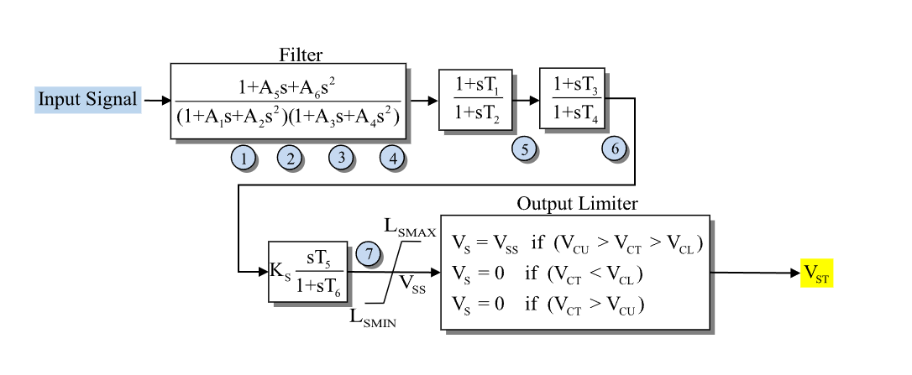

# **IEEE Stabilizer Model (IEEEST)**

IEEEST is a standard IEEE power system stabilizer with a derived-order notch
filter, two lead-lag blocks, washout, and an output limiter.

## Notes

> [!NOTE]
> $V_{\mathrm{cl}}$, $V_{\mathrm{cu}}$, and $T_{\mathrm{delay}}$ are accepted for
> input-format compatibility but are not modeled. A finite nonzero value logs a
> warning and is ignored.

- The notch-filter order is derived from the two configured denominator
  factors. It is not an input parameter.
- The numerator must be proper: its order cannot exceed the derived denominator
  order.

## Block Diagram



Figure 1: IEEEST block diagram. Figure courtesy of [PowerWorld](https://www.powerworld.com/WebHelp/)

## Model Parameters

Symbol                  | Units    | JSON     | Description                          | Typical Value | Note
------------------------|----------|----------|--------------------------------------|---------------|------
$A_1$                   | [sec]    | `A1`     | Notch denominator coefficient        | 1.013         |
$A_2$                   | [sec²]   | `A2`     | Notch denominator coefficient        | 0.013         |
$A_3$                   | [sec]    | `A3`     | Notch denominator coefficient        | 0.0           |
$A_4$                   | [sec²]   | `A4`     | Notch denominator coefficient        | 0.0           |
$A_5$                   | [sec]    | `A5`     | Notch numerator coefficient          | 1.013         |
$A_6$                   | [sec²]   | `A6`     | Notch numerator coefficient          | 0.113         |
$T_1$                   | [sec]    | `T1`     | Lead-lag 1 numerator time constant   | 0.0           |
$T_2$                   | [sec]    | `T2`     | Lead-lag 1 denominator time constant | 0.02          |
$T_3$                   | [sec]    | `T3`     | Lead-lag 2 numerator time constant   | 0.0           |
$T_4$                   | [sec]    | `T4`     | Lead-lag 2 denominator time constant | 0.0           |
$T_5$                   | [sec]    | `T5`     | Washout numerator time constant      | 1.65          |
$T_6$                   | [sec]    | `T6`     | Washout denominator time constant    | 1.65          |
$K_s$                   | [p.u.]   | `Ks`     | Stabilizer gain                      | 3.0           |
$L_s^{\min}$            | [p.u.]   | `Lsmin`  | Minimum stabilizer output limit      | -0.1          |
$L_s^{\max}$            | [p.u.]   | `Lsmax`  | Maximum stabilizer output limit      | 0.1           |
$V_{\mathrm{cl}}$       | [p.u.]   | `Vcl`    | Lower input cutout threshold         | 0.0           | Nonzero values warn and are ignored
$V_{\mathrm{cu}}$       | [p.u.]   | `Vcu`    | Upper input cutout threshold         | 0.0           | Nonzero values warn and are ignored
$T_{\mathrm{delay}}$    | [sec]    | `Tdelay` | Input delay                          | 0.0           | Nonzero values warn and are ignored

### Parameter Validation

Let $m$ be the numerator order. Exact zero selects the notch-filter topology:

```math
\begin{aligned}
  m &=
  \begin{cases}
    2 & A_6 \ne 0 \\
    1 & A_6 = 0,\ A_5 \ne 0 \\
    0 & A_5 = A_6 = 0
  \end{cases} \\
  m &\le n \\
  T_2,T_4,T_6 &\ge 0 \\
  L_s^{\min} &< L_s^{\max} \\
  a_n &\ne 0 \quad n>0
\end{aligned}
```

The raw and derived coefficients must be finite. The final condition applies to
the leading coefficient selected by the derived order. Negative denominator
time constants are rejected.

### Model Derived Parameters

For one denominator factor, define its exact order by

```math
d(p,q)=
\begin{cases}
  2 & q \ne 0 \\
  1 & q = 0,\ p \ne 0 \\
  0 & p = q = 0.
\end{cases}
```

The model derives the notch-filter order and expanded denominator coefficients
once during construction:

```math
\begin{aligned}
  n   &= d(A_1,A_2) + d(A_3,A_4) \\
  a_1 &= A_1 + A_3 \\
  a_2 &= A_2 + A_4 + A_1 A_3 \\
  a_3 &= A_1 A_4 + A_2 A_3 \\
  a_4 &= A_2 A_4.
\end{aligned}
```

Let $\epsilon_T=10^{-3}\ \mathrm{s}$. A denominator time constant below
$\epsilon_T$ is raised to that floor and logs a warning:

```math
T \leftarrow \max(T,\epsilon_T),
\qquad T\in\{T_2,T_4,T_6\}.
```

## Model Ports

Name     | Port   | Init  | Description
---------|--------|-------|------
`input`  | Input  | Known | Stabilizer input signal
`output` | Output | Known | Stabilizer output signal

The input must be attached to a linked signal. Assigning the output signal is
optional.

## Model Variables

### Internal Variables

#### Differential

All seven differential variables are always present. Inactive notch-filter
states remain differential and are frozen by $0=-\dot{x}_i$.

Symbol | Units       | Description                           | Note
-------|-------------|---------------------------------------|------
$x_1$  | [p.u.]      | Notch-filter signal state             | Active for $n\ge1$; frozen for $n=0$
$x_2$  | [p.u./sec]  | First derivative of filtered signal   | Active for $n\ge2$; otherwise frozen
$x_3$  | [p.u./sec²] | Second derivative of filtered signal  | Active for $n\ge3$; otherwise frozen
$x_4$  | [p.u./sec³] | Third derivative of filtered signal   | Active for $n=4$; otherwise frozen
$x_5$  | [p.u.]      | Lead-lag 1 state                      | State 5 in Fig. 1
$x_6$  | [p.u.]      | Lead-lag 2 state                      | State 6 in Fig. 1
$x_7$  | [p.u.]      | Washout state                         | State 7 in Fig. 1

#### Algebraic

Symbol            | Units  | Description                              | Note
------------------|--------|------------------------------------------|------
$v_4$             | [p.u.] | Notch filter output                      |
$v_5$             | [p.u.] | Lead-lag 1 output                        |
$v_6$             | [p.u.] | Lead-lag 2 output                        |
$v_7$             | [p.u.] | Unlimited stabilizer signal              |
$V_{\mathrm{ss}}$ | [p.u.] | Limited stabilizer signal (model output) |

### External Variables

#### Differential

None.

#### Algebraic

Symbol | Units  | Type  | Description             | Note
-------|--------|-------|-------------------------|------
$u$    | [p.u.] | Known | Stabilizer input signal | Required signal port `input`

## Model Equations

### Differential Equations

A runtime switch selects one notch-filter realization using the derived order
$n$. The state layout does not change with $n$.

```math
\begin{aligned}
  0 &= -\dot{x}_1
    + \begin{cases}
      0 & n=0 \\
      \dfrac{-x_1+u}{a_1} & n=1 \\
      x_2 & n\in\{2,3,4\}
    \end{cases} \\
  0 &= -\dot{x}_2
    + \begin{cases}
      0 & n\in\{0,1\} \\
      \dfrac{-x_1-a_1x_2+u}{a_2} & n=2 \\
      x_3 & n\in\{3,4\}
    \end{cases} \\
  0 &= -\dot{x}_3
    + \begin{cases}
      0 & n\in\{0,1,2\} \\
      \dfrac{-x_1-a_1x_2-a_2x_3+u}{a_3} & n=3 \\
      x_4 & n=4
    \end{cases} \\
  0 &= -\dot{x}_4
    + \begin{cases}
      0 & n\in\{0,1,2,3\} \\
      \dfrac{-x_1-a_1x_2-a_2x_3-a_3x_4+u}{a_4} & n=4
    \end{cases} \\
  0 &= -\dot{x}_5 + \dfrac{v_4-x_5}{T_2} \\
  0 &= -\dot{x}_6 + \dfrac{v_5-x_6}{T_4} \\
  0 &= -\dot{x}_7 + \dfrac{v_6-x_7}{T_6}.
\end{aligned}
```

### Algebraic Equations

```math
\begin{aligned}
  0 &= -v_4
    + \begin{cases}
      u & n=0 \\
      x_1 + \dfrac{A_5}{a_1}(-x_1+u) & n=1 \\
      x_1 + A_5x_2
        + \dfrac{A_6}{a_2}(-x_1-a_1x_2+u) & n=2 \\
      x_1 + A_5x_2 + A_6x_3 & n\in\{3,4\}
    \end{cases} \\
  0 &= -v_5 + x_5 + \dfrac{T_1}{T_2}(v_4-x_5) \\
  0 &= -v_6 + x_6 + \dfrac{T_3}{T_4}(v_5-x_6) \\
  0 &= -v_7 + K_s\dfrac{T_5}{T_6}(v_6-x_7) \\
  0 &= -V_{\mathrm{ss}}
    + \text{clamp}(v_7,L_s^{\min},L_s^{\max}).
\end{aligned}
```

CommonMath defines the smooth
[clamp](../../../../CommonMath.md#clamp).

## Initialization

### Input Initialization

```math
u \leftarrow \text{stabilizer input signal}.
```

### Internal Initialization

```math
\begin{aligned}
  x_1 &\leftarrow
    \begin{cases}
      0 & n=0 \\
      u & n\in\{1,2,3,4\}
    \end{cases} \\
  x_2,x_3,x_4 &\leftarrow 0 \\
  v_4,x_5,v_5,x_6,v_6,x_7 &\leftarrow u \\
  v_7 &\leftarrow 0 \\
  V_{\mathrm{ss}} &\leftarrow
    \text{clamp}(v_7,L_s^{\min},L_s^{\max}) \\
  \dot{x}_i &\leftarrow 0,
    \qquad i\in\{1,\ldots,7\}.
\end{aligned}
```

### Output Initialization

None.

## Monitorable Outputs

Output | Units  | Description                                 | Note
-------|--------|---------------------------------------------|------
`vss`  | [p.u.] | Limited stabilizer signal $V_{\mathrm{ss}}$ | Model output
