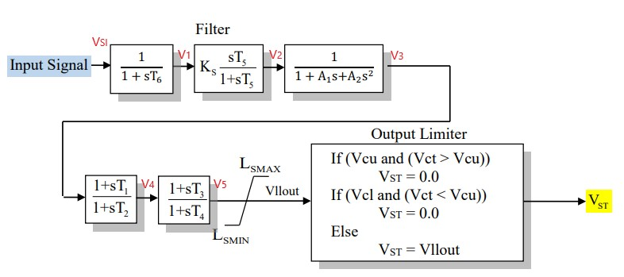

# PSS1A

> [!NOTE]
> This is not yet implemented

> [!NOTE]
> The Parameters, variables, and equations need to be formatted and verified - this is WIP.




Figure 1: Power system stabilizer PSS1A model. Figure courtesy of [PowerWorld](https://www.powerworld.com/WebHelp/)

## Model Parameters


- $I_{cs}$ - stabilizer input code,  (2)
- $A_{1}$ - notch filter parameters, (0)
- $A_{2}$ - notch filter parameters, (0)
- $T_{1}$ - lead/lag time constant, sec (0.25)
- $T_{2}$ - lead/lag time constant, sec (0.03)
- $T_{3}$ - lead/lag time constant, sec (0.25)
- $T_{4}$ - lead/lag time constant, sec (0.03)
- $T_{5}$ - washout numerator time constant, sec (20)
- $T_{6}$ - washout denomirator time constant/transducer time constant, sec (0.02)
- $K_{S}$ - stabilizer gains, (10)
- $L_{smax}$ - maximum stabilizer output, pu (0.1)
- $L_{smin}$ - minimum stabilizer output, pu (-0.1)
- $V_{cu}$ - stabilizer input cutoff threshold, pu (0)
- $V_{cl}$ - stabilizer input cutoff threshold, pu (0)


## Model Variables

These were the variables listed in the old documentation.

1. rotor speed deviation (p.u.)
2. bus frequency deviation (p.u.) - default
3. generator electrical power in Gen MVA Base (p.u.)
4. generator accelerating power (p.u.)
5. bus voltage (p.u.)
6. derivative of p.u. bus voltage

### Internal Variables

#### Differential

TBD

#### Algebraic

TBD

### External Variables

#### Differential

None.

#### Algebraic

Symbol | Units | Description | Note
------ | ----- | ----------- | ----
$u$ | [p.u.] | Stabilizer input signal |
$V_{ct}$ | [p.u.] | Cutout signal (compared to $V_{cl},V_{cu}$) | from the block diagram


### Differential Equations

```math
\begin{aligned}
\dot{V_{1}} &= \dfrac{1}{ T_{6} }( V_{SI}-V_{1} ) \\
\dot{x_{1}} &= -\dfrac{ V_{2} }{ T_{5} } \\
\dfrac{d^{2}V_{3}}{dt^{2}}+\dfrac{A_{1}}{A_{2}}\dfrac{dV_{3}}{dt}&=\dfrac{1}{A_{2}}(V_{2}-1) \\
\dfrac{dx_{2}}{dt}&=\dfrac{1}{T_{2}}(V_{3}-V_{4}) \\
\dfrac{dx_{3}}{dt}&=\dfrac{1}{T_{4}}(V_{4}-V_{5})

\end{aligned}
```

### Algebraic Equations

```math
\begin{aligned}
V_{2} &= x_{1} + K_{S} V_{1} \\
V_{4}&=x_{2}+\dfrac{T_{1}}{T_{2}}V_{3} \\
V_{5}&=x_{3}+\dfrac{T_{3}}{T_{4}}V_{4} \\
V_{llout} &= \begin{cases}
   L_{SMAX} &\text{if } V_{5}>V_{SMAX} \\
   L_{SMIN} &\text{if } V_{5}<V_{SMIN} \\
   V_{5}
\end{cases}
\end{aligned}
```
