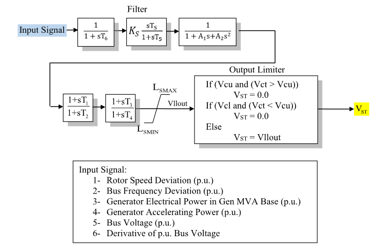

# **IEEE Type PSS1A Power System Stabilizer Model (PSS1A)**

PSS1A is an IEEE single-input power system stabilizer model.

## Notes

- `Ics` selects the stabilizer input signal shown in Fig. 1.
- The output limiter includes the $L_s$ limiter and voltage cutout logic shown
  in Fig. 1.
- $V_{\mathrm{cl}}$ and $V_{\mathrm{cu}}$ cutout thresholds are ignored when set
  to zero.

## Block Diagram

Standard PSS1A power system stabilizer model.



Figure 1: PSS1A block diagram. Figure courtesy of [PowerWorld](https://www.powerworld.com/WebHelp/)

## Model Parameters

Symbol                  | Units    | JSON     | Description                                | Typical Value | Note
------------------------|----------|----------|--------------------------------------------|---------------|------
$I_{\mathrm{cs}}$       | [index]  | `Ics`    | Stabilizer input code                      | -             | Selects input signal 1–6 in Fig. 1
$A_1$                   | [sec]    | `A1`     | Second-order filter denominator coefficient | -             | Block denominator term
$A_2$                   | [sec²]   | `A2`     | Second-order filter denominator coefficient | -             | Block denominator term
$T_1$                   | [sec]    | `T1`     | Lead–lag 1 numerator time constant         | -             |
$T_2$                   | [sec]    | `T2`     | Lead–lag 1 denominator time constant       | -             |
$T_3$                   | [sec]    | `T3`     | Lead–lag 2 numerator time constant         | -             |
$T_4$                   | [sec]    | `T4`     | Lead–lag 2 denominator time constant       | -             |
$T_5$                   | [sec]    | `T5`     | Washout time constant                      | -             | Block name: `T5`
$T_6$                   | [sec]    | `T6`     | Input-filter time constant                 | -             | Block name: `T6`
$K_s$                   | [p.u.]   | `Ks`     | Stabilizer gain                            | -             | Block name: `Ks`
$L_s^{\max}$            | [p.u.]   | `Lsmax`  | Maximum stabilizer output limit            | -             | Block name: `Lsmax`
$L_s^{\min}$            | [p.u.]   | `Lsmin`  | Minimum stabilizer output limit            | -             | Block name: `Lsmin`
$V_{\mathrm{cu}}$       | [p.u.]   | `Vcu`    | Upper voltage cutout threshold             | -             | Block name: `Vcu`
$V_{\mathrm{cl}}$       | [p.u.]   | `Vcl`    | Lower voltage cutout threshold             | -             | Block name: `Vcl`

### Parameter Validation

Invalid PSS1A parameter sets are rejected by the following checks. Let $\epsilon_T=10^{-3}$.

```math
\begin{aligned}
  T &\leftarrow \max\!\left(T, \epsilon_T\right)
    \quad T\in\{T_2,T_4,T_5,T_6\} \\
  I_{\mathrm{cs}}
    &\in \{1,2,3,4,5,6\} \\
  L_s^{\min}
    &\le 0 \le L_s^{\max} \\
  V_{\mathrm{cl}}
    &\ge 0 \\
  V_{\mathrm{cu}}
    &\ge 0 \\
  V_{\mathrm{cl}}
    &< V_{\mathrm{cu}}
    \quad\text{when}\quad
    V_{\mathrm{cl}}\ne 0,\ V_{\mathrm{cu}}\ne 0
\end{aligned}
```

### Model Derived Parameters

```math
\begin{aligned}
  n &=
    \begin{cases}
      2 & A_2 \ne 0 \\
      1 & A_2 = 0,\ A_1 \ne 0 \\
      0 & A_2 = A_1 = 0
    \end{cases}
\end{aligned}
```

## Model Ports

Name     | Port   | Init  | Description
---------|--------|-------|------
`input`  | Input  | Known | Stabilizer input signal
`vct`    | Input  | Known | Terminal voltage for cutout logic
`output` | Output | Known | Stabilizer output signal

## Model Variables

### Internal Variables

#### Differential

Symbol                  | Units  | Description                         | Note
------------------------|--------|-------------------------------------|------
$x_f$                   | [p.u.] | Input-filter state                  | Filter block in Fig. 1
$x_w$                   | [p.u.] | Washout state                       | Washout block in Fig. 1
$x_{n1}, x_{n2}$        | [p.u.] | Second-order filter states          | Filter denominator block in Fig. 1
$x_{\ell1}$             | [p.u.] | Lead–lag 1 state                    | Lead–lag 1 block in Fig. 1
$x_{\ell2}$             | [p.u.] | Lead–lag 2 state                    | Lead–lag 2 block in Fig. 1

#### Algebraic

Symbol                          | Units  | Description                         | Note
--------------------------------|--------|-------------------------------------|------
$u_f$                           | [p.u.] | Filtered stabilizer input           |
$v_w$                           | [p.u.] | Washout and gain output             |
$v_n$                           | [p.u.] | Second-order filter output          |
$v_{\ell1}$                     | [p.u.] | Lead–lag 1 output                   |
$v_{\ell2}$                     | [p.u.] | Lead–lag 2 output before limiter    |
$V_{\mathrm{ll}}^{\mathrm{out}}$ | [p.u.] | Signal after $L_s$ limiter          | Diagram label: `Vllout`
$s_{\mathrm{cut}}$              | [binary] | Voltage cutout indicator          | 1 when the output is cut out
$V_{\mathrm{ST}}$               | [p.u.] | Limited stabilizer signal           | Model output

### External Variables

#### Differential

None.

#### Algebraic

Symbol                 | Units  | Type  | Description                         | Note
-----------------------|--------|-------|-------------------------------------|------
$u$                    | [p.u.] | Known | Stabilizer input signal             | Selected by `Ics`
$V_{\mathrm{ct}}$      | [p.u.] | Known | Terminal voltage for cutout logic   |

## Model Equations

### Differential Equations

```math
\begin{aligned}
  0 &=
    -\dot{x}_f
    + \dfrac{1}{T_6}\left(u - x_f\right) \\
  0 &=
    -\dot{x}_w
    + \dfrac{1}{T_5}\left(u_f - x_w\right) \\
  0 &=
    -\dot{x}_{n1}
    + \begin{cases}
      0,
        & n = 0 \\
      \dfrac{1}{A_1}\left(-x_{n1} + v_w\right),
        & n = 1 \\
      x_{n2},
        & n = 2
    \end{cases} \\
  0 &=
    -\dot{x}_{n2}
    + \begin{cases}
      0,
        & n = 0,1 \\
      \dfrac{1}{A_2}\left(-x_{n1} - A_1x_{n2} + v_w\right),
        & n = 2
    \end{cases} \\
  0 &=
    -\dot{x}_{\ell1}
    + \dfrac{1}{T_2}\left(v_n - x_{\ell1}\right) \\
  0 &=
    -\dot{x}_{\ell2}
    + \dfrac{1}{T_4}\left(v_{\ell1} - x_{\ell2}\right)
\end{aligned}
```

### Algebraic Equations

```math
\begin{aligned}
  0 &=
    -u_f
    + x_f \\
  0 &=
    -v_w
    + K_s\left(u_f - x_w\right) \\
  0 &=
    -v_n
    + \begin{cases}
      v_w,
        & n = 0 \\
      x_{n1},
        & n = 1,2
    \end{cases} \\
  0 &=
    -v_{\ell1}
    + x_{\ell1}
    + \dfrac{T_1}{T_2}\left(v_n - x_{\ell1}\right) \\
  0 &=
    -v_{\ell2}
    + x_{\ell2}
    + \dfrac{T_3}{T_4}\left(v_{\ell1} - x_{\ell2}\right) \\
  0 &=
    -V_{\mathrm{ll}}^{\mathrm{out}}
    + \text{clamp}\left(v_{\ell2};\, L_s^{\min}, L_s^{\max}\right) \\
  0 &=
    -s_{\mathrm{cut}}
    + \begin{cases}
      \text{outside}\left(V_{\mathrm{ct}};\, V_{\mathrm{cl}}, V_{\mathrm{cu}}\right),
        & V_{\mathrm{cl}}\ne 0,\ V_{\mathrm{cu}}\ne 0 \\
      \sigma\left(V_{\mathrm{cl}} - V_{\mathrm{ct}}\right),
        & V_{\mathrm{cl}}\ne 0,\ V_{\mathrm{cu}} = 0 \\
      \sigma\left(V_{\mathrm{ct}} - V_{\mathrm{cu}}\right),
        & V_{\mathrm{cl}} = 0,\ V_{\mathrm{cu}}\ne 0 \\
      0,
        & V_{\mathrm{cl}} = V_{\mathrm{cu}} = 0
    \end{cases} \\
  0 &=
    -V_{\mathrm{ST}}
    + \left(1 - s_{\mathrm{cut}}\right)V_{\mathrm{ll}}^{\mathrm{out}}
\end{aligned}
```

CommonMath defines [clamp and outside](../../../../CommonMath.md#derived-functions)
and the [step function](../../../../CommonMath.md#primitives).

## Initialization

### Input Initialization

```math
\begin{aligned}
  u
    &\leftarrow \text{stabilizer input signal} \\
  V_{\mathrm{ct}}
    &\leftarrow \text{terminal voltage for cutout logic}
\end{aligned}
```

### Internal Initialization

Initialization is performed by evaluating the steady-state residuals in
dependency order. Let subscript $0$ denote initial values and set all internal
derivatives to zero:

```math
\begin{aligned}
  x_{f,0}
    &= u_0 \\
  u_{f,0}
    &= x_{f,0} \\
  x_{w,0}
    &= u_{f,0} \\
  v_{w,0}
    &= 0 \\
  x_{n1,0}
    &= 0 \\
  x_{n2,0}
    &= 0 \\
  v_{n,0}
    &= 0 \\
  x_{\ell1,0}
    &= 0 \\
  v_{\ell1,0}
    &= 0 \\
  x_{\ell2,0}
    &= 0 \\
  v_{\ell2,0}
    &= 0 \\
  V_{\mathrm{ll},0}^{\mathrm{out}}
    &= \text{clamp}\left(v_{\ell2,0};\, L_s^{\min}, L_s^{\max}\right) \\
  s_{\mathrm{cut},0}
    &=
    \begin{cases}
      \text{outside}\left(V_{\mathrm{ct},0};\, V_{\mathrm{cl}}, V_{\mathrm{cu}}\right),
        & V_{\mathrm{cl}}\ne 0,\ V_{\mathrm{cu}}\ne 0 \\
      \sigma\left(V_{\mathrm{cl}} - V_{\mathrm{ct},0}\right),
        & V_{\mathrm{cl}}\ne 0,\ V_{\mathrm{cu}} = 0 \\
      \sigma\left(V_{\mathrm{ct},0} - V_{\mathrm{cu}}\right),
        & V_{\mathrm{cl}} = 0,\ V_{\mathrm{cu}}\ne 0 \\
      0,
        & V_{\mathrm{cl}} = V_{\mathrm{cu}} = 0
    \end{cases} \\
  V_{\mathrm{ST},0}
    &= \left(1 - s_{\mathrm{cut},0}\right)V_{\mathrm{ll},0}^{\mathrm{out}}
\end{aligned}
```

### Output Initialization

None.

## Monitorable Outputs

Output | Units  | Description               | Note
-------|--------|---------------------------|------
`vst`  | [p.u.] | Limited stabilizer signal | Exported through `output` when assigned
