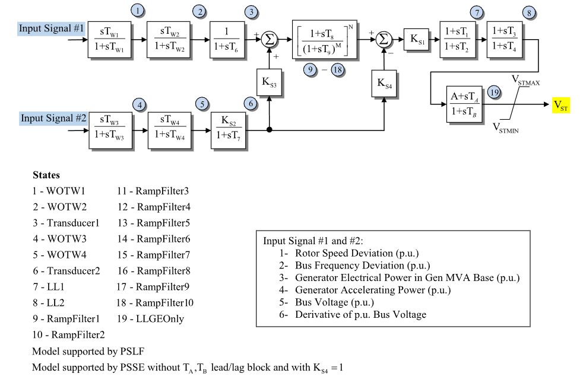

# **IEEE Type PSS2A Power System Stabilizer Model (PSS2A)**

PSS2A is an IEEE dual-input power system stabilizer model.

## Notes

- `Ics1` and `Ics2` select the stabilizer input signals shown in Fig. 1.
- The $A$, $T_A$, $T_B$ lead–lag block is the non-IEEE extension shown in Fig. 1.
- The ramp-tracking filter is represented by the ten ramp-filter states shown
  in Fig. 1.
- The diagram states correspond to PowerWorld state labels 1–19.

## Block Diagram

Standard PSS2A power system stabilizer model.



Figure 1: PSS2A block diagram. Figure courtesy of [PowerWorld](https://www.powerworld.com/WebHelp/)

## Model Parameters

Symbol                    | Units    | JSON      | Description                                | Typical Value | Note
--------------------------|----------|-----------|--------------------------------------------|---------------|------
$I_{\mathrm{cs}1}$        | [index]  | `Ics1`    | First stabilizer input code                | -             | Selects input signal 1–6 in Fig. 1
$I_{\mathrm{cs}2}$        | [index]  | `Ics2`    | Second stabilizer input code               | -             | Selects input signal 1–6 in Fig. 1
$M$                       | [-]      | `M`       | Ramp-tracking denominator order            | -             | Ramp-filter block in Fig. 1
$N$                       | [-]      | `N`       | Ramp-tracking numerator order              | -             | Must not exceed $M$
$T_{w1}$                  | [sec]    | `Tw1`     | First washout time constant on input 1     | -             | State 1 in Fig. 1
$T_{w2}$                  | [sec]    | `Tw2`     | Second washout time constant on input 1    | -             | State 2 in Fig. 1
$T_6$                     | [sec]    | `T6`      | Input-1 transducer time constant           | -             | State 3 in Fig. 1
$T_{w3}$                  | [sec]    | `Tw3`     | First washout time constant on input 2     | -             | State 4 in Fig. 1
$T_{w4}$                  | [sec]    | `Tw4`     | Second washout time constant on input 2    | -             | State 5 in Fig. 1
$T_7$                     | [sec]    | `T7`      | Input-2 transducer time constant           | -             | State 6 in Fig. 1
$K_{S2}$                  | [p.u.]   | `Ks2`     | Input-2 transducer gain                    | -             | Block name: `Ks2`
$K_{S3}$                  | [p.u.]   | `Ks3`     | Input-2 feedforward gain                   | -             | Block name: `Ks3`
$T_8$                     | [sec]    | `T8`      | Ramp-tracking numerator time constant      | -             | Ramp-filter block in Fig. 1
$T_9$                     | [sec]    | `T9`      | Ramp-tracking denominator time constant    | -             | Ramp-filter block in Fig. 1
$K_{S1}$                  | [p.u.]   | `Ks1`     | Stabilizer gain                            | -             | Block name: `Ks1`
$T_1$                     | [sec]    | `T1`      | Lead–lag 1 numerator time constant         | -             | State 7 in Fig. 1
$T_2$                     | [sec]    | `T2`      | Lead–lag 1 denominator time constant       | -             | State 7 in Fig. 1
$T_3$                     | [sec]    | `T3`      | Lead–lag 2 numerator time constant         | -             | State 8 in Fig. 1
$T_4$                     | [sec]    | `T4`      | Lead–lag 2 denominator time constant       | -             | State 8 in Fig. 1
$V_{\mathrm{ST}}^{\max}$ | [p.u.]   | `Vstmax`  | Maximum stabilizer output limit            | -             | Block name: `VSTMAX`
$V_{\mathrm{ST}}^{\min}$ | [p.u.]   | `Vstmin`  | Minimum stabilizer output limit            | -             | Block name: `VSTMIN`
$A$                       | [p.u.]   | `A`       | Final lead–lag numerical gain              | -             | Not in IEEE model
$T_A$                     | [sec]    | `Ta`      | Final lead–lag numerator time constant     | -             | Not in IEEE model
$T_B$                     | [sec]    | `Tb`      | Final lead–lag denominator time constant   | -             | Not in IEEE model
$K_{S4}$                  | [p.u.]   | `Ks4`     | Input-2 feedback gain                      | -             | Block name: `Ks4`

### Parameter Validation

Invalid PSS2A parameter sets are rejected by the following checks. Let $\epsilon_T=10^{-3}$.

```math
\begin{aligned}
  T &\leftarrow \max\!\left(T, \epsilon_T\right)
    \quad
    T\in\{
      T_{w1},T_{w2},T_6,T_{w3},T_{w4},T_7,T_9,T_2,T_4,T_B
    \} \\
  I_{\mathrm{cs}1}, I_{\mathrm{cs}2}
    &\in \{1,2,3,4,5,6\} \\
  M,N
    &\in \{0,1,\ldots,10\} \\
  N
    &\le M \\
  V_{\mathrm{ST}}^{\min}
    &\le 0 \le V_{\mathrm{ST}}^{\max}
\end{aligned}
```

The condition $N\le M$ rejects nonproper ramp-tracking filters.

### Model Derived Parameters

```math
\begin{aligned}
  b_i &=
    \begin{cases}
      1 & i \le N \\
      0 & i > N
    \end{cases}
    \quad i\in\{1,\ldots,10\}
\end{aligned}
```

The selector $b_i$ marks ramp-filter stages that use the $T_8$ lead term.

## Model Ports

Name     | Port   | Init  | Description
---------|--------|-------|------
`input1` | Input  | Known | Stabilizer input signal 1
`input2` | Input  | Known | Stabilizer input signal 2
`output` | Output | Known | Stabilizer output signal

## Model Variables

### Internal Variables

#### Differential

Symbol                         | Units  | Description                          | Note
-------------------------------|--------|--------------------------------------|------
$x_{w1}$                       | [p.u.] | Input-1 first washout state          | State 1 in Fig. 1; source label: `WOTW1`
$x_{w2}$                       | [p.u.] | Input-1 second washout state         | State 2 in Fig. 1; source label: `WOTW2`
$x_{t1}$                       | [p.u.] | Input-1 transducer state             | State 3 in Fig. 1; source label: `Transducer1`
$x_{w3}$                       | [p.u.] | Input-2 first washout state          | State 4 in Fig. 1; source label: `WOTW3`
$x_{w4}$                       | [p.u.] | Input-2 second washout state         | State 5 in Fig. 1; source label: `WOTW4`
$x_{t2}$                       | [p.u.] | Input-2 transducer state             | State 6 in Fig. 1; source label: `Transducer2`
$x_{\ell1}$                    | [p.u.] | Lead–lag 1 state                     | State 7 in Fig. 1; source label: `LL1`
$x_{\ell2}$                    | [p.u.] | Lead–lag 2 state                     | State 8 in Fig. 1; source label: `LL2`
$x_{r1},\ldots,x_{r10}$        | [p.u.] | Ramp-tracking filter states          | States 9–18 in Fig. 1
$x_{\ell g}$                   | [p.u.] | Final lead–lag extension state       | State 19 in Fig. 1; source label: `LLGEOnly`

#### Algebraic

Symbol                    | Units  | Description                              | Note
--------------------------|--------|------------------------------------------|------
$v_{w1}$                  | [p.u.] | Input-1 first washout output             |
$v_{w2}$                  | [p.u.] | Input-1 second washout output            |
$v_{t1}$                  | [p.u.] | Input-1 transducer output                |
$v_{w3}$                  | [p.u.] | Input-2 first washout output             |
$v_{w4}$                  | [p.u.] | Input-2 second washout output            |
$v_{t2}$                  | [p.u.] | Input-2 transducer output                |
$v_p$                     | [p.u.] | Ramp-tracking filter input               |
$z_0,\ldots,z_{10}$       | [p.u.] | Ramp-tracking filter stage signals       | $z_0=v_p$
$v_r$                     | [p.u.] | Ramp-tracking filter output              |
$v_s$                     | [p.u.] | Stabilizer signal before $K_{S1}$        |
$v_{S1}$                  | [p.u.] | Stabilizer signal after $K_{S1}$         |
$v_{\ell1}$               | [p.u.] | Lead–lag 1 output                        |
$v_{\ell2}$               | [p.u.] | Lead–lag 2 output                        |
$v_{\ell g}$              | [p.u.] | Final lead–lag extension output          |
$V_{\mathrm{ST}}$         | [p.u.] | Limited stabilizer signal                | Model output

### External Variables

#### Differential

None.

#### Algebraic

Symbol      | Units  | Type  | Description                   | Note
------------|--------|-------|-------------------------------|------
$u_1$       | [p.u.] | Known | Stabilizer input signal 1     | Selected by `Ics1`
$u_2$       | [p.u.] | Known | Stabilizer input signal 2     | Selected by `Ics2`

## Model Equations

### Differential Equations

```math
\begin{aligned}
  0 &=
    -\dot{x}_{w1}
    + \dfrac{1}{T_{w1}}\left(u_1 - x_{w1}\right) \\
  0 &=
    -\dot{x}_{w2}
    + \dfrac{1}{T_{w2}}\left(v_{w1} - x_{w2}\right) \\
  0 &=
    -\dot{x}_{t1}
    + \dfrac{1}{T_6}\left(v_{w2} - x_{t1}\right) \\
  0 &=
    -\dot{x}_{w3}
    + \dfrac{1}{T_{w3}}\left(u_2 - x_{w3}\right) \\
  0 &=
    -\dot{x}_{w4}
    + \dfrac{1}{T_{w4}}\left(v_{w3} - x_{w4}\right) \\
  0 &=
    -\dot{x}_{t2}
    + \dfrac{1}{T_7}\left(K_{S2}v_{w4} - x_{t2}\right) \\
  0 &=
    -\dot{x}_{ri}
    + \begin{cases}
      \dfrac{1}{T_9}\left(z_{i-1} - x_{ri}\right),
        & i \le M \\
      0,
        & i > M
    \end{cases}
    \quad i\in\{1,\ldots,10\} \\
  0 &=
    -\dot{x}_{\ell1}
    + \dfrac{1}{T_2}\left(v_{S1} - x_{\ell1}\right) \\
  0 &=
    -\dot{x}_{\ell2}
    + \dfrac{1}{T_4}\left(v_{\ell1} - x_{\ell2}\right) \\
  0 &=
    -\dot{x}_{\ell g}
    + \dfrac{1}{T_B}\left(v_{\ell2} - x_{\ell g}\right)
\end{aligned}
```

### Algebraic Equations

```math
\begin{aligned}
  0 &=
    -v_{w1}
    + u_1
    - x_{w1} \\
  0 &=
    -v_{w2}
    + v_{w1}
    - x_{w2} \\
  0 &=
    -v_{t1}
    + x_{t1} \\
  0 &=
    -v_{w3}
    + u_2
    - x_{w3} \\
  0 &=
    -v_{w4}
    + v_{w3}
    - x_{w4} \\
  0 &=
    -v_{t2}
    + x_{t2} \\
  0 &=
    -v_p
    + v_{t1}
    + K_{S3}v_{t2} \\
  0 &=
    -z_0
    + v_p \\
  0 &=
    -z_i
    + \begin{cases}
      x_{ri}
        + b_i\dfrac{T_8}{T_9}\left(z_{i-1} - x_{ri}\right),
        & i \le M \\
      0,
        & i > M
    \end{cases}
    \quad i\in\{1,\ldots,10\} \\
  0 &=
    -v_r
    + \begin{cases}
      z_0,
        & M = 0 \\
      z_M,
        & M > 0
    \end{cases} \\
  0 &=
    -v_s
    + v_r
    - K_{S4}v_{t2} \\
  0 &=
    -v_{S1}
    + K_{S1}v_s \\
  0 &=
    -v_{\ell1}
    + x_{\ell1}
    + \dfrac{T_1}{T_2}\left(v_{S1} - x_{\ell1}\right) \\
  0 &=
    -v_{\ell2}
    + x_{\ell2}
    + \dfrac{T_3}{T_4}\left(v_{\ell1} - x_{\ell2}\right) \\
  0 &=
    -v_{\ell g}
    + A x_{\ell g}
    + \dfrac{T_A}{T_B}\left(v_{\ell2} - x_{\ell g}\right) \\
  0 &=
    -V_{\mathrm{ST}}
    + \text{clamp}\left(v_{\ell g};\, V_{\mathrm{ST}}^{\min}, V_{\mathrm{ST}}^{\max}\right)
\end{aligned}
```

CommonMath defines [clamp](../../../../CommonMath.md#derived-functions).

## Initialization

### Input Initialization

```math
\begin{aligned}
  u_1
    &\leftarrow \text{stabilizer input signal 1} \\
  u_2
    &\leftarrow \text{stabilizer input signal 2}
\end{aligned}
```

### Internal Initialization

Initialization is performed by evaluating the steady-state residuals in
dependency order. Let subscript $0$ denote initial values and set all internal
derivatives to zero:

```math
\begin{aligned}
  x_{w1,0}
    &= u_{1,0} \\
  v_{w1,0}
    &= 0 \\
  x_{w2,0}
    &= v_{w1,0} \\
  v_{w2,0}
    &= 0 \\
  x_{t1,0}
    &= v_{w2,0} \\
  v_{t1,0}
    &= x_{t1,0} \\
  x_{w3,0}
    &= u_{2,0} \\
  v_{w3,0}
    &= 0 \\
  x_{w4,0}
    &= v_{w3,0} \\
  v_{w4,0}
    &= 0 \\
  x_{t2,0}
    &= K_{S2}v_{w4,0} \\
  v_{t2,0}
    &= x_{t2,0} \\
  v_{p,0}
    &= v_{t1,0} + K_{S3}v_{t2,0} \\
  z_{0,0}
    &= v_{p,0} \\
  x_{ri,0}
    &= 0
    \quad i\in\{1,\ldots,10\} \\
  z_{i,0}
    &= 0
    \quad i\in\{1,\ldots,10\} \\
  v_{r,0}
    &= z_{M,0} \\
  v_{s,0}
    &= v_{r,0} - K_{S4}v_{t2,0} \\
  v_{S1,0}
    &= K_{S1}v_{s,0} \\
  x_{\ell1,0}
    &= v_{S1,0} \\
  v_{\ell1,0}
    &= x_{\ell1,0} \\
  x_{\ell2,0}
    &= v_{\ell1,0} \\
  v_{\ell2,0}
    &= x_{\ell2,0} \\
  x_{\ell g,0}
    &= v_{\ell2,0} \\
  v_{\ell g,0}
    &= A x_{\ell g,0} \\
  V_{\mathrm{ST},0}
    &= \text{clamp}\left(v_{\ell g,0};\,
                         V_{\mathrm{ST}}^{\min},
                         V_{\mathrm{ST}}^{\max}\right)
\end{aligned}
```

### Output Initialization

None.

## Monitorable Outputs

Output | Units  | Description               | Note
-------|--------|---------------------------|------
`vst`  | [p.u.] | Limited stabilizer signal | Exported through `output` when assigned
