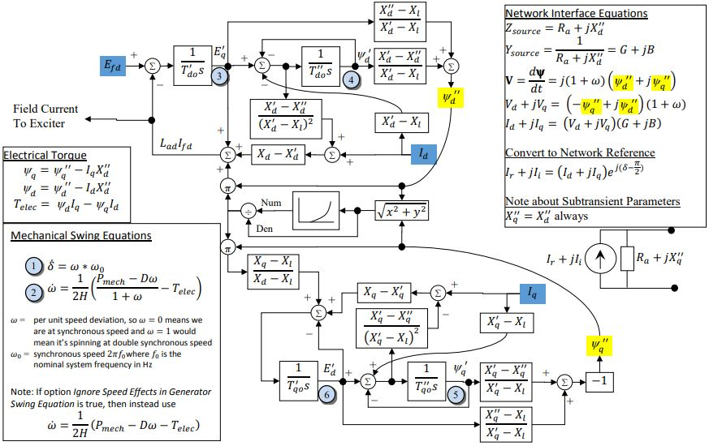

# GENROU

This synchronous machine model is 6th order and is specifically designed for round rotor machines. It is a standard model used in phasor-domain industry stability studies.
See the [General Synchronous Machine Model](../README.md) for general synchronous machine information.

Notes:
- $X_q''=X_d''$  (round rotor assumptions)
- $X''_{d}$ does not saturate
- Same relative amount of saturation occurs on both $d$ and $q$ axis

## Block Diagram
<div align="center">
   

  Figure 2: GENROU. Figure courtesy of
  [PowerWorld](https://www.powerworld.com/WebHelp/)
</div>

## Model Parameters

Symbol     | Units   | Description                     | Typical Value | Note
-----------|---------|---------------------------------|---------------| ------
$P_0$      | [p.u.]  | Initial active power injection  | 1.0 |
$Q_0$      | [p.u.]  | Initial reactive power injection | 0.0 |
$H$        | [s]     | rotor inertia                   | 3
$D$        | [p.u.]  | damping coefficient             | 0
$R_a$      | [p.u.]  | winding resistance              | 0
$R_c$      | [p.u.]  | Compensation resistance for $E_C$ sensed by exciter | 0
$X_c$      | [p.u.]  | Compensation reactance for $E_C$ sensed by exciter | 0.06
$T'_{d0}$  | [s]     | Open circuit direct axis transient time const. | 7 |
$T''_{d0}$ | [s]     | Open circuit direct axis sub-transient time const. | 0.04 |
$T'_{q0}$  | [s]     | Open circuit quadrature axis transient time const. | 0.75 |
$T''_{q0}$ | [s]     | Open circuit quadrature axis sub-transient time const. | 0.05 |
$X_{d}$    | [p.u.]  | Direct axis synchronous reactance | 2.1 |
$X'_{d}$   | [p.u.]  | Direct axis transient reactance | 0.2 |
$X''_{d}$  | [p.u.]  | Direct axis sub-transient reactance | 0.18 |
$X_{q}$    | [p.u.]  | Quadrature axis synchronous reactance | 0.5 |
$X'_{q}$   | [p.u.]  | Quadrature axis transient reactance | 0.5 |
$X''_{q}$  | [p.u.]  | Quadrature axis sub-transient reactance | 0.18 |
$X_{\ell}$ | [p.u.]  | Stator leakage reactance        | 0.15 |
$S_{10}$   | [p.u.]  | Saturation factor at 1.0 pu flux | 0 |
$S_{12}$   | [p.u.]  | Saturation factor at 1.2 pu flux | 0 |
$S_\mathrm{mach}$ | [MVA] | Machine power base        | 100 |

The line-drop compensation impedance $R_c + jX_c$ represents the impedance
between the generator terminal and the point at which the exciter senses
voltage (e.g., the high side of the step-up transformer). The implemented
output is
$E_C=\sqrt{(V_r + R_c I_r - X_c I_i)^2 + (V_i + R_c I_i + X_c I_r)^2}$.
A nonzero $X_c$ can keep $|E_C|$ supported by reactive current during fault
transients without raising the physical bus voltage.

### Model Derived Parameters
``` math
\begin{aligned}
  G      &=  \dfrac{R_a}{R_a^2+(X_q'')^2} &
  B      &= -\dfrac{X_q''}{R_a^2+(X_q'')^2}\\
  S_A    &= \dfrac{1.2\sqrt{S_{10}/S_{12}} +1}{\sqrt{S_{10}/S_{12}} +1} &
  S_B    &= \dfrac{1.2\sqrt{S_{10}/S_{12}} -1}{\sqrt{S_{10}/S_{12}} -1} \\
  X_{d1} &= X_d-X_d'                 & X_{q1} &= X_q-X_q' \\
  X_{d2} &= X_d'-X_\ell              & X_{q2} &= X_q'-X_\ell\\
  X_{d3} &= (X_d'-X_d'')/X_{d2}^2    & X_{q3} &= (X_q'-X_q'')/X_{q2}^2 \\
  X_{d4} &= (X_d'-X_d'')/X_{d2}      & X_{q4} &= (X_q'-X_q'')/X_{q2} \\
  X_{d5} &= (X_d''-X_\ell)/X_{d2}    & X_{q5} &= (X_q''-X_\ell)/X_{q2}\\
  X_{qd} &= (X_q-X_\ell)/(X_d-X_\ell) \\
  f_\mathrm{base} &= f_\mathrm{sys} &
  S_\mathrm{mach,VA} &= 10^6 S_\mathrm{mach}
\end{aligned}
```

System bases are taken from the system at initialization.

## Model Variables

### Internal Variables

#### Differential

Symbol    | Units  | Description                       | Note
----------|--------|-----------------------------------|-------
$\delta$  | [rad]  | Machine internal rotor angle      |
$\omega$  | [p.u.] | Machine Speed Deviation           | Optionally read by governor or stabilizer component
$\psi'_d$ | [p.u.] | Direct axis subtransient flux     |
$\psi'_q$ | [p.u.] | Quadrature axis subtransient flux |
$E'_d$    | [p.u.] | Direct axis transient flux        |
$E'_q$    | [p.u.] | Quadrature axis subtransient flux |

#### Algebraic
Symbol      | Units  | Description                       | Note
------------|--------|---------------------------------  | ------
$V_d$       | [p.u.] | Machine internal voltage, d-axis  |
$V_q$       | [p.u.] | Machine internal voltage, q-axis  |
$I_d$       | [p.u.] | Terminal current, d-axis          |
$I_q$       | [p.u.] | Terminal current, q-axis          |
$I_r$       | [p.u.] | Terminal current, real component on network reference frame      | Read by bus and optionally by controllers
$I_i$       | [p.u.] | Terminal current, imaginary component on network reference frame | Read by bus and optionally by controllers
$\psi''_q$  | [p.u.] | Total q-axis subtransient flux    |
$\psi''_d$  | [p.u.] | Total d-axis subtransient flux    |
$\psi''$    | [p.u.] | Machine total subtransient flux   |
$T_{e}$     | [p.u.] | Electrical torque                 |
$k_{sat}$   | [p.u.] | Saturation coefficient            |
$E_C$       | [p.u.] | Compensated terminal voltage      | Sent to exciter

### External Variables

#### Differential
None.

#### Algebraic
Symbol   | Units  | Description                     | Note
---------|--------|---------------------------------| ------
$V_r$    | [p.u.] | Terminal voltage, real component on network reference frame      | owned by bus object
$V_i$    | [p.u.] | Terminal voltage, imaginary component on network reference frame | owned by bus object
$P_{m}$  | [p.u.] | Mechanical power from the prime mover            | Owned by governor, constant if no governor is connected to the machine
$E_{fd}$ | [p.u.] | Field winding voltage from the excitation system | Owned by exciter, constant if no exciter is connected to the machine

## Model Equations

### Differential Equations

``` math
\begin{aligned}
  0 &= -\dot\delta              + \omega\cdot 2\pi f_\mathrm{base} \\
  0 &= -2H\,\dot\omega          + \dfrac{P_{m}-D\omega}{1+\omega} - T_{elec} \\
  0 &= -T''_{d0}\,\dot{\psi}'_{d} + E'_{q}-\psi'_{d}-X_{d2}I_{d} \\
  0 &= -T''_{q0}\,\dot{\psi}'_{q} + E'_{d}-\psi'_{q}+X_{q2}I_{q} \\
  0 &= -T'_{q0}\,\dot{E}'_{d}   - E'_{d}+X_{q1}
      (I_{q}-X_{q3}(E'_{d}-\psi'_{q}+X_{q2}I_{q}))
      + X_{qd}\psi''_{q}k_{sat} \\
  0 &= -T'_{d0}\,\dot{E}'_{q}   + E_{fd}-E'_{q}-X_{d1}
      (I_{d}+X_{d3}(E'_{q}-\psi'_{d}-X_{d2}I_{d}))
      -\psi''_{d}k_{sat} \\
\end{aligned}
```

### Algebraic Equations
Note that for implementation purposes, some of these equations may be simplified into functions and the internal variables eliminated. Nevertheless, for modeling clarity and conformance to typical practice, the full equations are given here.
``` math
\begin{aligned}
  0 &= -\psi''_{q} -E'_{d}X_{q5} - \psi'_{q}X_{q4} \\
  0 &= -\psi''_{d} +E'_{q}X_{d5} + \psi'_{d}X_{d4}\\
  0 &= -(\psi'')^2 + (\psi''_{d})^2+(\psi''_{q})^2 \\
  0 &= -V_{d} -\psi''_{q}(1+\omega)\\
  0 &= -V_{q}  +\psi''_{d}(1+\omega)\\
  0 &= -T_{elec} +(\psi''_{d} - I_dX_d'')I_q-(\psi''_{q} - I_qX_d'')I_d \\
  0 &= -k_{sat} + S_B(\psi''-S_A)^2 \\
  0 &= -I_d + I_r \sin(\delta) - I_i \cos(\delta) \\
  0 &= -I_q + I_r \cos(\delta) + I_i \sin(\delta) \\
  0 &= -I_r + G (V_d \sin(\delta) + V_q \cos(\delta) - V_r) - B (V_d \cos(\delta) + V_q \sin(\delta) - V_i) \\
  0 &= -I_i + B (V_d \sin(\delta) + V_q \cos(\delta) - V_r) + G (V_d \cos(\delta) + V_q \sin(\delta) - V_i) \\
  0 &= -E_C^2 + (V_r + R_c I_r - X_c I_i)^2 + (V_i + R_c I_i + X_c I_r)^2
\end{aligned}
```

## Initialization

### Without Saturation
Presume there is no saturation to simplify the solution procedure for the initial
conditions.

Using the power-flow solution, we have explicit solutions for the following
variables. The internal variables $I_d$, $I_q$, $V_d$, and $V_q$ are calculated
from the network interface equations. The remaining are algebraically solved
from the steady-state initial conditions.
``` math
\begin{aligned}
\omega &= 0 \\
\delta &= \text{arg} \left[V_r + jV_i + (R_a + jX_q) (I_r + jI_i)\right] \\
  \psi^{''}_{d} &= V_q \\
  \psi^{''}_{q} &= -V_d \\
  \psi^{''} &= \sqrt{(\psi''_{d})^2+(\psi''_{q})^2} \\
  k_{sat}     &=
    \begin{cases}
      S_B(\psi^{''}-S_A)^2, & \psi^{''} > S_A\\
      0, & \psi^{''} \le S_A
    \end{cases}\\
  T_{elec}    &= (\psi''_{d} - I_dX_d^{''})I_q-(\psi''_{q} - I_qX_d^{''})I_d \\
  P_{m}    &= T_{elec} \\
  \psi_d'  &= \psi_d'' - (X_d'' - X_\ell)I_d \\
  \psi_q'  &= (X_q'' - X_\ell)I_q - \psi_q'' \\
  E^{'}_d     &=\psi^{'}_q - X_{q2}I_q \\
  E^{'}_q     &=\psi^{'}_d + X_{d2}I_d \\
  E_{fd}      &= E'_{q}+X_{d1}I_{d}+\psi^{''}_{d}k_{sat} \\
\end{aligned}
```

### With Saturation
It is important to point out that finding the initial value of $\delta$ for
the model without saturation, the direct method can be used. In case saturation
is considered, some "clever" math is needed. Key insight for determining initial
$\delta$ is that the magnitude of the saturation, which depends upon the magnitude
of $\psi''$, which is independent of $\delta$.

``` math
\begin{aligned}
  \delta=\tan^{-1}
  \left[
    \dfrac{(V_{i}+R_{a}I_{i})k_{sat}+(k_{sat}X''_{d}+X_{q}-X''_{q})I_{r}}
          {(V_{r}+R_{a}I_{r})k_{sat}-(k_{sat}X''_{d}+X_{q}-X''_{q})I_{i}}
  \right]
\end{aligned}
```

## Model Outputs

Symbol     | Units  | Description                       | Note
-----------|--------|-----------------------------------|------
$I_r$      | [p.u.] | Terminal current, real component on network reference frame | Oriented leaving the machine, system base
$I_i$      | [p.u.] | Terminal current, imaginary component on network reference frame | Oriented leaving the machine, system base
$P$        | [p.u.] | Active power, $V_rI_r+V_iI_i$     | Oriented leaving the machine, system base
$Q$        | [p.u.] | Reactive power, $V_iI_r-V_rI_i$   | Oriented leaving the machine, system base
$\delta$   | [rad]  | Machine internal rotor angle      |
$\omega$   | [p.u.] | Machine speed deviation           | $\omega=0$ at synchronous speed
$\text{speed}$ | [p.u.] | Per-unit machine speed            | $1+\omega$
