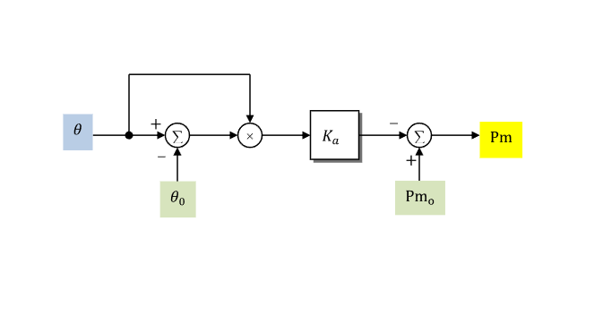

# **Wind Turbine Generator Aerodynamic Model (WTGARA)**

WTGARA is a WECC wind-turbine generator aerodynamic model.

## Notes

- WTGARA corresponds to the source model `WTGAR_A`.
- The equivalent PTI source model name is `WTARA1`.
- When used with WTGTA, connect WTGARA `pm` to WTGTA `pm`.
- Mechanical-power signal output is on system base.
- Internal aerodynamic power quantities are on component base.

## Block Diagram

Standard WTGARA aerodynamic model.



Figure 1: WTGARA block diagram. Figure courtesy of [PowerWorld](https://www.powerworld.com/WebHelp/)

## Model Parameters

Symbol                              | Units        | JSON    | Description                                             | Typical Value | Note
------------------------------------|--------------|---------|---------------------------------------------------------|---------------|------
$S^\mathrm{base}$                   | [MVA]        | `mva`   | WTGARA component power base                             | 100.0         | Required positive value; source label: `MVABase`
$K_a$                               | [p.u./deg^2] | `Ka`    | Aerodynamic gain factor                                 | -             | Block name: `Ka`
$P_{\text{m},0}$                    | [p.u.]       | `Pm0`   | Prior mechanical power                                  | -             | System base; block name: `Pm0`
$\theta_0$                          | [deg]        | `Theta` | Prior initial blade pitch angle                         | -             | Block name: `Theta`

### Parameter Validation

Invalid WTGARA parameter sets are rejected by the following checks.

```math
\begin{aligned}
  S^\mathrm{base}
    &> 0
\end{aligned}
```

### Model Derived Parameters

```math
\begin{aligned}
  k_{\mathrm{base}}
    &= \dfrac{S^\mathrm{sys}}{S^\mathrm{base}}
\end{aligned}
```

## Model Ports

Name    | Port   | Init    | Description
--------|--------|---------|------
`theta` | Input  | Unknown | Blade-pitch angle
`pm`    | Output | Known   | Mechanical-power output

## Model Variables

### Internal Variables

#### Differential

None.

#### Algebraic

Symbol                              | Units  | Description                         | Note
------------------------------------|--------|-------------------------------------|------
$P_\text{m}$                        | [p.u.] | Mechanical-power output             | System base; signal port `pm`

### External Variables

#### Differential

None.

#### Algebraic

Symbol                              | Units  | Type    | Description                         | Note
------------------------------------|--------|---------|-------------------------------------|------
$\theta$                            | [deg]  | Unknown | Blade-pitch angle                   | Signal port `theta`

## Model Equations

### Differential Equations

None.

### Algebraic Equations

```math
\begin{aligned}
  0 &=
    -k_{\mathrm{base}}\left(P_\text{m} - P_{\text{m},0}\right)
    - K_a\theta\left(\theta - \theta_0\right)
\end{aligned}
```

## Initialization

### Input Initialization

```math
\begin{aligned}
  P_\text{m}
    &\leftarrow \text{mechanical-power start on system base}
\end{aligned}
```

### Internal Initialization

None.

### Output Initialization

```math
\begin{aligned}
  \theta
    &\leftarrow
      \begin{cases}
        \dfrac{1}{2}
        \left[
          \theta_0
          + \sqrt{
            \theta_0^2
            - \dfrac{4k_{\mathrm{base}}}{K_a}
              \left(P_\text{m} - P_{\text{m},0}\right)
          }
        \right] & K_a\ne 0 \\
        \theta_0 & K_a = 0
      \end{cases}
\end{aligned}
```

Initialization requires $\theta_0\ge 0$, a nonnegative pitch radicand when
$K_a\ne 0$, and $P_\text{m} = P_{\text{m},0}$ when
$K_a=0$.

## Monitorable Outputs

Output          | Units  | Description                         | Note
----------------|--------|-------------------------------------|------
`pm`            | [p.u.] | Mechanical-power output             | $P_\text{m}$ (system base)
`dtheta`        | [deg]  | Pitch-angle deviation               | $\theta-\theta_0$
