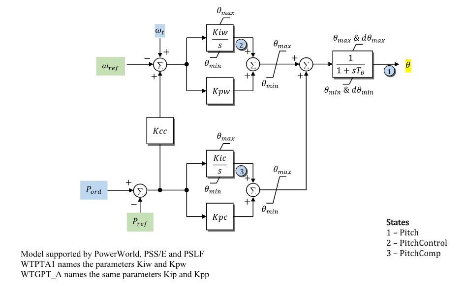

# **Wind Turbine Generator Pitch-Control Model (WTGPTA)**

WTGPTA is a WECC wind-turbine generator pitch-control model.

## Notes

- WTGPTA corresponds to the source model `WTGPT_A`.
- The equivalent `WTPTA1` source model names $K_{\mathrm{ip}}$ and
  $K_{\mathrm{pp}}$ as `Kiw` and `Kpw`.
- Signal ports and active-power commands are on system base.
- Pitch-control states and outputs are in degrees.

## Block Diagram

Standard WTGPTA pitch-control model.



Figure 1: WTGPTA block diagram. Figure courtesy of [PowerWorld](https://www.powerworld.com/WebHelp/)

## Model Parameters

Symbol                              | Units         | JSON        | Description                                             | Typical Value | Note
------------------------------------|---------------|-------------|---------------------------------------------------------|---------------|------
$S^\mathrm{base}$                   | [MVA]         | `mva`       | WTGPTA component power base                             | 100.0         | Required positive value; source label: `MVABase`
$T_\theta$                          | [sec]         | `Tp`        | Blade-pitch response time constant                      | -             | State 1 in Fig. 1
$K_{\mathrm{pp}}$                   | [deg/p.u.]    | `Kpp`       | Speed-control proportional gain                         | -             | `WTPTA1` source label: `Kpw`
$K_{\mathrm{ip}}$                   | [deg/p.u./s]  | `Kip`       | Speed-control integral gain                             | -             | State 2 path; `WTPTA1` source label: `Kiw`
$K_{\mathrm{pc}}$                   | [deg/p.u.]    | `Kpc`       | Pitch-compensator proportional gain                     | -             | Block name: `Kpc`
$K_{\mathrm{ic}}$                   | [deg/p.u./s]  | `Kic`       | Pitch-compensator integral gain                         | -             | State 3 path
$\theta^{\min}$                     | [deg]         | `ThetaMin`  | Minimum pitch angle                                     | -             | Block name: `ThetaMin`
$\theta^{\max}$                     | [deg]         | `ThetaMax`  | Maximum pitch angle                                     | -             | Block name: `ThetaMax`
$R_\theta^{\min}$                   | [deg/s]       | `RThetaMin` | Minimum pitch-rate limit                                | -             | Block name: `RThetaMin`
$R_\theta^{\max}$                   | [deg/s]       | `RThetaMax` | Maximum pitch-rate limit                                | -             | Block name: `RThetaMax`
$K_{\mathrm{cc}}$                   | [-]           | `Kcc`       | Cross-coupling gain from active-power error to speed-error path | -      | Block name: `Kcc`

### Parameter Validation

Invalid WTGPTA parameter sets are rejected by the following checks. Let $\epsilon_T=10^{-3}$.

```math
\begin{aligned}
  T_\theta
    &\leftarrow \max\!\left(T_\theta, \epsilon_T\right) \\
  S^\mathrm{base}
    &> 0 \\
  \theta^{\min}
    &\le \theta^{\max} \\
  R_\theta^{\min}
    &\le 0 \le R_\theta^{\max}
\end{aligned}
```

### Model Derived Parameters

```math
\begin{aligned}
  k_{\mathrm{base}}
    &= \dfrac{S^\mathrm{sys}}{S^\mathrm{base}}
\end{aligned}
```

## Model Ports

Name     | Port   | Init    | Description
---------|--------|---------|------
`omegat` | Input  | Unknown | Turbine rotor speed
`pord`   | Input  | Unknown | Active-power order feedback
`wref`   | Input  | Known   | Rotor-speed reference
`pref`   | Input  | Known   | Active-power reference
`theta`  | Output | Known   | Blade-pitch angle output

## Model Variables

### Internal Variables

#### Differential

Symbol                              | Units | Description                         | Note
------------------------------------|-------|-------------------------------------|------
$\theta$                            | [deg] | Blade-pitch angle                   | State 1 in Fig. 1
$x_\omega^\mathrm{I}$               | [deg] | Speed-control integral state        | State 2 in Fig. 1; source label: `PitchControl`
$x_P^\mathrm{I}$                    | [deg] | Pitch-compensator integral state    | State 3 in Fig. 1; source label: `PitchComp`

#### Algebraic

Symbol                              | Units    | Description                         | Note
------------------------------------|----------|-------------------------------------|------
$e_\omega$                          | [p.u.]   | Speed-control error                 |
$e_P$                               | [p.u.]   | Active-power command error          | Component base
$\theta_\omega$                     | [deg]    | Limited speed-control pitch command |
$\theta_P$                          | [deg]    | Limited active-power pitch-compensator command |
$\theta^\mathrm{cmd}$               | [deg]    | Combined pitch command before blade response |
$r_\theta$                          | [deg/s]  | Rate-limited pitch derivative target |

### External Variables

#### Differential
None.

#### Algebraic

Symbol                               | Units  | Type    | Description                       | Note
-------------------------------------|--------|---------|-----------------------------------|------
$\omega_t$                           | [p.u.] | Unknown | Turbine rotor speed               | Signal port `omegat`
$P^\mathrm{ord}$                     | [p.u.] | Unknown | Active-power order feedback       | Signal port `pord`; system base
$\omega^\mathrm{ref}$                | [p.u.] | Known   | Rotor-speed reference             | Optional signal port `wref`
$P^\mathrm{ref}$                     | [p.u.] | Known   | Active-power reference            | Optional signal port `pref`; system base

## Model Equations

### Differential Equations

```math
\begin{aligned}
  0 &=
    -\dot{\theta}
    + \text{antiwindup}
      \left(\theta, r_\theta;\, \theta^{\min}, \theta^{\max}\right) \\
  0 &=
    -\dot{x}_\omega^\mathrm{I}
    + \text{antiwindup}
      \left(x_\omega^\mathrm{I}, K_{\mathrm{ip}}e_\omega;\,
            \theta^{\min}, \theta^{\max}\right) \\
  0 &=
    -\dot{x}_P^\mathrm{I}
    + \text{antiwindup}
      \left(x_P^\mathrm{I}, K_{\mathrm{ic}}e_P;\,
            \theta^{\min}, \theta^{\max}\right)
\end{aligned}
```

CommonMath defines the [Anti-Windup](../../../../CommonMath.md#anti-windup-indicator)
target and smooth approximation.

### Algebraic Equations

```math
\begin{aligned}
  0 &=
    -e_P
    + k_{\mathrm{base}}
      \left(P^\mathrm{ord} - P^\mathrm{ref}\right) \\
  0 &=
    -e_\omega
    + \omega_t
    - \omega^\mathrm{ref}
    + K_{\mathrm{cc}}e_P \\
  0 &=
    -\theta_\omega
    + \text{clamp}
      \left(K_{\mathrm{pp}}e_\omega + x_\omega^\mathrm{I};\,
            \theta^{\min}, \theta^{\max}\right) \\
  0 &=
    -\theta_P
    + \text{clamp}
      \left(K_{\mathrm{pc}}e_P + x_P^\mathrm{I};\,
            \theta^{\min}, \theta^{\max}\right) \\
  0 &=
    -\theta^\mathrm{cmd}
    + \theta_\omega
    + \theta_P \\
  0 &=
    -r_\theta
    + \text{clamp}
      \left(
        \dfrac{\theta^\mathrm{cmd} - \theta}{T_\theta};\,
        R_\theta^{\min},\,
        R_\theta^{\max}
      \right)
\end{aligned}
```

CommonMath defines [clamp](../../../../CommonMath.md#derived-functions).

## Initialization

### Input Initialization

```math
\begin{aligned}
  \theta
    &\leftarrow \text{blade-pitch angle start} \\
  \omega^\mathrm{ref}
    &\leftarrow \text{rotor-speed reference start} \\
  P^\mathrm{ref}
    &\leftarrow \text{active-power reference start on system base}
\end{aligned}
```

### Internal Initialization

Initialization is performed by evaluating the steady-state residuals in
dependency order. Let subscript $0$ denote initial values and set all internal
derivatives to zero:

```math
\begin{aligned}
  e_{P,0}
    &= 0 \\
  e_{\omega,0}
    &= 0 \\
  x_{P,0}^\mathrm{I}
    &= 0 \\
  \theta_{P,0}
    &= 0 \\
  x_{\omega,0}^\mathrm{I}
    &= \theta_0 \\
  \theta_{\omega,0}
    &= \theta_0 \\
  \theta_0^\mathrm{cmd}
    &= \theta_0 \\
  r_{\theta,0}
    &= 0
\end{aligned}
```

### Output Initialization

```math
\begin{aligned}
  \omega_t
    &\leftarrow \omega_0^\mathrm{ref} \\
  P^\mathrm{ord}
    &\leftarrow P_0^\mathrm{ref}
\end{aligned}
```

Initialization rejects pitch starts outside
$[\theta^{\min},\theta^{\max}]$ and nonzero WTGPTA antiwindup rates.

## Monitorable Outputs

Output          | Units   | Description                         | Note
----------------|---------|-------------------------------------|------
`theta`         | [deg]   | Blade-pitch angle                   | $\theta$
`theta_cmd`     | [deg]   | Combined pitch command before blade response | $\theta^\mathrm{cmd}$
`theta_speed`   | [deg]   | Limited speed-control pitch command | $\theta_\omega$
`theta_power`   | [deg]   | Limited active-power pitch-compensator command | $\theta_P$
`eomega`        | [p.u.]  | Speed-control error                 | $e_\omega$
`ep`            | [p.u.]  | Active-power command error          | $e_P$ (component base)
