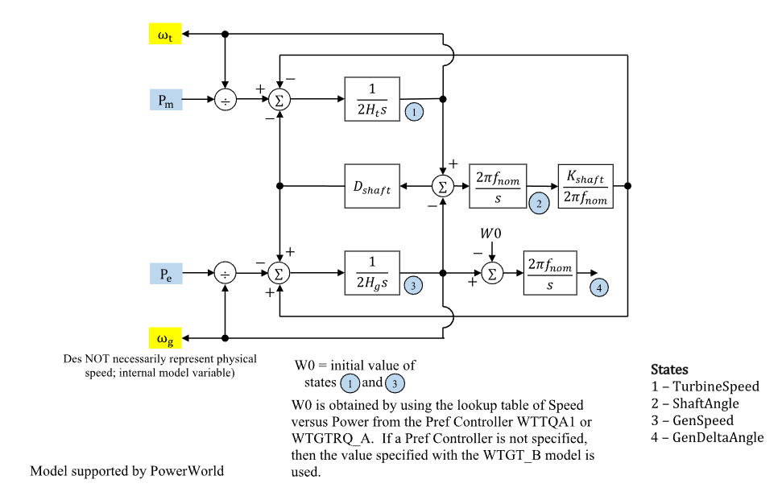

# **Wind Turbine Generator Drive-Train Model (WTGTA)**

WTGTA is a WECC wind-turbine generator two-mass drive-train model.

## Notes

- WTGTA corresponds to the source model `WTGT_A`.
- When used with WTGARA, connect WTGARA `pm` to WTGTA `pm`.
- When used with WTGPTA, connect WTGTA `omegat` to WTGPTA `omegat`.
- When used with WTGTRQA, connect WTGTA `omegag` to WTGTRQA `omegag`.
- Power signal inputs are on system base.
- Internal torque quantities are on component base.
- $\omega_g$ is an internal model variable and does not necessarily represent a
  physical generator speed measurement.

## Block Diagram

Standard WTGTA drive-train model.



Figure 1: WTGTA block diagram. Figure courtesy of [PowerWorld](https://www.powerworld.com/WebHelp/)

## Model Parameters

Symbol                              | Units        | JSON      | Description                                             | Typical Value | Note
------------------------------------|--------------|-----------|---------------------------------------------------------|---------------|------
$H_t$                               | [MW sec/MVA] | `Ht`      | Turbine inertia                                         | -             | State 1 path
$H_g$                               | [MW sec/MVA] | `Hg`      | Generator inertia                                       | -             | State 3 path
$D^\mathrm{shaft}$                  | [p.u.]       | `DShaft`  | Shaft damping coefficient                               | -             | Block name: `Dshaft`
$K^\mathrm{shaft}$                  | [p.u.]       | `KShaft`  | Shaft spring constant                                   | -             | Block name: `Kshaft`
$S^\mathrm{base}$                   | [MVA]        | `mva`     | WTGTA component power base                              | 100.0         | Required positive value; source label: `MWCap`
$\omega_0$                          | [p.u.]       | `W0`      | Initial speed                                           | -             | Diagram label: `W0`

### Parameter Validation

Invalid WTGTA parameter sets are rejected by the following checks.

```math
\begin{aligned}
  H_t, H_g
    &> 0 \\
  D^\mathrm{shaft}
    &\ge 0 \\
  K^\mathrm{shaft}
    &> 0 \\
  S^\mathrm{base}
    &> 0 \\
  \omega_0
    &> 0
\end{aligned}
```

### Model Derived Parameters

```math
\begin{aligned}
  k_{\mathrm{base}}
    &= \dfrac{S^\mathrm{sys}}{S^\mathrm{base}} \\
  \omega_s
    &= 2\pi f_{\mathrm{nom}}
\end{aligned}
```

Here $f_{\mathrm{nom}}$ is the nominal system frequency.

## Model Ports

Name     | Port   | Init    | Description
---------|--------|---------|------
`pm`     | Input  | Unknown | Mechanical power
`pelec`  | Input  | Unknown | Electrical active-power feedback
`omegat` | Output | Known   | Turbine speed output
`omegag` | Output | Known   | Generator speed output

## Model Variables

### Internal Variables

#### Differential

Symbol                              | Units | Description                         | Note
------------------------------------|-------|-------------------------------------|------
$\omega_t$                          | [p.u.] | Turbine speed output                | State 1 in Fig. 1; signal port `omegat`
$\delta^\mathrm{shaft}$             | [rad] | Shaft angle                         | State 2 in Fig. 1
$\omega_g$                          | [p.u.] | Generator speed output              | State 3 in Fig. 1; signal port `omegag`
$\delta_g$                          | [rad] | Generator delta angle               | State 4 in Fig. 1

#### Algebraic

Symbol                              | Units  | Description                         | Note
------------------------------------|--------|-------------------------------------|------
$T_m$                               | [p.u.] | Mechanical torque                   | Component base
$T_e$                               | [p.u.] | Electrical torque                   | Component base
$T_{\mathrm{d}}$                    | [p.u.] | Shaft damping torque                | Component base
$T_{\mathrm{s}}$                    | [p.u.] | Shaft spring torque                 | Component base

### External Variables

#### Differential

None.

#### Algebraic

Symbol                              | Units  | Type  | Description                         | Note
------------------------------------|--------|-------|-------------------------------------|------
$P_\text{m}$                        | [p.u.] | Unknown | Mechanical power                   | Signal port `pm`; system base
$P_e$                               | [p.u.] | Unknown | Electrical active-power feedback   | Signal port `pelec`; system base

## Model Equations

### Differential Equations

```math
\begin{aligned}
  0 &=
    -\dot{\omega}_t
    + \dfrac{1}{2H_t}
      \left(T_m - T_{\mathrm{s}} - T_{\mathrm{d}}\right) \\
  0 &=
    -\dot{\delta}^\mathrm{shaft}
    + \omega_s\left(\omega_t - \omega_g\right) \\
  0 &=
    -\dot{\omega}_g
    + \dfrac{1}{2H_g}
      \left(T_{\mathrm{s}} + T_{\mathrm{d}} - T_e\right) \\
  0 &=
    -\dot{\delta}_g
    + \omega_s\left(\omega_g - \omega_0\right)
\end{aligned}
```

### Algebraic Equations

```math
\begin{aligned}
  0 &=
    -\omega_t T_m
    + k_{\mathrm{base}}P_\text{m} \\
  0 &=
    -\omega_g T_e
    + k_{\mathrm{base}}P_e \\
  0 &=
    -T_{\mathrm{d}}
    + D^\mathrm{shaft}\left(\omega_t - \omega_g\right) \\
  0 &=
    -\omega_s T_{\mathrm{s}}
    + K^\mathrm{shaft}\delta^\mathrm{shaft}
\end{aligned}
```

## Initialization

### Input Initialization

```math
\begin{aligned}
  \omega_t, \omega_g
    &\leftarrow \text{initial speeds}
\end{aligned}
```

### Internal Initialization

Initialization is performed by evaluating the steady-state residuals in
dependency order. Let subscript $0$ denote initial values and set all internal
derivatives to zero:

```math
\begin{aligned}
  T_{\mathrm{d},0}
    &= D^\mathrm{shaft}\left(\omega_{t,0} - \omega_{g,0}\right) \\
  T_{\mathrm{s},0}
    &= 0 \\
  T_{m,0}
    &= T_{\mathrm{s},0} + T_{\mathrm{d},0} \\
  T_{e,0}
    &= T_{\mathrm{s},0} + T_{\mathrm{d},0} \\
  \delta_0^\mathrm{shaft}
    &= 0 \\
  \delta_{g,0}
    &= 0
\end{aligned}
```

### Output Initialization

```math
\begin{aligned}
  P_\text{m}
    &\leftarrow \dfrac{\omega_{t,0}T_{m,0}}{k_{\mathrm{base}}} \\
  P_e
    &\leftarrow \dfrac{\omega_{g,0}T_{e,0}}{k_{\mathrm{base}}}
\end{aligned}
```

Initialization rejects starts with $\omega_{t,0}\ne \omega_{g,0}$ or
$\omega_{g,0}\ne \omega_0$.

## Monitorable Outputs

Output            | Units  | Description                         | Note
------------------|--------|-------------------------------------|------
`omegat`          | [p.u.] | Turbine speed                       | $\omega_t$
`omegag`          | [p.u.] | Generator speed                     | $\omega_g$
`shaft_angle`     | [rad]  | Shaft angle                         | $\delta^\mathrm{shaft}$
`gen_delta_angle` | [rad]  | Generator delta angle               | $\delta_g$
`tm`              | [p.u.] | Mechanical torque                   | $T_m$ (component base)
`te`              | [p.u.] | Electrical torque                   | $T_e$ (component base)
