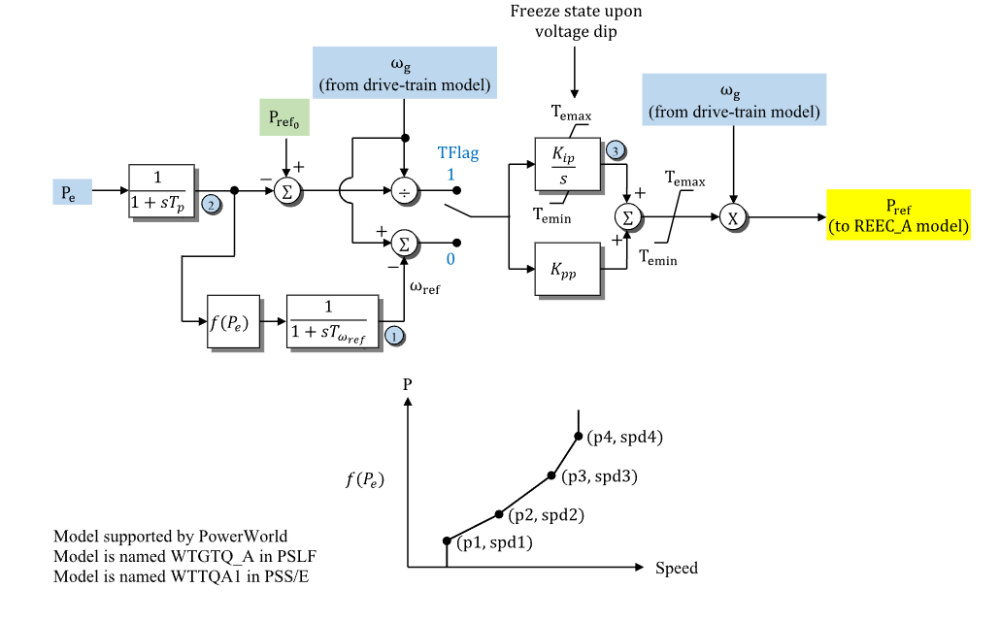

# **Wind Turbine Generator Torque-Control Model (WTGTRQA)**

WTGTRQA is a WECC wind-turbine generator torque-control model.

## Notes

- WTGTRQA corresponds to the source model `WTGTRQ_A`.
- The equivalent PTI source model name is `WTTQA1`.
- When used with REECA, connect WTGTRQA `pref` to REECA `pref`.
- When used with WTGPTA, connect WTGTRQA `wref` to WTGPTA `wref`.
- Active-power signal ports are on system base.
- Internal measured power and torque-controller quantities are on component base.

## Block Diagram

Standard WTGTRQA wind-turbine generator torque-control model.



Figure 1: WTGTRQA block diagram. Figure courtesy of [PowerWorld](https://www.powerworld.com/WebHelp/)

## Model Parameters

Symbol                              | Units    | JSON      | Description                                             | Typical Value | Note
------------------------------------|----------|-----------|---------------------------------------------------------|---------------|------
$S^\mathrm{base}$                   | [MVA]    | `mva`     | WTGTRQA component power base                            | 100.0         | Required positive value; source label: `MVABase`
$s_T$                               | [index]  | `Flag`    | Torque-controller mode flag                             | -             | 0 = torque control, 1 = speed control, 2 = torque control with $P^\mathrm{ref}_0$ upper torque limit
$K_{\mathrm{ip}}$                   | [p.u./s] | `Kip`     | Integral gain                                           | -             | State 3 path
$K_{\mathrm{pp}}$                   | [p.u.]   | `Kpp`     | Proportional gain                                       | -             | Block name: `Kpp`
$T_p$                               | [sec]    | `Tp`      | Electrical-power measurement lag time constant          | -             | State 2 in Fig. 1
$T_{\omega}^{\mathrm{ref}}$         | [sec]    | `Twref`   | Speed-reference lag time constant                       | -             | State 1 in Fig. 1
$T_e^{\max}$                        | [p.u.]   | `Temax`   | Maximum torque limit                                    | -             | Block name: `Temax`
$T_e^{\min}$                        | [p.u.]   | `Temin`   | Minimum torque limit                                    | -             | Block name: `Temin`
$P_1$                               | [p.u.]   | `P1`      | Power point 1 for speed-reference curve                 | -             | Component base
$\omega_1$                          | [p.u.]   | `Speed1`  | Speed point 1 for speed-reference curve                 | -             |
$P_2$                               | [p.u.]   | `P2`      | Power point 2 for speed-reference curve                 | -             | Component base
$\omega_2$                          | [p.u.]   | `Speed2`  | Speed point 2 for speed-reference curve                 | -             |
$P_3$                               | [p.u.]   | `P3`      | Power point 3 for speed-reference curve                 | -             | Component base
$\omega_3$                          | [p.u.]   | `Speed3`  | Speed point 3 for speed-reference curve                 | -             |
$P_4$                               | [p.u.]   | `P4`      | Power point 4 for speed-reference curve                 | -             | Component base
$\omega_4$                          | [p.u.]   | `Speed4`  | Speed point 4 for speed-reference curve                 | -             |

### Parameter Validation

Invalid WTGTRQA parameter sets are rejected by the following checks. Let $\epsilon_T=10^{-3}$.

```math
\begin{aligned}
  T &\leftarrow \max\!\left(T, \epsilon_T\right)
    \quad T\in\{T_p,T_{\omega}^{\mathrm{ref}}\} \\
  S^\mathrm{base}
    &> 0 \\
  s_T
    &\in \{0,1,2\} \\
  T_e^{\min}
    &\le 0 \le T_e^{\max} \\
  0
    &\le P_1 < P_2 < P_3 < P_4 \\
  \omega_1,\omega_2,\omega_3,\omega_4
    &> 0
\end{aligned}
```

### Model Derived Parameters

```math
\begin{aligned}
  k_{\mathrm{base}}
    &= \dfrac{S^\mathrm{sys}}{S^\mathrm{base}} \\
  \omega^\mathrm{sch}(P)
    &= \omega_1
       + \text{linseg}\left(P;\, P_1, P_2, \omega_2-\omega_1\right)
       + \text{linseg}\left(P;\, P_2, P_3, \omega_3-\omega_2\right)
       + \text{linseg}\left(P;\, P_3, P_4, \omega_4-\omega_3\right)
\end{aligned}
```

CommonMath defines [linseg](../../../../CommonMath.md#derived-functions).

## Model Ports

Name     | Port   | Init    | Description
---------|--------|---------|------
`pelec`  | Input  | Unknown | Electrical active-power feedback
`omegag` | Input  | Unknown | Generator speed from drive-train model
`freeze` | Input  | Known   | Voltage-dip freeze signal
`pref0`  | Input  | Known   | Active-power reference input
`wref`   | Output | Known   | Speed-reference output
`pref`   | Output | Known   | Active-power reference output

## Model Variables

### Internal Variables

#### Differential

Symbol                              | Units  | Description                         | Note
------------------------------------|--------|-------------------------------------|------
$\omega^\mathrm{ref}$               | [p.u.] | Filtered speed reference            | State 1 in Fig. 1; signal port `wref`
$P^\mathrm{meas}$                   | [p.u.] | Filtered electrical active power    | State 2 in Fig. 1; component base
$x_T^\mathrm{I}$                    | [p.u.] | Torque-control integral state       | State 3 in Fig. 1; component base

#### Algebraic

Symbol                              | Units  | Description                         | Note
------------------------------------|--------|-------------------------------------|------
$\omega^\mathrm{cmd}$               | [p.u.] | Scheduled speed reference           | From $\omega^\mathrm{sch}(P^\mathrm{meas})$
$e_P$                               | [p.u.] | Active-power reference error        | Component base
$e_\omega$                          | [p.u.] | Speed-control error                 |
$e_T$                               | [p.u.] | Selected torque-controller error    |
$T_e^{\max,\mathrm{eff}}$           | [p.u.] | Effective maximum torque limit      |
$T_e^\mathrm{raw}$                  | [p.u.] | Unlimited torque command            |
$T_e^\mathrm{cmd}$                  | [p.u.] | Limited torque command              |
$P^\mathrm{ref}$                    | [p.u.] | Active-power reference output       | System base; signal port `pref`

### External Variables

#### Differential

None.

#### Algebraic

Symbol                              | Units    | Type    | Description                         | Note
------------------------------------|----------|---------|-------------------------------------|------
$P_e$                               | [p.u.]   | Unknown | Electrical active-power feedback    | Signal port `pelec`; system base
$\omega_g$                          | [p.u.]   | Unknown | Generator speed from drive-train model | Signal port `omegag`
$s_{\mathrm{frz}}$                  | [binary] | Known   | Voltage-dip freeze signal           | Signal port `freeze`; 1 freezes $x_T^\mathrm{I}$
$P^\mathrm{ref}_0$                  | [p.u.]   | Known   | Active-power reference input        | Optional signal port `pref0`; system base

## Model Equations

### Differential Equations

```math
\begin{aligned}
  0 &=
    -\dot{\omega}^\mathrm{ref}
    + \dfrac{1}{T_{\omega}^{\mathrm{ref}}}
      \left(\omega^\mathrm{cmd} - \omega^\mathrm{ref}\right) \\
  0 &=
    -\dot{P}^\mathrm{meas}
    + \dfrac{1}{T_p}
      \left(k_{\mathrm{base}}P_e - P^\mathrm{meas}\right) \\
  0 &=
    -\dot{x}_T^\mathrm{I}
    + \left(1-s_{\mathrm{frz}}\right)
      \text{antiwindup}
      \left(
        T_e^\mathrm{raw}, K_{\mathrm{ip}}e_T;\,
        T_e^{\min}, T_e^{\max,\mathrm{eff}}
      \right)
\end{aligned}
```

CommonMath defines the [Anti-Windup](../../../../CommonMath.md#anti-windup-indicator)
target and smooth approximation.

### Algebraic Equations

```math
\begin{aligned}
  0 &=
    -\omega^\mathrm{cmd}
    + \omega^\mathrm{sch}\left(P^\mathrm{meas}\right) \\
  0 &=
    -e_P
    + k_{\mathrm{base}}P^\mathrm{ref}_0
    - P^\mathrm{meas} \\
  0 &=
    -e_\omega
    + \omega_g
    - \omega^\mathrm{ref} \\
  0 &=
    -e_T
    + \begin{cases}
      \dfrac{e_P}{\omega_g}
        & s_T\in\{0,2\} \\
      e_\omega
        & s_T = 1
    \end{cases} \\
  0 &=
    -T_e^{\max,\mathrm{eff}}
    + \begin{cases}
      T_e^{\max}
        & s_T\in\{0,1\} \\
      \dfrac{k_{\mathrm{base}}P^\mathrm{ref}_0}{\omega_g}
        & s_T = 2
    \end{cases} \\
  0 &=
    -T_e^\mathrm{raw}
    + K_{\mathrm{pp}}e_T
    + x_T^\mathrm{I} \\
  0 &=
    -T_e^\mathrm{cmd}
    + \text{clamp}
      \left(T_e^\mathrm{raw};\, T_e^{\min}, T_e^{\max,\mathrm{eff}}\right) \\
  0 &=
    -k_{\mathrm{base}}P^\mathrm{ref}
    + \omega_g T_e^\mathrm{cmd}
\end{aligned}
```

CommonMath defines [clamp](../../../../CommonMath.md#derived-functions).

## Initialization

### Input Initialization

```math
\begin{aligned}
  P^\mathrm{ref}_0
    &\leftarrow \text{active-power reference input on system base} \\
  s_{\mathrm{frz}}
    &\leftarrow \text{voltage-dip freeze signal}
\end{aligned}
```

### Internal Initialization

Initialization is performed by evaluating the steady-state residuals in
dependency order. Let subscript $0$ denote initial values and set all internal
derivatives to zero:

```math
\begin{aligned}
  P_0^\mathrm{meas}
    &= k_{\mathrm{base}}P^\mathrm{ref}_0 \\
  \omega_0^\mathrm{cmd}
    &= \omega^\mathrm{sch}\left(P_0^\mathrm{meas}\right) \\
  \omega_0^\mathrm{ref}
    &= \omega_0^\mathrm{cmd} \\
  e_{\omega,0}
    &= 0 \\
  e_{P,0}
    &= 0 \\
  e_{T,0}
    &=
    \begin{cases}
      \dfrac{e_{P,0}}{\omega_0^\mathrm{ref}}
        & s_T\in\{0,2\} \\
      e_{\omega,0}
        & s_T = 1
    \end{cases} \\
  T_{e,0}^{\max,\mathrm{eff}}
    &=
    \begin{cases}
      T_e^{\max}
        & s_T\in\{0,1\} \\
      \dfrac{k_{\mathrm{base}}P^\mathrm{ref}_0}{\omega_0^\mathrm{ref}}
        & s_T = 2
    \end{cases} \\
  T_{e,0}^\mathrm{cmd}
    &= \dfrac{k_{\mathrm{base}}P^\mathrm{ref}_0}{\omega_0^\mathrm{ref}} \\
  x_{T,0}^\mathrm{I}
    &= T_{e,0}^\mathrm{cmd} - K_{\mathrm{pp}}e_{T,0} \\
  T_{e,0}^\mathrm{raw}
    &= K_{\mathrm{pp}}e_{T,0} + x_{T,0}^\mathrm{I}
\end{aligned}
```

### Output Initialization

```math
\begin{aligned}
  \omega_g
    &\leftarrow \omega_0^\mathrm{ref} \\
  P_e
    &\leftarrow P^\mathrm{ref}_0
\end{aligned}
```

Initialization rejects nonpositive solved generator-speed starts, initialized
torque commands outside their limits, and nonzero WTGTRQA antiwindup rates.

## Monitorable Outputs

Output          | Units  | Description                         | Note
----------------|--------|-------------------------------------|------
`pref`          | [p.u.] | Active-power reference output       | $P^\mathrm{ref}$ (system base)
`pmeas`         | [p.u.] | Filtered electrical active power    | $P^\mathrm{meas}$ (component base)
`wref`          | [p.u.] | Filtered speed reference            | $\omega^\mathrm{ref}$
`tecmd`         | [p.u.] | Limited torque command              | $T_e^\mathrm{cmd}$ (component base)
`et`            | [p.u.] | Selected torque-controller error    | $e_T$
