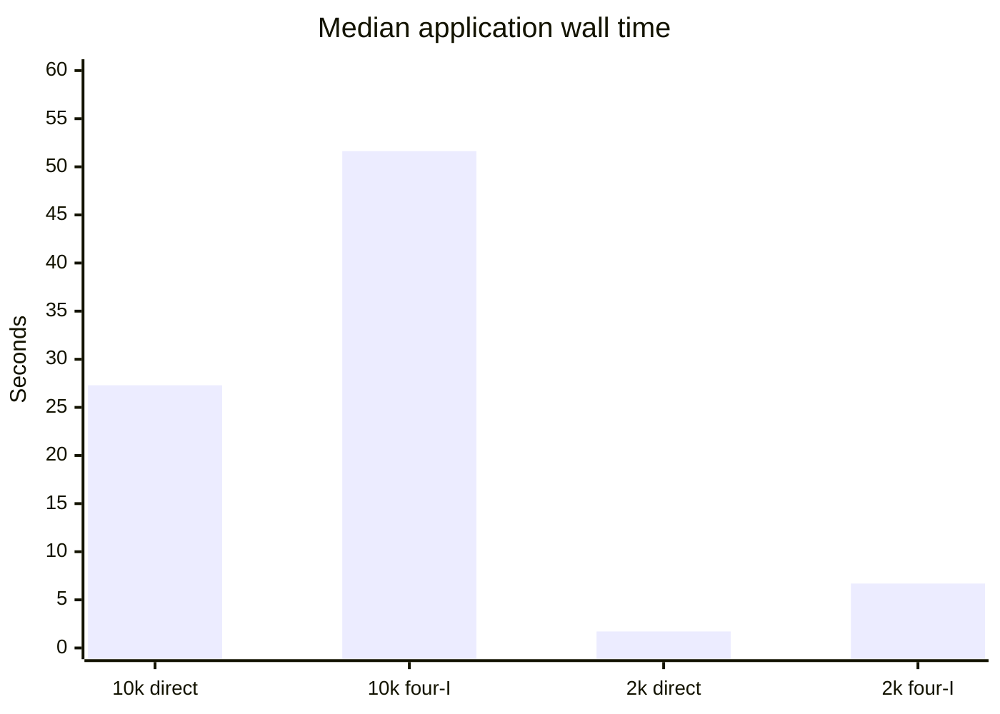
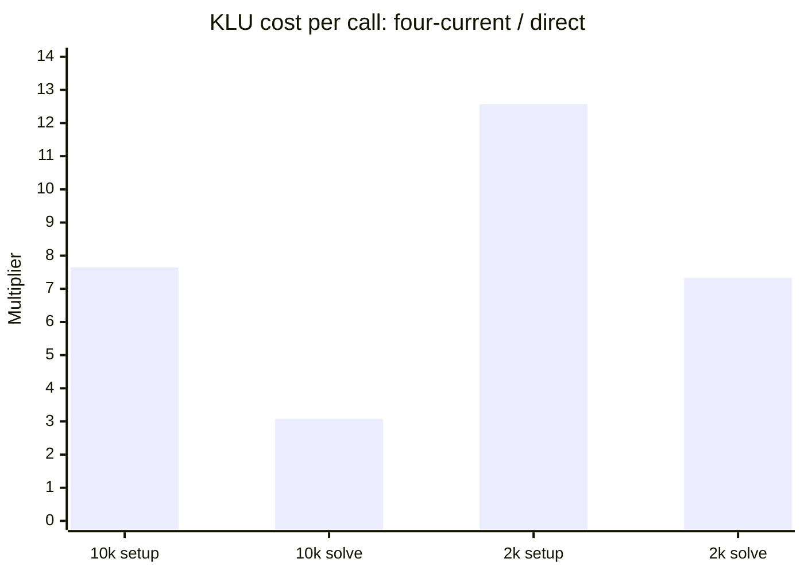

# Branch terminal-current formulation benchmark

Date: 2026-08-27

## Executive conclusion

Making the two complex Branch terminal currents four solver-owned algebraic
variables is mathematically equivalent to the develop formulation after the
current variables are eliminated, but it is substantially more expensive for
both representative systems on this host.

| Case | Direct coupling, application wall | Four current variables, application wall | Slowdown |
|---|---:|---:|---:|
| ACTIVSg10k | 27.298363 +/- 0.127240 s | 51.630775 +/- 0.078125 s | 1.891x (+89.1%) |
| ACTIVSg2000 | 1.712052 +/- 0.079147 s | 6.696209 +/- 0.184207 s | 3.911x (+291.1%) |

Values are the median +/- median absolute deviation (MAD) of five measured
runs. One discarded warm-up preceded each branch/case cell.

The main bottleneck is sparse linear algebra, not additional IDA work:

- On 10k, KLU setup and solve account for 77.4% of the added mean solver time.
  Setup costs 7.64x more per call and solve costs 3.08x more per call.
- On 2k, KLU setup and solve account for 74.6% of the added mean solver time.
  Setup costs 12.57x more per call and solve costs 7.33x more per call, even
  though the number of setups falls from 96 to 79.
- The raw Jacobian grows by 53.9% on 10k and 55.4% on 2k. Its nonzeros per
  state remain nearly flat, but raw Jacobian nonzeros do not describe KLU
  factor fill. The much larger setup and triangular-solve cost per call is
  strong evidence that the augmented block structure is less favorable to
  factorization and solve under the default ordering.
- Branch residual work also increases: 1.29x on 10k and 3.00x on 2k in total.
  This is real but secondary to the KLU regression.

The benchmark therefore does not support keeping four dedicated terminal
currents for performance reasons in the present solver/layout. The direct
formulation is faster and uses less memory in both tested systems.





## Compared formulations and branch stack

The local branch stack is:

1. `develop` at `6c1a9aab`.
2. `lukel/branch-bench-dev` at `0c060569`, containing only the shared
   instrumentation and reproducible runner.
3. `lukel/branch-bench-dev2`, based directly on `lukel/branch-bench-dev`,
   containing the four-current Branch formulation, its tests and model
   documentation, and this report.

No benchmark outputs are committed. Both branches remain local.

### Direct coupling

The develop Branch owns no solver variables. It evaluates terminal current
from the connected bus voltages and contributes that current directly to the
bus current-balance residuals.

### Four algebraic terminal currents

The alternative Branch owns

\[
\mathbf I = [I_{r1}, I_{i1}, I_{r2}, I_{i2}]^T
\]

as four algebraic variables. It contributes `I_r1`, `I_i1`, `I_r2`, and
`I_i2` to the two bus current-balance equations and owns four algebraic
equations

\[
0 = -\mathbf I + \mathbf Y\mathbf V.
\]

The variables are initialized from the initialized bus voltages, their
derivatives are initialized to zero, they are tagged algebraic, and Branch
monitors read the solver-owned currents. The Enzyme Jacobian contains the
four voltage-to-current blocks, four `-1` current diagonals, and the four
current-to-bus couplings.

In block form, the direct system contains the Schur-complement contribution
of the augmented system:

\[
\begin{bmatrix}
A & C \\
Y & -I
\end{bmatrix}
\begin{bmatrix}
\Delta z \\
\Delta I
\end{bmatrix}
=
\begin{bmatrix}
r_z \\
r_I
\end{bmatrix}.
\]

Eliminating `Delta I` recovers the direct voltage coupling. The formulations
therefore encode the same network relation, but IDA/KLU sees a larger
saddle-point-like system in the four-current formulation. The extra
algebraic variables also participate in IDA's error control and can change
the accepted step/Jacobian schedule even when the underlying equations are
equivalent.

## Instrumentation carried onto develop

Both binaries contain exactly the same benchmarking instrumentation. It
reports:

- application parsing, model construction, allocation, IDA configuration,
  simulation, postprocessing, and total wall time;
- buses, branches, differential variables, algebraic variables, total states,
  and Jacobian structural nonzeros;
- IDA consistent-initial-condition and solve envelopes, state update and
  monitoring time, and IDA work counters;
- residual callback input, model, output, and unclassified time;
- Jacobian callback input, model, zeroing, structure, value-copy, and
  unclassified time;
- KLU setup and solve time and call counts; and
- SystemModel residual and Jacobian time by model family, plus system
  Jacobian zeroing and component/bus scatter time.

The timers are hierarchical. For example, model-family residual time is
inside SystemModel residual time, which is inside residual callback time,
which is inside the solver envelope. Nested values must not be added as if
they were independent categories.

## Protocol

### Cases

| Case | Source | Buses | Branches | Other important model counts |
|---|---|---:|---:|---|
| ACTIVSg10k | `cases/PhasorDynamics/ACTIVSg10k/ACTIVSg10k.case.json` | 10,000 | 12,706 | 4,722 LoadZIP, 1,456 IEEEST, 1,456 synchronous machines, 1 BusFault |
| ACTIVSg2000 | `examples/PhasorDynamics/Large/Texas/texas.case.json` | 2,000 | 3,206 | 1,507 LoadZ, 432 GENROU, 432 IEEET1, 414 TGOV1, 2,000 BusFault |

The runner generates copies under the ignored build directory and recursively
removes `mon` and `monitors`; the canonical case files are not changed. Every
measured run reported `monitor_print_calls=0`.

Both cases use the same controlled 10 s study:

- adaptive IDA (`dt_fixed=0`);
- `rel_tol=1e-5`, `abs_tol=1e-7`;
- `max_steps=1000000`;
- consistent IC mode `ya_ydp`;
- the develop/default KLU ordering, with no benchmark ordering override; and
- fault 0 on at 1.0 s and off at 1.1 s.

### Build and host

| Item | Value |
|---|---|
| Host | WSL2 Linux 6.18.33.2 |
| CPU | Intel Core i9-12900K, 24 logical CPUs, 30 MiB L3 |
| Memory | 39 GiB |
| Affinity | Each simulation pinned to logical CPU 4 with `taskset` |
| Build preset/type | `enzyme`, `RelWithDebInfo` |
| Compiler | Clang 16.0.6, C++20 |
| Relevant flags | `-O2 -g -DNDEBUG -march=haswell -mtune=native` |
| SUNDIALS | 7.7.0, IDA with KLU |
| SuiteSparse | 7.8 |

Separate build trees preserve both binaries while trials are interleaved.
Their SHA-256 identities are:

| Formulation | Binary SHA-256 |
|---|---|
| Direct | `7772c53f1212c9555d7641e7d8314034705982a090b7e46435351ad4e89a6d4c` |
| Four currents | `c715511c7392ab957537d34df6632758640c986247cd9fd7695323b3d0eb64aa` |

The run metadata labels the variant `lukel/branch-bench-dev2-working-tree`
because its binary was built and frozen after code/test validation but before
the authorized single commit. The binary hash is the exact executable
identity; no compiled source changed between that build and the commit.

The runner rejects identical binaries, missing or duplicate instrumentation
blocks, missing core metrics, or a failed process. After four discarded
warm-ups, it rotates the four case/formulation cells each round and records
five trials per cell using application timers and GNU `time`.

### Statistical treatment

Scalar result tables use independent five-run medians. Spread is shown as MAD
and `[minimum, maximum]`. Runtime shares are medians of each trial's share of
its parent timer; because values are medianed independently, displayed seconds
and shares can have tiny nonclosure.

The slowdown-attribution waterfall uses differences of five-run group means.
Means are used only there because the exclusive solver buckets then add
exactly to the mean solver-envelope difference. Headline slowdown conclusions
remain ratio-of-medians and are not driven by the mean.

## Results

### End-to-end time and variation

| Case | Formulation | Application wall, median +/- MAD [min, max] (s) | GNU wall median [min, max] (s) | App `Complete in` median (s) |
|---|---|---:|---:|---:|
| 10k | Direct | 27.298363 +/- 0.127240 [26.266048, 27.425603] | 27.47 [26.44, 27.60] | 27.07000 |
| 10k | Four currents | 51.630775 +/- 0.078125 [50.437292, 54.208656] | 51.94 [50.75, 54.52] | 51.48990 |
| 2k | Direct | 1.712052 +/- 0.079147 [1.576320, 1.791200] | 1.72 [1.59, 1.80] | 1.63578 |
| 2k | Four currents | 6.696209 +/- 0.184207 [6.392050, 6.926344] | 6.71 [6.40, 6.94] | 6.66885 |

The 10k four-current trial at 54.208656 s is a host-timing high point, 4.99%
above its median. It had the same structure and deterministic IDA counters as
the other four-current 10k trials and empty stderr, so it is retained. The
median and MAD keep it from dominating the headline result. The shorter 2k
direct run is visibly more scheduling-sensitive, which is why its full range
is reported.

Application-wall ratios are 1.891x for 10k and 3.911x for 2k. The app-reported
`Complete in` ratios are 1.902x and 4.077x, respectively. The independently
timed GNU wall results agree with the direction and scale of the regression.

### System size and memory

| Case | Formulation | States | Differential | Algebraic | Jacobian nnz | nnz/state | Peak RSS (KiB) |
|---|---|---:|---:|---:|---:|---:|---:|
| 10k | Direct | 95,480 | 27,391 | 68,089 | 384,472 | 4.0267 | 204,272 |
| 10k | Four currents | 146,304 | 27,391 | 118,913 | 591,680 | 4.0442 | 252,488 |
| 2k | Direct | 24,352 | 5,148 | 19,204 | 100,448 | 4.1248 | 59,560 |
| 2k | Four currents | 37,176 | 5,148 | 32,028 | 156,056 | 4.1978 | 77,840 |

| Case | Added algebraic/state variables | State change | Jacobian nnz change | nnz/state change | Peak RSS change |
|---|---:|---:|---:|---:|---:|
| 10k | 50,824 = 4 x 12,706 | +53.23% | +53.89% | +0.43% | +48,216 KiB (+23.60%) |
| 2k | 12,824 = 4 x 3,206 | +52.66% | +55.36% | +1.77% | +18,280 KiB (+30.69%) |

The exact `4 x branches` state increase and unchanged differential-variable
count confirm that the intended four algebraic variables were applied once to
every Branch and nowhere else.

### Solver runtime composition

Each parenthesized value is the median per-run share of the solver envelope.

| Case | Formulation | Solver envelope (s) | Residual | Jacobian | KLU setup | KLU solve | SUNDIALS remainder |
|---|---|---:|---:|---:|---:|---:|---:|
| 10k | Direct | 26.98685 | 13.94361 (51.67%) | 2.53241 (9.42%) | 1.38485 (5.17%) | 4.88375 (18.23%) | 4.14112 (15.46%) |
| 10k | Four currents | 51.29529 | 16.40101 (32.22%) | 3.21097 (6.24%) | 11.49818 (22.39%) | 13.93948 (27.08%) | 6.17889 (12.17%) |
| 2k | Direct | 1.64811 | 0.65635 (39.54%) | 0.26427 (16.52%) | 0.19110 (11.59%) | 0.28221 (17.03%) | 0.25418 (15.42%) |
| 2k | Four currents | 6.62895 | 1.49944 (23.03%) | 0.27648 (4.25%) | 1.97699 (29.99%) | 2.23319 (33.39%) | 0.62316 (9.38%) |

KLU setup plus solve grows from roughly 23% to 49% of the 10k solver envelope
and from roughly 29% to 63% of the 2k envelope. It becomes the dominant runtime
category in both four-current systems.

### Exact attribution of added solver time

This table uses differences of group means, solely so the mutually exclusive
rows sum exactly to the total difference.

| Solver bucket | 10k added mean time (s) | 10k share of increase | 2k added mean time (s) | 2k share of increase |
|---|---:|---:|---:|---:|
| Residual callbacks | +2.772767 | 11.13% | +0.881901 | 17.76% |
| Jacobian callbacks | +0.724118 | 2.91% | +0.013749 | 0.28% |
| KLU setup | +10.147749 | 40.74% | +1.782893 | 35.91% |
| KLU solve | +9.124068 | 36.63% | +1.922413 | 38.72% |
| SUNDIALS remainder | +2.137470 | 8.58% | +0.364518 | 7.34% |
| **Solver envelope** | **+24.906171** | **100.00%** | **+4.965474** | **100.00%** |

The KLU rows explain 77.38% of the 10k increase and 74.62% of the 2k
increase. Using differences of independent medians instead gives the same
practical conclusion: about 79% and 75%, respectively.

### Work count versus unit cost

| Case | Operation | Direct calls | Four-current calls | Call-count ratio | Direct us/call | Four-current us/call | Unit-cost ratio | Total-time ratio |
|---|---|---:|---:|---:|---:|---:|---:|---:|
| 10k | Residual | 2,320 | 2,152 | 0.928x | 6,010.18 | 7,621.29 | 1.268x | 1.176x |
| 10k | Jacobian | 174 | 189 | 1.086x | 14,554.09 | 16,989.26 | 1.167x | 1.268x |
| 10k | KLU setup | 174 | 189 | 1.086x | 7,958.92 | 60,836.91 | 7.644x | 8.303x |
| 10k | KLU solve | 2,320 | 2,152 | 0.928x | 2,105.07 | 6,477.45 | 3.077x | 2.854x |
| 2k | Residual | 1,078 | 1,164 | 1.080x | 608.86 | 1,288.18 | 2.116x | 2.285x |
| 2k | Jacobian | 96 | 79 | 0.823x | 2,752.86 | 3,499.73 | 1.271x | 1.046x |
| 2k | KLU setup | 96 | 79 | 0.823x | 1,990.60 | 25,025.20 | 12.572x | 10.345x |
| 2k | KLU solve | 1,078 | 1,164 | 1.080x | 261.79 | 1,918.54 | 7.329x | 7.913x |

Raw size alone does not explain the unit-cost increase. After normalizing each
setup call by assembled Jacobian nonzeros, four-current cost is still 4.97x
higher on 10k and 8.09x higher on 2k. After normalizing each solve call by
state count, cost is still 2.01x and 4.80x higher, respectively.

The integration schedule does not explain the slowdown:

| Case | Formulation | Steps | Residual evals | Jacobian/setups | Error-test failures | Nonlinear iterations | Nonlinear convergence failures |
|---|---|---:|---:|---:|---:|---:|---:|
| 10k | Direct | 1,483 | 2,320 | 174 | 57 | 2,314 | 45 |
| 10k | Four currents | 1,340 | 2,152 | 189 | 49 | 2,146 | 47 |
| 2k | Direct | 754 | 1,078 | 96 | 27 | 1,072 | 7 |
| 2k | Four currents | 822 | 1,164 | 79 | 22 | 1,158 | 9 |

The 10k four-current run performs 7.2% fewer residual evaluations, yet is
89.1% slower end to end. The 2k four-current run performs 17.7% fewer
Jacobian evaluations and setups, yet KLU setup time is 10.35x higher in total.
Those two counterexamples isolate per-operation cost, especially sparse
factorization and solve, as the governing effect.

Consistent-initial-condition time also rises from 0.4033 to 0.8846 s on 10k
(+119%) and from 0.0713 to 0.2894 s on 2k (+306%). This is another expected
cost of solving the augmented algebraic system, but it is small compared with
the repeated KLU cost over the full simulation.

### Residual model-family composition

Shares below are of `residual_model_seconds`, medianed per trial.

| Model family | 10k direct | 10k four-I | 2k direct | 2k four-I |
|---|---:|---:|---:|---:|
| Bus | 11.96% | 11.42% | 8.34% | 8.02% |
| Branch | **47.09%** | **51.48%** | **35.22%** | **45.72%** |
| Load | 14.78% | 13.84% | 17.87% | 14.38% |
| Generator | 9.44% | 8.58% | 10.34% | 8.48% |
| Governor | 5.20% | 4.49% | 4.13% | 3.35% |
| Stabilizer | 4.73% | 3.96% | 0.00% | 0.00% |
| Exciter | 6.72% | 6.29% | 6.63% | 5.51% |
| BusFault | 0.03% | 0.02% | 17.36% | 14.51% |

Branch is the largest residual model family in every cell. Its independent
median time changes as follows:

| Case | Direct Branch residual | Four-I Branch residual | Ratio | Direct share | Four-I share |
|---|---:|---:|---:|---:|---:|
| 10k | 5.654278 s | 7.283599 s | 1.288x | 47.09% | 51.48% |
| 2k | 0.195917 s | 0.587551 s | 2.999x | 35.22% | 45.72% |

The four-current Branch now evaluates four local algebraic residual rows in
addition to contributing the current variables to bus KCL. The larger system
also increases working-set pressure for the complete residual callback. On 2k,
the residual callback as a whole costs 2.12x more per call; on 10k it costs
1.27x more per call.

The 2k case contains 2,000 BusFault components, so its direct residual makeup
is less Branch-dominated than 10k. That case-composition difference explains
part of the different percentages, but it does not explain the KLU unit-cost
increase.

### Jacobian model-family composition

Shares below are of `jacobian_model_seconds`, medianed per trial.

| Model family | 10k direct | 10k four-I | 2k direct | 2k four-I |
|---|---:|---:|---:|---:|
| Bus | 5.83% | 5.96% | 4.39% | 4.15% |
| Branch | **26.55%** | **27.48%** | **21.51%** | **20.09%** |
| Load | 8.84% | 9.06% | 6.66% | 6.85% |
| Generator | 8.80% | 8.03% | 12.05% | 14.51% |
| Governor | 4.22% | 3.80% | 3.91% | 3.40% |
| Stabilizer | 5.22% | 4.63% | 0.00% | 0.00% |
| Exciter | 5.99% | 5.41% | 6.72% | 6.01% |
| BusFault | 0.02% | 0.02% | 10.63% | 10.86% |

The independent median Branch Jacobian time is 0.584571 to 0.726482 s on 10k
(+24.3%). On 2k it is 0.051325 to 0.046869 s (-8.7%) only because there are
17.7% fewer Jacobian calls; its per-call Branch Jacobian cost still increases
by about 11%. Thus Jacobian callback construction is not the main 2k
regression, while factorization of the constructed matrix is.

System Jacobian bookkeeping changes are comparatively small:

| Case | Formulation | System zero (s) | Component scatter (s) | Bus scatter (s) |
|---|---|---:|---:|---:|
| 10k | Direct | 0.075221 | 0.593982 | 0.090129 |
| 10k | Four currents | 0.129193 | 0.732955 | 0.103476 |
| 2k | Direct | 0.008344 | 0.062930 | 0.007321 |
| 2k | Four currents | 0.013988 | 0.057650 | 0.006342 |

The additional matrix zeroing and scatter work is visible but far below KLU
setup and solve time.

### Callback subdivisions

| Case | Formulation | Residual input | Residual model | Residual output | Residual other |
|---|---|---:|---:|---:|---:|
| 10k | Direct | 1.704624 s | 12.057503 s | 0.179100 s | 0.001726 s |
| 10k | Four currents | 1.972481 s | 14.169266 s | 0.277420 s | 0.001904 s |
| 2k | Direct | 0.090472 s | 0.556602 s | 0.008955 s | 0.000287 s |
| 2k | Four currents | 0.192312 s | 1.285784 s | 0.020933 s | 0.000505 s |

| Case | Formulation | Jacobian input | Jacobian model | Callback zero | Structure | Value copy | Other |
|---|---|---:|---:|---:|---:|---:|---:|
| 10k | Direct | 0.110968 s | 2.205468 s | 0.093420 s | 0.074154 s | 0.046629 s | 0.000490 s |
| 10k | Four currents | 0.156985 s | 2.689388 s | 0.157911 s | 0.128041 s | 0.088137 s | 0.000599 s |
| 2k | Direct | 0.008976 s | 0.234031 s | 0.009816 s | 0.009188 s | 0.003406 s | 0.000133 s |
| 2k | Four currents | 0.010513 s | 0.231822 s | 0.015119 s | 0.012826 s | 0.005049 s | 0.000135 s |

Model evaluation remains the largest callback-local bucket, but the complete
callback totals are not the dominant four-current solver bucket. KLU consumes
more time than residual plus Jacobian callbacks in both four-current cases,
with the larger margin on 2k.

### Application phases

| Case | Formulation | Parse (s) | Construct (s) | Allocate (s) | IDA configure (s) | Simulation (s) |
|---|---|---:|---:|---:|---:|---:|
| 10k | Direct | 0.174228 | 0.016830 | 0.093823 | 0.008259 | 26.990957 |
| 10k | Four currents | 0.178675 | 0.015172 | 0.110533 | 0.010708 | 51.300484 |
| 2k | Direct | 0.037056 | 0.003249 | 0.020522 | 0.001502 | 1.648681 |
| 2k | Four currents | 0.037238 | 0.003108 | 0.023129 | 0.001925 | 6.629918 |

Allocation rises 17.8% on 10k and 12.7% on 2k; IDA configuration rises about
30% in both. These increases are expected for the larger vectors and matrix,
but they are only milliseconds. Repeated simulation work determines the
end-to-end tradeoff.

## Bottleneck diagnosis

The measured causal chain is:

1. Four algebraic current unknowns and equations are added per Branch.
2. Total state and raw Jacobian size rise by about 53% to 55%.
3. Residual and Jacobian callback unit costs rise, but IDA does not uniformly
   do more work: 10k has fewer residual calls, and 2k has fewer setups.
4. KLU setup cost per call rises by 7.64x and 12.57x; KLU solve cost per call
   rises by 3.08x and 7.33x.
5. KLU accounts for approximately three quarters of the added solver time and
   becomes the largest four-current runtime category.

The direct matrix is effectively the Schur complement of the augmented
current-variable matrix. Sparse factorization cost depends on dimension,
ordering, elimination tree, and factor fill rather than only the raw Jacobian
nonzero count. The results are consistent with greater fill and/or poorer
factor/triangular-solve locality for the augmented structure under the default
ordering. That mechanism is an inference: this instrumentation records raw
Jacobian nonzeros and aggregate KLU time, but not symbolic versus numeric
factorization time, `L`/`U` nonzeros, elimination-tree statistics, or KLU
flops.

The 2k relative penalty is larger because its direct solve is very cheap and
the augmented KLU unit-cost penalty is especially large. Different model mix,
state ordering, factor structure, cache behavior, and CPU-frequency behavior
can all affect the exact ratio. The data establish where the time goes; they
do not by themselves distinguish those lower-level mechanisms.

## Validation and data-integrity checks

- Both complete configured Enzyme build trees succeeded.
- All 23 tests matching `^PhasorDynamics` passed on each formulation.
- Branch-focused tests cover size, current initialization, zero derivatives,
  algebraic tags/tolerances, internal equations, bus coupling through the
  current variables, dependency maps, Enzyme Jacobian structure, and System
  alias offsets.
- Both formulations completed 10k and 2k event-study preflights.
- All 20 measured processes completed successfully, all 20 stderr files are
  empty, and no timed record was discarded.
- Buses, branches, states, variable types, and Jacobian nonzeros are identical
  within every five-run cell.
- Instrumentation residual/Jacobian/setup call counts match IDA's reported
  counters in every trial.
- All measured trials report zero monitor calls.
- The differential count is unchanged and the algebraic delta is exactly four
  times the branch count in both systems.

## Limitations and follow-up measurements

1. Absolute times include the common instrumentation overhead. The two-branch
   comparison is controlled because both binaries use identical timers, but
   this is not an overhead-corrected release-performance measurement.
2. Monitoring was intentionally disabled to avoid output cost. The benchmark
   therefore records successful completion and deterministic solver work, not
   a trajectory checksum. Unit/system tests validate the algebraic model and
   Jacobian, but a separate monitored trajectory comparison would be needed to
   quantify time-series agreement.
3. Five trials are sufficient to make the large regression unambiguous, but a
   longer campaign on native Linux and an otherwise idle host would tighten
   hardware-specific variance, especially for the short 2k direct run.
4. The exact factorization mechanism remains unmeasured. The highest-value
   next instrumentation is KLU symbolic versus numeric time, `L`/`U` nonzero
   counts, ordering/permutation statistics, and factor memory.
5. If dedicated currents are needed for another design reason, the next
   experiments should compare KLU orderings and variable orderings, then test
   explicit/static condensation of the current block. The present default
   augmented layout should be treated as the measured baseline for those
   optimizations.

## Reproduction and raw data

Build and runner commands are documented in `benchmark/branch-model/README.md`.
The exact completed run is under the ignored directory:

```text
build/benchmark/branch-model/2026-08-27/
```

It contains generated monitor-free inputs, raw stdout/stderr and GNU `time`
files, `trials.json`, `trials.tsv`, and `summary.tsv`. The raw artifacts are
deliberately excluded from git.
