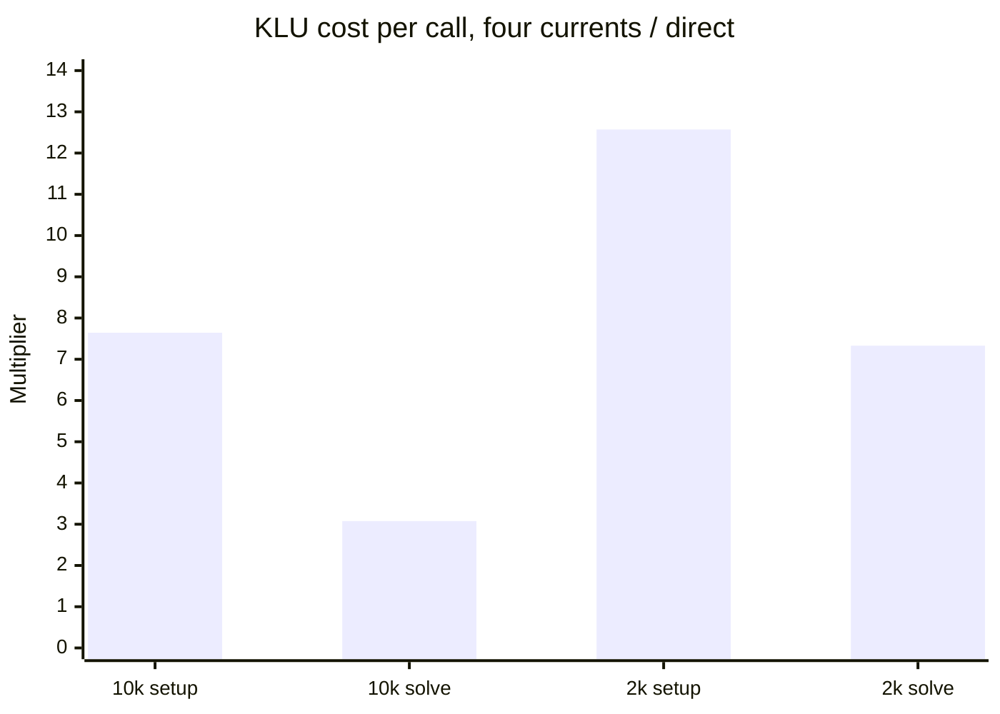

# Branch terminal-current formulation benchmark

Date: 2026-08-27

## Summary

Two Branch formulations were compared. Direct coupling (develop) computes terminal current from the bus voltages and adds it to the bus current-balance residuals. The four-current form owns the two complex terminal currents as four algebraic solver variables with four extra equations per Branch. The two are equivalent once the currents are eliminated, so the direct Jacobian is the Schur complement of the four-current Jacobian.

The four-current form is slower and uses more memory on both test systems.

| Case | Direct | Four currents | Slowdown |
|---|---:|---:|---:|
| ACTIVSg10k | 27.30 ± 0.13 s | 51.63 ± 0.08 s | 1.89× |
| ACTIVSg2000 | 1.71 ± 0.08 s | 6.70 ± 0.18 s | 3.91× |

Application wall time, median ± MAD of five runs.

Where the added time goes:

- KLU setup and solve are 77% of the added solver time on 10k and 75% on 2k.
- KLU setup per call is 7.6× (10k) and 12.6× (2k) more expensive. KLU solve per call is 3.1× and 7.3× more expensive.
- Jacobian nonzeros grow 54% to 55%, in line with the 53% state growth. Nonzeros per state are flat, so the per-call KLU increase comes from factor structure, not matrix size.
- Branch residual time grows 1.29× (10k) and 3.00× (2k). Secondary.
- IDA does not do more work. 10k takes fewer steps and residual calls, 2k takes fewer Jacobian setups.

## Setup

| Case | Buses | Branches | Other models |
|---|---:|---:|---|
| ACTIVSg10k | 10,000 | 12,706 | 4,722 LoadZIP, 1,456 IEEEST, 1,456 machines, 1 BusFault |
| ACTIVSg2000 | 2,000 | 3,206 | 1,507 LoadZ, 432 GENROU, 432 IEEET1, 414 TGOV1, 2,000 BusFault |

10 s study, adaptive IDA, `rel_tol=1e-5`, `abs_tol=1e-7`, IC mode `ya_ydp`, default KLU ordering, fault on at 1.0 s and off at 1.1 s. Monitors stripped from the case copies.

Clang 16.0.6, `RelWithDebInfo`, `-O2 -march=haswell`, SUNDIALS 7.7.0 IDA with KLU, SuiteSparse 7.8. i9-12900K under WSL2, each run pinned to one core. Both binaries carry the same instrumentation. Five trials per cell after warm-up, cells interleaved. Tables report medians unless stated.

## Results

### End-to-end time

| Case | Formulation | Application wall, median ± MAD [min, max] (s) | GNU wall median (s) |
|---|---|---:|---:|
| 10k | Direct | 27.298363 ± 0.127240 [26.266048, 27.425603] | 27.47 |
| 10k | Four currents | 51.630775 ± 0.078125 [50.437292, 54.208656] | 51.94 |
| 2k | Direct | 1.712052 ± 0.079147 [1.576320, 1.791200] | 1.72 |
| 2k | Four currents | 6.696209 ± 0.184207 [6.392050, 6.926344] | 6.71 |

### Size and memory

| Case | Formulation | States | Differential | Algebraic | Jacobian nnz | nnz/state | Peak RSS (KiB) |
|---|---|---:|---:|---:|---:|---:|---:|
| 10k | Direct | 95,480 | 27,391 | 68,089 | 384,472 | 4.0267 | 204,272 |
| 10k | Four currents | 146,304 | 27,391 | 118,913 | 591,680 | 4.0442 | 252,488 |
| 2k | Direct | 24,352 | 5,148 | 19,204 | 100,448 | 4.1248 | 59,560 |
| 2k | Four currents | 37,176 | 5,148 | 32,028 | 156,056 | 4.1978 | 77,840 |

States grow by exactly 4 × branches (+53%). Jacobian nnz grows 54% (10k) and 55% (2k). Peak RSS grows 24% (10k) and 31% (2k).

### Solver time by category

Share of solver total in parentheses.

| Case | Formulation | Solver total (s) | Residual | Jacobian | KLU setup | KLU solve | SUNDIALS remainder |
|---|---|---:|---:|---:|---:|---:|---:|
| 10k | Direct | 26.98685 | 13.94361 (51.67%) | 2.53241 (9.42%) | 1.38485 (5.17%) | 4.88375 (18.23%) | 4.14112 (15.46%) |
| 10k | Four currents | 51.29529 | 16.40101 (32.22%) | 3.21097 (6.24%) | 11.49818 (22.39%) | 13.93948 (27.08%) | 6.17889 (12.17%) |
| 2k | Direct | 1.64811 | 0.65635 (39.54%) | 0.26427 (16.52%) | 0.19110 (11.59%) | 0.28221 (17.03%) | 0.25418 (15.42%) |
| 2k | Four currents | 6.62895 | 1.49944 (23.03%) | 0.27648 (4.25%) | 1.97699 (29.99%) | 2.23319 (33.39%) | 0.62316 (9.38%) |

KLU setup plus solve goes from 23% to 49% of the 10k solver total and from 29% to 63% on 2k.

### Added solver time

Differences of five-run means. Rows are exclusive and sum to the total.

| Solver bucket | 10k added (s) | 10k share | 2k added (s) | 2k share |
|---|---:|---:|---:|---:|
| Residual callbacks | +2.772767 | 11.13% | +0.881901 | 17.76% |
| Jacobian callbacks | +0.724118 | 2.91% | +0.013749 | 0.28% |
| KLU setup | +10.147749 | 40.74% | +1.782893 | 35.91% |
| KLU solve | +9.124068 | 36.63% | +1.922413 | 38.72% |
| SUNDIALS remainder | +2.137470 | 8.58% | +0.364518 | 7.34% |
| **Solver total** | **+24.906171** | **100.00%** | **+4.965474** | **100.00%** |

### Per-call cost

| Case | Operation | Direct calls | Four-current calls | Call ratio | Direct µs/call | Four-current µs/call | Unit-cost ratio | Total-time ratio |
|---|---|---:|---:|---:|---:|---:|---:|---:|
| 10k | Residual | 2,320 | 2,152 | 0.928× | 6,010.18 | 7,621.29 | 1.268× | 1.176× |
| 10k | Jacobian | 174 | 189 | 1.086× | 14,554.09 | 16,989.26 | 1.167× | 1.268× |
| 10k | KLU setup | 174 | 189 | 1.086× | 7,958.92 | 60,836.91 | 7.644× | 8.303× |
| 10k | KLU solve | 2,320 | 2,152 | 0.928× | 2,105.07 | 6,477.45 | 3.077× | 2.854× |
| 2k | Residual | 1,078 | 1,164 | 1.080× | 608.86 | 1,288.18 | 2.116× | 2.285× |
| 2k | Jacobian | 96 | 79 | 0.823× | 2,752.86 | 3,499.73 | 1.271× | 1.046× |
| 2k | KLU setup | 96 | 79 | 0.823× | 1,990.60 | 25,025.20 | 12.572× | 10.345× |
| 2k | KLU solve | 1,078 | 1,164 | 1.080× | 261.79 | 1,918.54 | 7.329× | 7.913× |

Normalized by Jacobian nnz, setup is still 4.97× (10k) and 8.09× (2k) more expensive. Normalized by state count, solve is still 2.01× and 4.80× more expensive.

### IDA counters

| Case | Formulation | Steps | Residual evals | Jacobian/setups | Error-test failures | Nonlinear iterations | Nonlinear convergence failures |
|---|---|---:|---:|---:|---:|---:|---:|
| 10k | Direct | 1,483 | 2,320 | 174 | 57 | 2,314 | 45 |
| 10k | Four currents | 1,340 | 2,152 | 189 | 49 | 2,146 | 47 |
| 2k | Direct | 754 | 1,078 | 96 | 27 | 1,072 | 7 |
| 2k | Four currents | 822 | 1,164 | 79 | 22 | 1,158 | 9 |

### Branch residual and Jacobian

| Case | Direct Branch residual (s) | Four-current Branch residual (s) | Ratio | Direct share | Four-current share |
|---|---:|---:|---:|---:|---:|
| 10k | 5.654278 | 7.283599 | 1.288× | 47.09% | 51.48% |
| 2k | 0.195917 | 0.587551 | 2.999× | 35.22% | 45.72% |

Shares are of total model residual time. Branch is the largest residual family in every cell. The residual callback as a whole costs 1.27× (10k) and 2.12× (2k) more per call.

Branch Jacobian time goes from 0.584571 to 0.726482 s on 10k (+24%) and from 0.051325 to 0.046869 s on 2k (−9%, with 18% fewer calls). Jacobian callbacks are under 3% of the added solver time.
