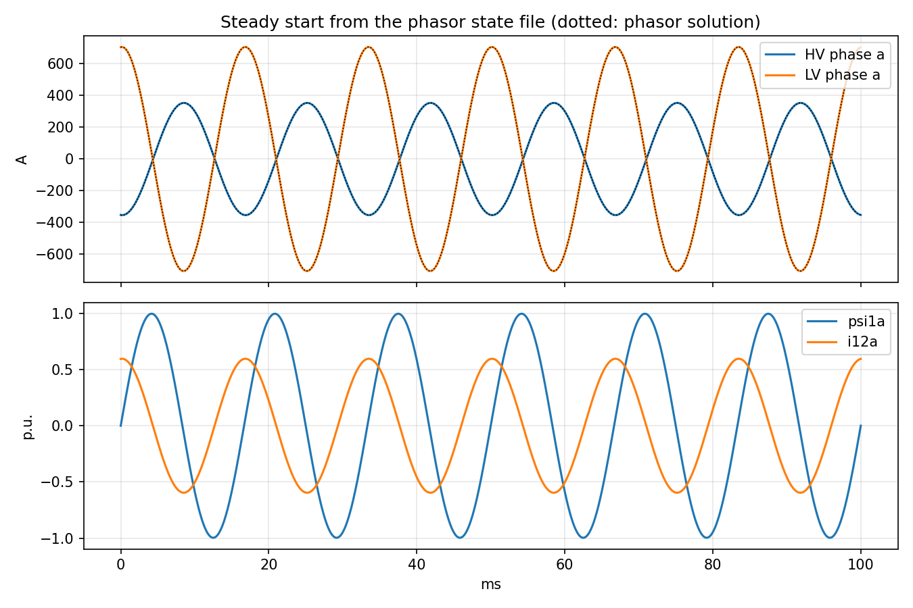
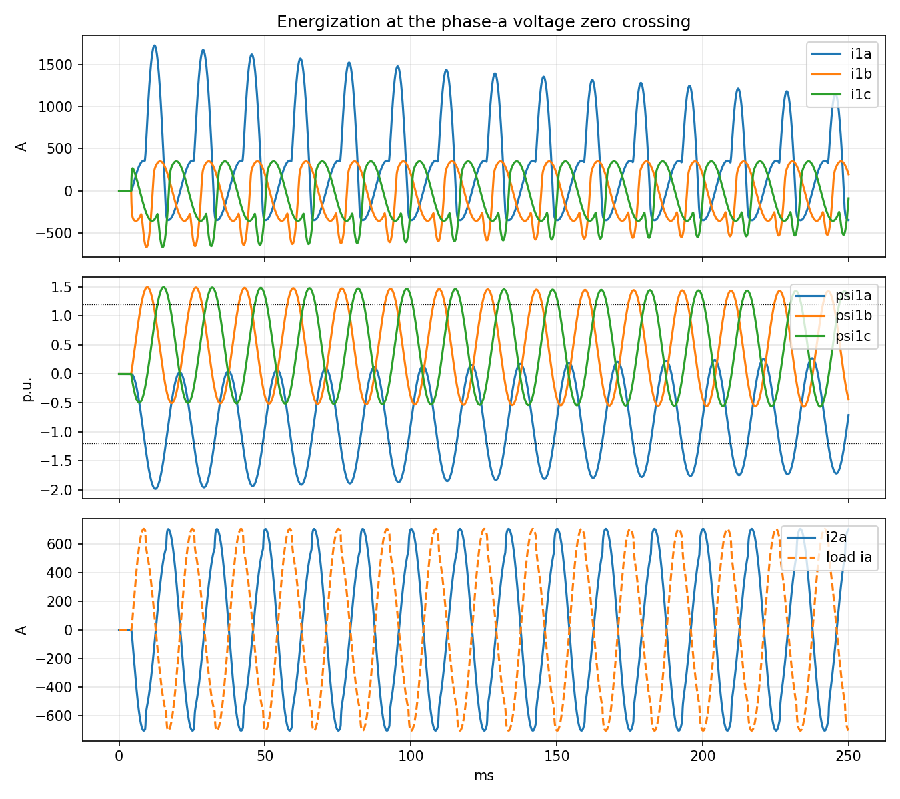

# Transformer bank steady state and energization

This case connects a 138 kV source with 0.5 ohm series resistance through a
breaker to a 100 MVA, 138/69 kV `Transformer` bank feeding a 79.35 ohm
resistive load, 60 MW at rated voltage. The bank has 0.5 percent resistance,
10 percent reactance, 1 percent no-load current, 60 kW no-load loss, a knee at
1.2 per unit, and a saturation inductance of 0.25 per unit. Both windings are
grounded wye.

Two scenarios share the case:

- `Steady` starts from `Steady.state.json`, the phasor solution written by
  `steady_state.py`, so the run holds the sinusoidal steady state from the
  first sample.
- `Energization` starts with the breaker open and closes it at the phase-a
  voltage zero crossing, 4.1667 ms. The flux offset drives phase a past the
  knee and draws inrush current.

With $\bar{y}_e$ the magnetizing admittances, $r_s$ the source resistance,
$r_\ell$ the load resistance, and $\bar{e}_s$ the source voltage, all in
transformer per unit, the steady node voltages are

```math
\bar{e}_2 = \frac{\bar{e}_s}{(1 + \mathrm{j}X k_2)(1 + (r_s + R_1)\bar{y}_1) + (r_s + R_1) k_2},
\qquad
k_2 = \bar{y}_2 + \frac{1}{\tau^2 (r_\ell + R_2)},
\qquad
\bar{e}_1 = (1 + \mathrm{j}X k_2)\,\bar{e}_2.
```

The normal EMT application uses IDA with the sparse KLU solver. From the
repository root:

```sh
cmake --build build --target EMTDynamicSimulation -j 10
python3 cases/EMT/Transformer/steady_state.py
python3 cases/EMT/Transformer/validate.py \
  --exe build/application/EMT/EMTDynamicSimulation \
  --results build/validation/Transformer --plot
```

Plotting requires matplotlib. The validator itself uses only the Python
standard library and is registered as `EMTTransformerCase` when Enzyme, sparse
SUNDIALS, and Python are enabled. Without `--results`, it uses a temporary
directory.

Validation checks that the nine bank states are the only differential
variables, the steady monitors against the phasor solution at every sample,
zero bank current before the breaker closes, both samples at the event, a flux
peak beyond the knee, and an inrush peak above four times the steady peak.

Outputs are `mon.csv`, `state.csv` and its layout, `simulation.log`,
`metrics.json`, and, with `--plot`, `steady.png` and `energization.png`.

## Results



Figure 1: Steady scenario, bank currents and states against the phasor solution.



Figure 2: Energization scenario, inrush current and flux offset past the knee.

The figures and `metrics.json` in
[examples/EMT/Transformer](../../../examples/EMT/Transformer) are the
`--plot` outputs of `validate.py`.
