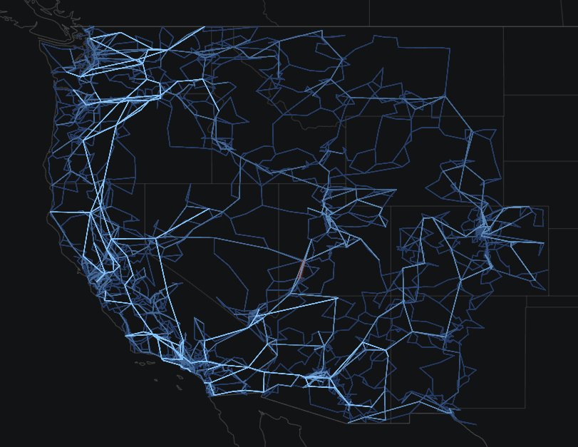

#  Western Electricity Coordinating Council  (ACTIVSg10k)

Texas A&M University [Grid Repository](https://electricgrids.engr.tamu.edu/electric-grid-test-cases/activsg200/)

# One-Line Diagram

Figure 1: Oneline of the ACTIVSg10k Case

## Development

Unimplemented models:

- `ESAC1A`
- `ESAC6A`
- `ESDC2A`
- `ESST4B`
- `EXAC1`
- `EXAC2`
- `EXPIC1`
- `GGOV1`
- `IEEEG1`
- `SCRX`
