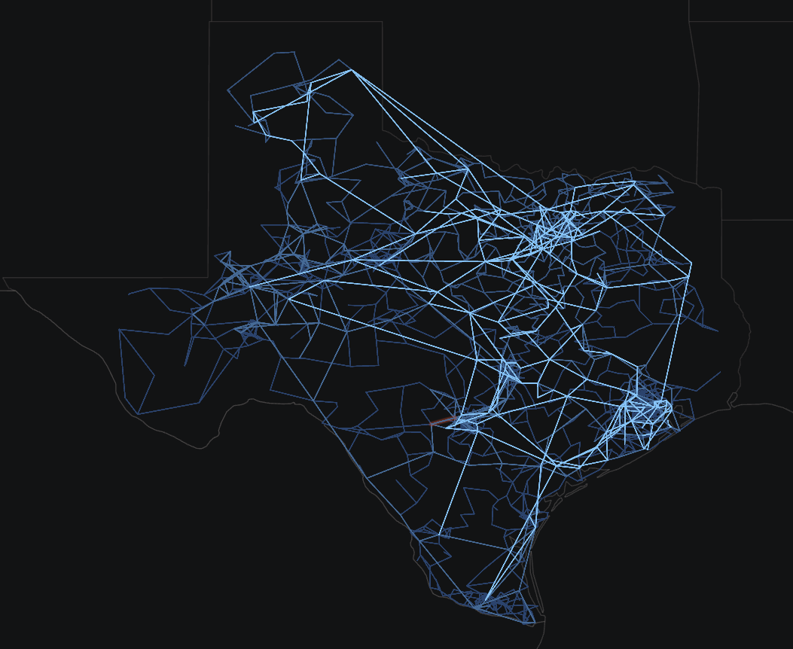

# Synthetic South Carolina (ACTIVSg2000)

Texas A&M University [Grid Repository](https://electricgrids.engr.tamu.edu/electric-grid-test-cases/activsg2000/)

# One-Line Diagram

Figure 1: Oneline of the ACTIVSg2000 Case

## Development

Unimplemented models:

- `DLSH`
- `ESAC1A`
- `ESAC6A`
- `ESDC2A`
- `ESST4B`
- `EXAC1`
- `EXAC2`
- `EXPIC1`
- `GGOV1`
- `IEEEG1`
- `SCRX`
