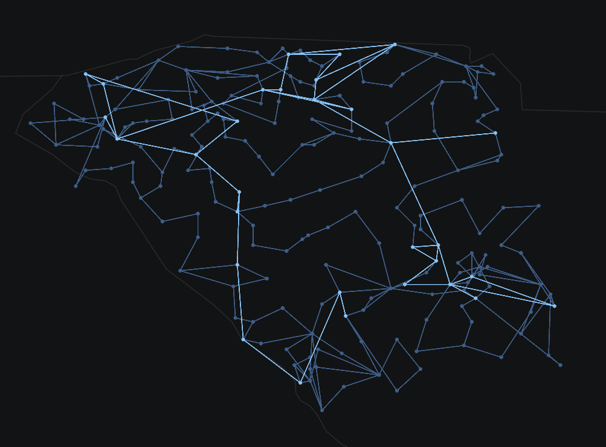

# Synthetic South Carolina (ACTIVSg500)

Texas A&M University [Grid Repository](https://electricgrids.engr.tamu.edu/electric-grid-test-cases/activsg500/)

# One-Line Diagram

Figure 1: Oneline of the ACTIVSg500 Case

## Development

The compelete dynamics of this case are modeled in GridKit.

[Validation results](../../../examples/PhasorDynamics/validation/ACTIVSg500/README.md)
