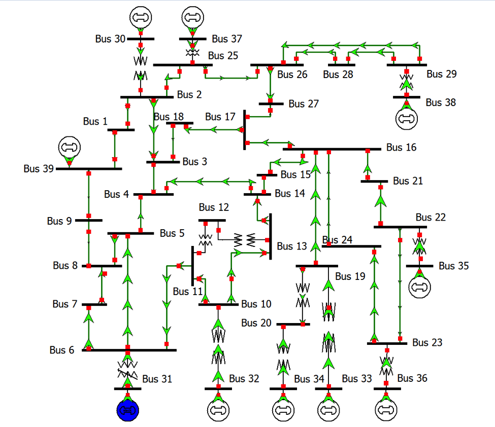

# IEEE 39-Bus New England

This case is a modified version of the IEEE 39-Bus New England case, available at the Texas A&M University [Electric Grid Test Case Repository](https://electricgrids.engr.tamu.edu/electric-grid-test-cases/).

## One-Line Diagram

Figure 1: Oneline of the the IEEE 39-Bus Case

## Development

Unimplemented models:

- `EXST1_GE`
