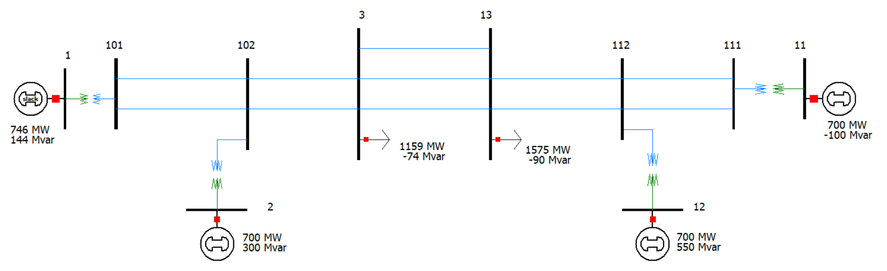

# Two-Area Kundur

## One-Line Diagram

Figure 1: One-line diagram of the TwoArea case.[^1]

## Development

This case is derived from the Kundur two-area system and includes exciters for use in GridKit.

Simulation and validation studies have not yet been implemented for this case.

[^1]: PowerWorld, [Simulator Help](https://www.powerworld.com/WebHelp/).
