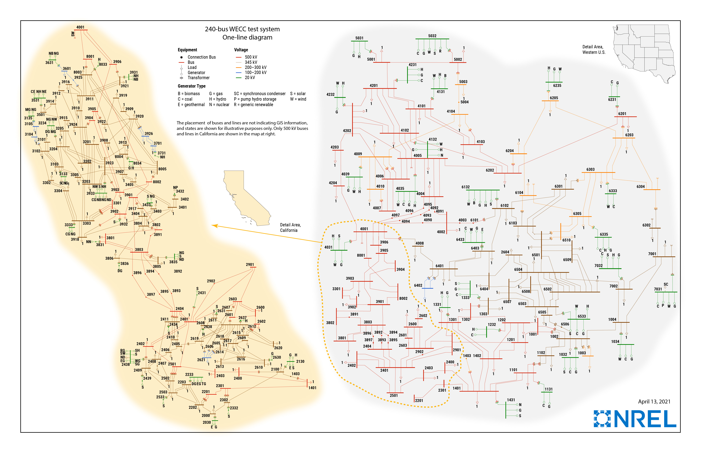

# Western Electricity Coordinating Council (WECC)

## One-Line Diagram

Figure 1: One-line diagram of the WECC240 case.[^1]

## Development

The complete dynamics of this case are modeled in GridKit.

This case was validated against PowerWorld. The comparison results are provided [here](../../../examples/PhasorDynamics/Validation/WECC240/README.md).

[^1]: [National Laboratory of the Rockies Test Case Repository](https://www.nlr.gov/grid/test-case-repository).
