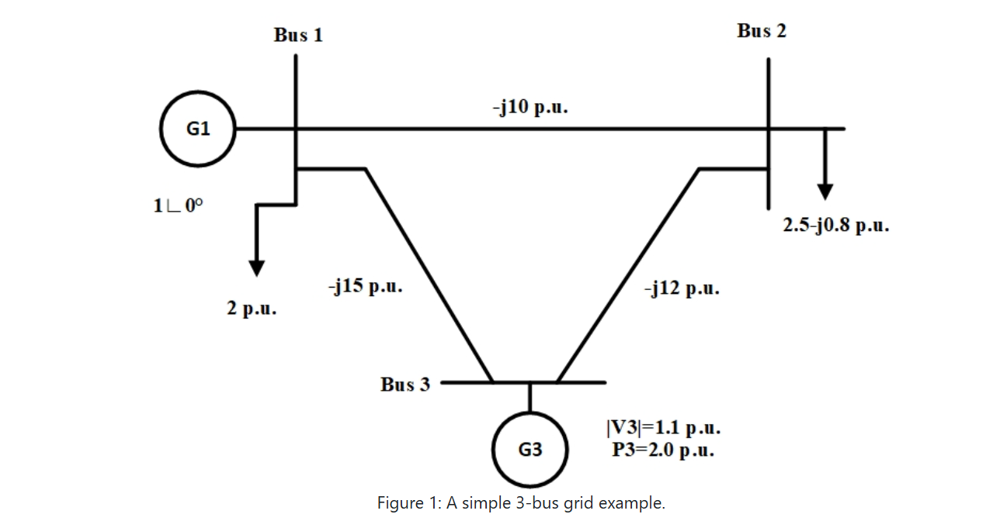

Notation: $I_{a,b}$ represents the current flowing into Bus b from the branch connecting Bus a and Bus b, $I_{G,a}$ the current from generator a, $I_{L,a}$ the current from load a, and $V_a$ the voltage at Bus a.
Each component is sub-index by the components ID. The 3Bus model is composed of 3 buses, 3 branches, 2 loads and 2 generators. For simplicity in some equation, $I = \left[\begin{array}{c} I_r \\ I_i \end{array}\right]$ to represent complex variables.

## Bus equations:
```math 
I_{G,1}+I_{2,1}+I_{3,1}+I_{L,1} = 0
```
```math
I_{L,2}+I_{1,2}+I_{3,2} = 0
```
```math 
I_{G,3}+I_{1,3}+I_{2,3} = 0
```

## Branch equations:

(branch connecting Bus 1 and Bus 2)
```math
\left[ \begin{array}{c}
        I_{2,1} \\
        I_{1,2}
    \end{array}\right] = 
    Y^{[1]}\left[ \begin{array}{c}
        V_1 \\
        V_2
\end{array}\right]
```

(branch connecting Bus 2 and Bus 3)
```math
\left[ \begin{array}{c}
        I_{3,2} \\
        I_{2,3}
    \end{array}\right] = 
    Y^{[2]}\left[ \begin{array}{c}
        V_2 \\
        V_3
    \end{array}\right]
```

(branch connecting Bus 1 and Bus 3)
```math
\left[ \begin{array}{c}
        I_{3,1} \\
        I_{1,3}
    \end{array}\right] = 
    Y^{[3]}\left[ \begin{array}{c}
        V_1 \\
        V_3
    \end{array}\right]
```

 ## Load equations:
 Loads connected to bus 1:
```math
 I_{L,1} = \frac{V_1}{R_1} 
``` 
Loads connected to bus 2:
```math
    I_{L,2} = \frac{V_2}{R_2}
```

## Generator 1
Generator connected to bus 1:<br>
Differential equations: 
```math
\dot{\delta}_1 = \omega_1 \cdot \omega_0 
```
```math
\dot{\omega}_1 = \frac{1}{2H_1}\left( \frac{P_{mech,1} - D_1\omega_1}{1+\omega_1} - T_{elec,1}\right)
```
```math
\dot{E}_{qp,1} = \frac{1}{T_{dop,1}}\left(  E_{fd,1} - \left( E_{qp,1} + X_{d1,1}\left( I_{d,1} + X_{d3,1}\left( E_{qp,1} - \psi_{dp,1} - X_{d2,1}I_{d,1} \right)  \right) + \psi_{dpp,1}\cdot k_{sat,1} \right) \right)
```
```math 
\dot{\psi}_{dp,1} = \frac{1}{T_{dopp,1}} \left( E_{qp,1} - \psi_{dp,1} - X_{d2,1} I_{d, 1} \right)
``` 
```math
\dot{\psi}_{qp,1} = \frac{1}{T_{qopp,1}} \left( E_{dp,1} - \psi_{qp,1} + X_{q2,1}I_{q,1}\right)
```
```math
\dot{E}_{dp,1} = \frac{1}{T_{qop,1}}\left(-E_{dp,1} + X_{qd,1}\psi_{qpp,1}\cdot k_{sat,1} + X_{q1,1} \left(I_{q,1} - X_{q3,1} \left(E_{dp,1} + I_{q,1}X_{q2,1} - \psi_{qp,1}\right)\right)\right)
```
Algebraic equations:
```math
V_{d,1} = -\psi_{qpp,1}(\psi_{qp,1},E_{dp,1})(1+\omega_1)
```
```math
V_{q,1} = \psi_{dpp,1}(\psi_{dp,1},E_{qp,1})(1+\omega_1)
```
```math
I_{d,1} = I_{G,r,1}\sin(\delta_1) - I_{G,i,1}\cos(\delta_1)
```
```math
I_{q,1} = I_{G,r,1}\cos(\delta_1) + I_{G,i,1}\sin(\delta_1)
```

Network interfaces:
```math
V_{d,1} = V_{r,1}\sin(\delta_1) - V_{i,1}\cos(\delta_1) + I_{d,1} R_{a,1}  -I_{q,1} X_{qpp,1}
```
```math
V_{q,1} = V_{r, 1}\cos(\delta_1) + V_{i,1}\sin(\delta_1) + I_{d,1}X_{qpp,1} + I_{q,1}R_{a,1}
```

We can lump together the algebraic and network interface equations to get the following equivalent constraint equations:
```math
\left[\begin{array}{c}
I_{d} \\ 
I_{q}
\end{array}\right] = 
\left[\begin{array}{cr}
\sin(\delta_1) & -\cos(\delta_1)\\
\cos(\delta_1) & \sin(\delta_1)
\end{array}\right] 
\left[\begin{array}{c}
I_{G,r,1} \\ 
I_{G,i,1}
\end{array}\right] 
```
```math
\left[\begin{array}{c}
-\psi_{qpp,1}(\psi_{qp,1},E_{dp,1})(1+\omega_1) \\
\psi_{dpp,1}(\psi_{dp,1},E_{qp,1})(1+\omega_1)
\end{array}\right]
- \left[\begin{array}{cr}
\sin(\delta_1) & -\cos(\delta_1)\\
\cos(\delta_1) & \sin(\delta_1)
\end{array}\right] 
\left[\begin{array}{c}
V_{r,1} \\ 
V_{i,1}
\end{array}\right] 
=
\left[\begin{array}{cr}
R_a & -X_{qpp}\\
X_{qpp} & R_a
\end{array}\right] 
\left[\begin{array}{c}
I_{d} \\ 
I_{q}
\end{array}\right]
```
## Generator 3
Generator connected to bus 3:<br>
Differential equations: 
```math
\dot{\delta}_3 = \omega_3 \cdot \omega_0 
```
```math
\dot{\omega}_3 = \frac{1}{2H_3}\left( \frac{P_{mech,3} - D_3\omega_3}{1+\omega_3} - T_{elec,3}\right)
```
```math
\dot{E_{qp,3}} = \frac{1}{T_{dop,3}}\left(  E_{fd,3} - \left( E_{qp,3} + X_{d1,3}\left( I_{d,3} + X_{d3,3}\left( E_{qp,3} - \psi_{dp,3} - X_{d2,3}I_{d,3} \right)  \right) + \psi_{dpp,3}\cdot k_{sat,3} \right) \right)
```
```math 
\dot{\psi}_{dp,3} = \frac{1}{T_{dopp,3}} \left( E_{qp,3} - \psi_{dp,3} - X_{d2,3} I_{d,3} \right)
``` 
```math
\dot{\psi}_{qp,3} = \frac{1}{T_{qopp,3}} \left( E_{dp,3} - \psi_{qp,3} + X_{q2,3}I_{q,3}\right)
```
```math
\dot{E}_{dp,3} = \frac{1}{T_{qop,3}}\left(-E_{dp,3} + X_{qd,3}\psi_{qpp,3}\cdot k_{sat,3} + X_{q1,3} \left(I_{q,3} - X_{q3,3} \left(E_{dp,3} + I_{q,3}X_{q2,3} - \psi_{qp,3}\right)\right)\right)
```
Algebraic equations:
```math
V_{d,3} = -\psi_{qpp,3}(\psi_{qp^{\prime},3}E_{dp,3})(1+\omega_3)
```
```math
V_{q,3} = \psi_{dpp,3}(\psi_{dp^{\prime},3}E_{qp,3})(1+\omega_3)
```
```math
I_{d,3} = I_{G,r,3}\sin(\delta_3) - I_{G,i,3}\cos(\delta_3)
```
```math
I_{q,3} = I_{G,r, 3}\cos(\delta_3) + I_{G,i,3}\sin(\delta_3)
```

Network interfaces:
```math
V_{d,3} = V_{r,3}\sin(\delta_3) - V_{i,3}\cos(\delta_3) + I_{d,3} R_{a,3}  -I_{q,3} X_{qpp,3}
```
```math
V_{q,3} = V_{r,3}\cos(\delta_3) + V_{i,3} \sin(\delta_3) + I_{d,3}X_{qpp,3} + I_{q,3}R_{a,3}
```

