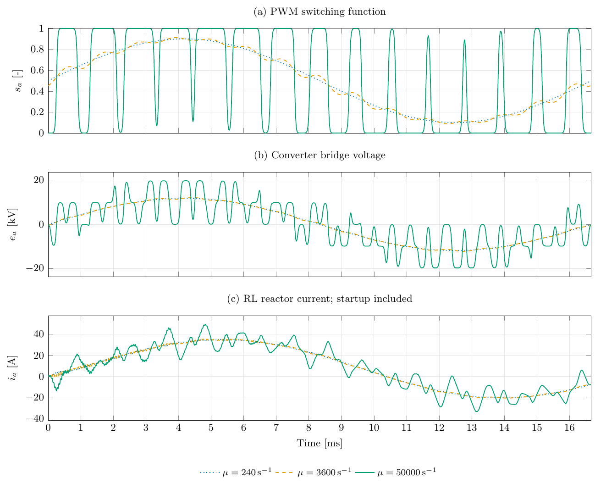

# CoupledGrid switching comparison

Phase-a PWM switching function, converter bridge voltage, and reactor current
at **μ = 240, 3600, and 50000 s⁻¹**. The plot shows the first 60 Hz cycle,
including startup. The carrier is 900 Hz, and the output interval is 1.667 μs.
The largest μ resolves the switching pulses.



[Vector PDF](results/switching.pdf) · [Editable TeX](switching.tex) ·
[Low data](results/low.plot.csv) · [Medium data](results/middle.plot.csv) ·
[High data](results/high.plot.csv)

Run from the repository root with the existing EMT executable:

```bash
python3 examples/EMT/CoupledGrid/plot_switching.py
```

The script writes simulation data and plots directly into `results/`. Rendering
uses pdfLaTeX with additional TeX memory for the full-resolution traces, and
Poppler for the PNG preview.
All runs share the physical case and DC voltage; only μ varies.
See the [case description](../../../cases/EMT/CoupledGrid/README.md) for the
network and the longer load-switching study.
