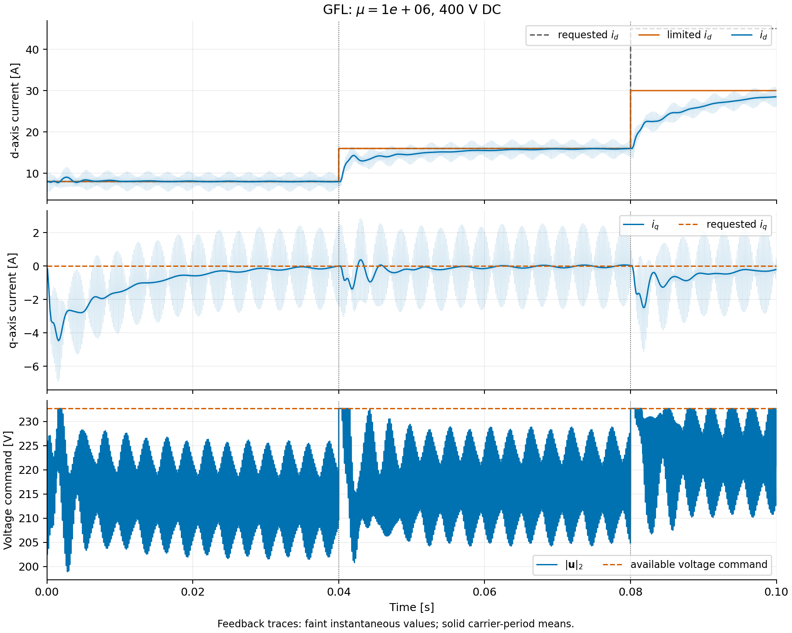
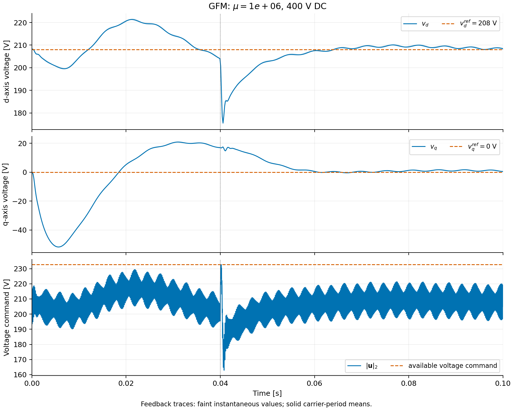
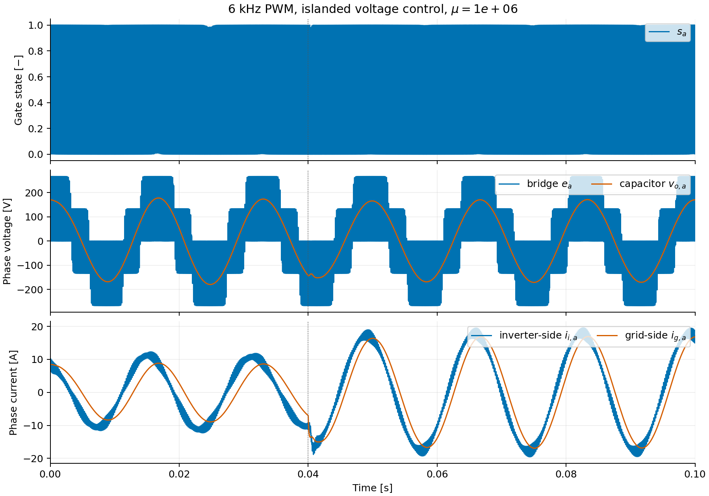
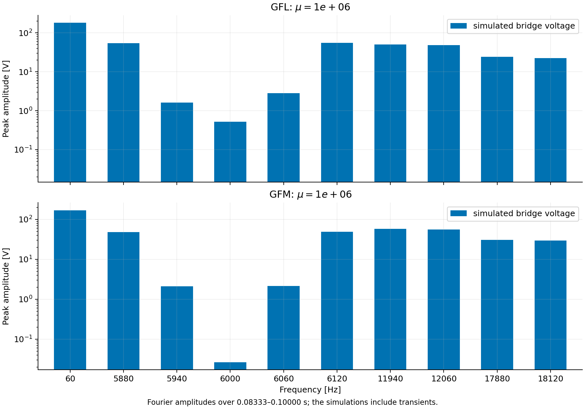

# Switching inverter current and voltage control

These studies connect the shared `InnerCurrentControl`, sampled `PWM`, and
`Converter` to a physical LCL filter. `GFL` tracks a prescribed current reference
against a stiff grid with its known reference angle. `GFM` uses
`OuterVoltageControl` to supply an islanded load at prescribed voltage and
frequency. The examples isolate the cascaded controls; PLL and primary droop
controllers connect through the same reference ports.

The bridge uses 6 kHz centered PWM, a 400 V DC supply, and `mu=1000000`.
The logistic 10–90% edge width is 4.39 µs. The filter has 2 mH / 0.2 Ω on the
inverter side, 100 µF shunt capacitance, and 1 mH / 0.1 Ω on the grid side.
Nominal voltage is 208 V line-to-line RMS at 60 Hz. The current-loop gains
use a 400 Hz nominal RL bandwidth; the voltage loop uses a 60 Hz nominal
bandwidth. All dq quantities use GridKit's power-invariant Park transform.

Both studies run for 0.2 s with 2 µs output spacing.

The current study steps the d-axis reference through 8, 16, 45, and 8 A;
the 45 A request exceeds the 30 A reference limit. The voltage study connects
and disconnects a second 20 Ω/phase load. Both retain all PWM pulses.

## Run and plot

```bash
cmake --build build --target EMTDynamicSimulation -j 10
python3 examples/EMT/CurrentControl/run.py
python3 examples/EMT/CurrentControl/plot.py
```

The runner stores solver logs and CSV waveforms under `simulation/`. The plotting
script writes PNG and PDF figures, compressed waveform data, and a numerical
summary beside them. This directory is deliberately available for review and
optional staging. No files are staged by the scripts. `*.run.json` records input and executable
hashes. Once the compressed files exist, the CSV copies can be removed;
`plot.py` also reads the retained NPZ waveforms.









See the [case files](../../../cases/EMT/CurrentControl/README.md) for the physical
connections and initialization. These are local simulation demonstrations;
formal tests and external benchmark comparisons are separate work.
