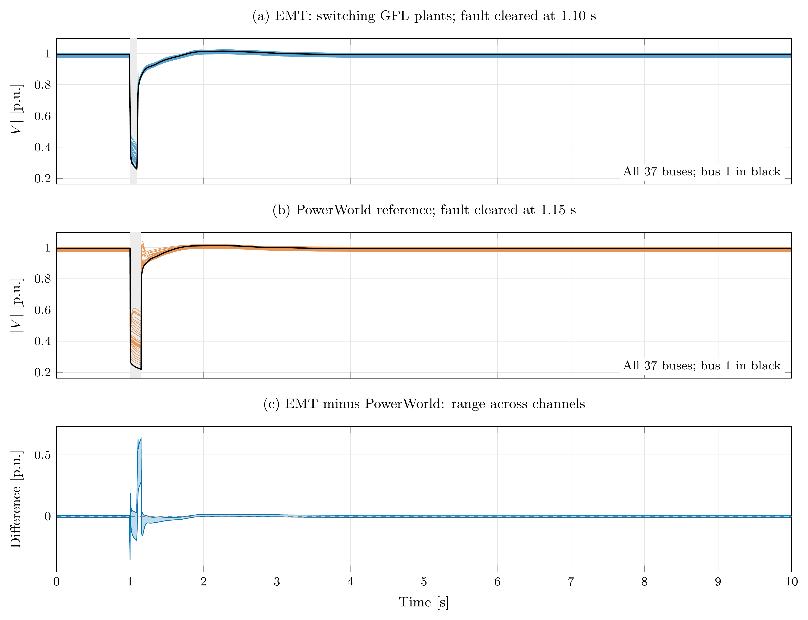
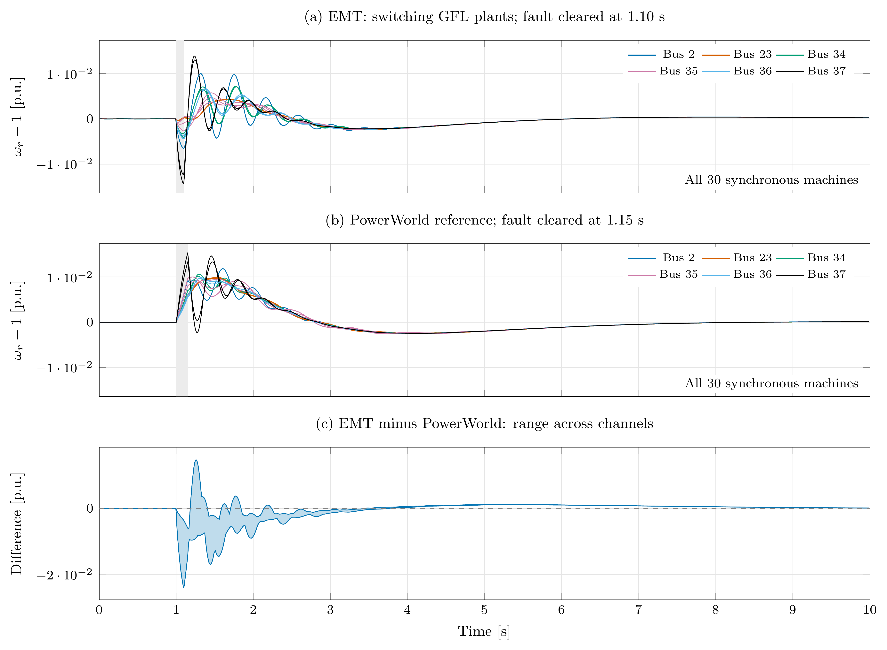
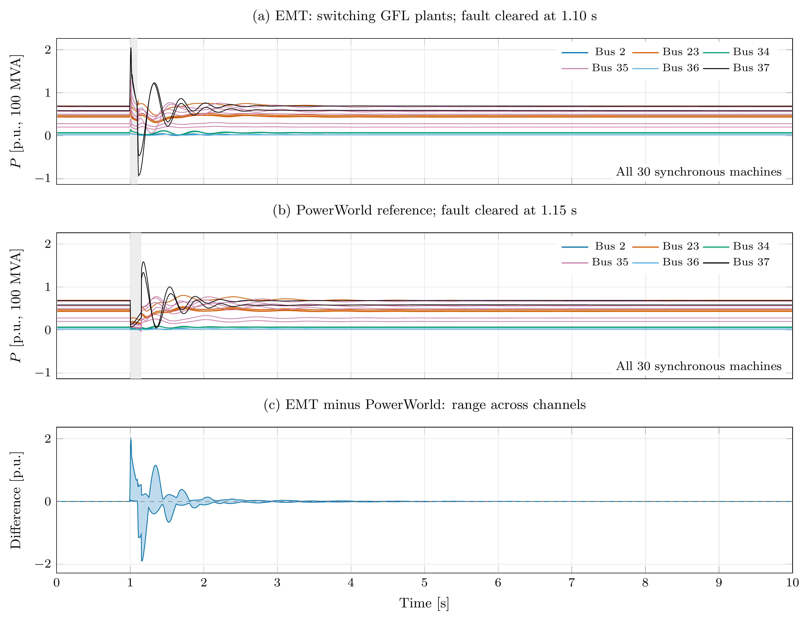
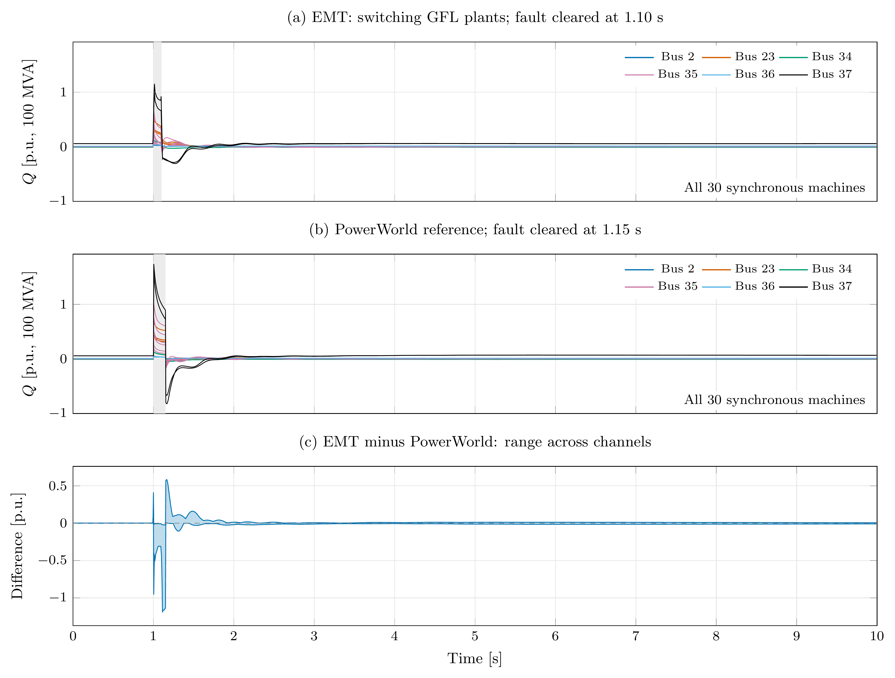

# Hawaii EMT fault study

The [case README](../../../cases/EMT/Hawaii/README.md) documents the conversion,
fabricated data, and deviations from the validated PhasorDynamics case.
The EMT fault runs from 1.0 to 1.10 s. The PowerWorld reference fault runs from
1.0 to 1.15 s. Both intervals are labelled in the plots.

The four figures contain all 37 buses or all 30 synchronous machines, followed
by the range of differences across matching channels. Bus voltage uses a
one-cycle positive-sequence estimate. Machine speed, active power, and reactive
power use cycle means; their colours identify the six machine buses. The time
label is the centre of the averaging window;
the approximately half-cycle transition spreading is a measurement effect.
Powers use the 100 MVA system base. These are comparisons between different
dynamic models, not a new PowerWorld validation.

The ten-second study completes with 4,722,429 accepted steps (median 2.252
microseconds) in 898.07 seconds of solver CPU time in one local run. Final
cycle-averaged bus voltages span 0.97457--1.00167 p.u. Machine speed deviations
span -0.01454--0.01387 p.u. over the run, and DC voltage remains within
0.56 percent of its initial value. The maximum monitored limited-current
ratio is 1.00005543; the validator allows $10^{-4}$ numerical error in that
algebraic quantity.

Channel | RMSE [p.u.] | Maximum absolute difference [p.u.]
------- | ----------- | ----------------------------------
Bus voltage magnitude | 0.032438 | 0.63278
Machine speed deviation | 0.0021838 | 0.023729
Machine active power, 100 MVA base | 0.069352 | 1.9792
Machine reactive power, 100 MVA base | 0.032967 | 1.1947

These differences include the unequal fault intervals. The resistive EMT fault
produces an active-power surge and initial machine deceleration; the inductive
reference fault produces a different initial response. The comparison therefore
does not establish equivalent disturbance dynamics, despite similar recovery
trends. The [deviation list](../../../cases/EMT/Hawaii/README.md#fault-and-comparison)
also covers the winding approximation and replacement inverter controls.









`metrics.json` records the EMT checks and accepted-step statistics;
`comparison.json` records per-channel errors against the frozen reference.
Input and averaged-data hashes connect these reports to the completed runs.
The validator snapshots case inputs before execution; `--reuse` analyzes a
completed snapshot without substituting newer workspace inputs.
`convergence.json` records the tolerance refinement through 1.5 s, including
both fault events. Tightening relative/absolute tolerances from
$10^{-5}/10^{-6}$ to $10^{-6}/10^{-7}$ changes centred cycle channels by at
most $8.11\times10^{-6}$ p.u. in voltage, $4.84\times10^{-7}$ p.u. in speed,
$2.60\times10^{-5}$ p.u. in active power, and $2.58\times10^{-5}$ p.u. in
reactive power on the 100 MVA base. This refinement covers the disturbance
and early recovery; it is not a second ten-second run.
`Hawaii.*.csv` contains the editable figure data and `Hawaii.*.tex` the PGFPlots
sources. PDFs are vector figures and PNGs are rendered at 600 DPI. The figures
remain editable through their TeX/data sources.

`switching.py` checks all nine bridges in a separate one-cycle run sampled at
720 kHz, using the same physical case and solver tolerances. At $\mu=50000$,
the independent periodic logistic-edge sum matches switching functions within
$1.27\times10^{-14}$ and the measured bridge harmonic amplitudes within
$5.10\times10^{-11}$ V. The bridge power identity error is below
$5.90\times10^{-16}$ p.u. on each plant base. `switching.json` records the
fundamental, carrier, and sideband amplitudes. The window includes startup;
these checks establish the continuous switching waveform and DC conversion,
not a steady-state harmonic-performance specification.

From the repository root, with Enzyme and SUNDIALS KLU enabled:

```bash
python3 cases/EMT/Hawaii/convert.py
cmake --build build --target EMTDynamicSimulation -j 10
python3 cases/EMT/Hawaii/validate.py \
  --exe build/application/EMT/EMTDynamicSimulation \
  --tmax 10 --output /tmp/gridkit-hawaii-run
cp /tmp/gridkit-hawaii-run/metrics.json examples/EMT/Hawaii/metrics.json
python3 examples/EMT/Hawaii/plot.py \
  --averaged /tmp/gridkit-hawaii-run/Hawaii.averaged.csv
python3 cases/EMT/Hawaii/validate.py \
  --exe build/application/EMT/EMTDynamicSimulation \
  --tmax 1.5 --rel-tol 1e-6 --abs-tol 1e-7 --output /tmp/gridkit-hawaii-refined
python3 examples/EMT/Hawaii/convergence.py \
  --baseline /tmp/gridkit-hawaii-run --refined /tmp/gridkit-hawaii-refined
python3 examples/EMT/Hawaii/switching.py \
  --exe build/application/EMT/EMTDynamicSimulation
ctest --test-dir build -R EMTHawaiiCase --output-on-failure
```

The CTest study ends at 1.5 s and covers fault inception, clearing, and early
recovery. The delivered ten-second study checks the longer response separately.
Plot generation reads the PowerWorld CSVs with `git show` at the same frozen
source revision used by the converter; no checkout is needed. It requires
PGFPlots, pdfLaTeX, and Poppler. Simulation and validation require only Python's
standard library in addition to the EMT executable.
