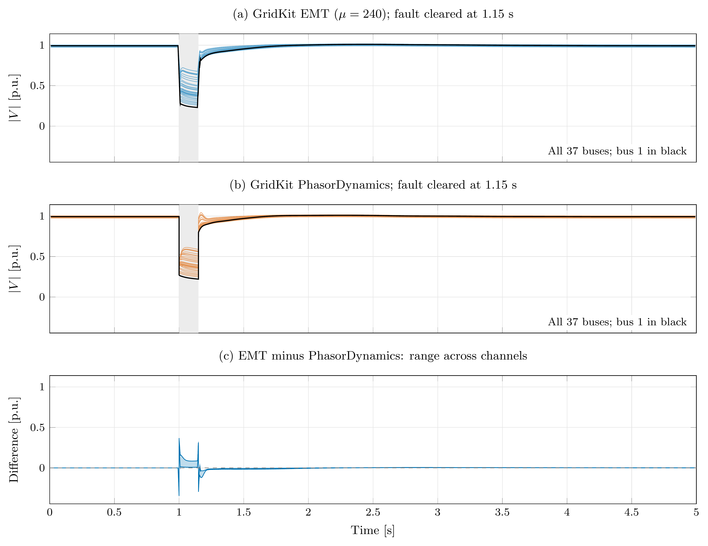
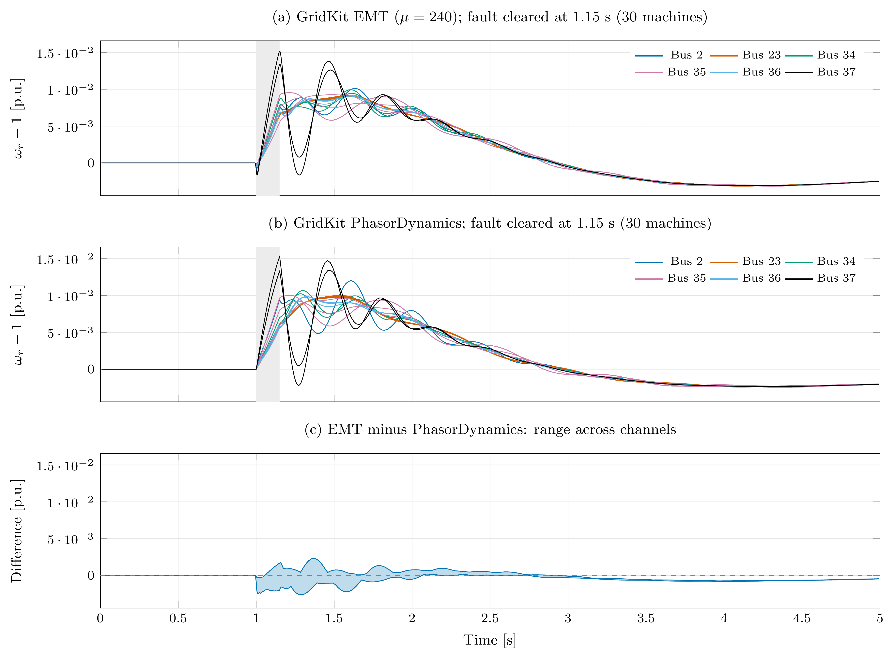
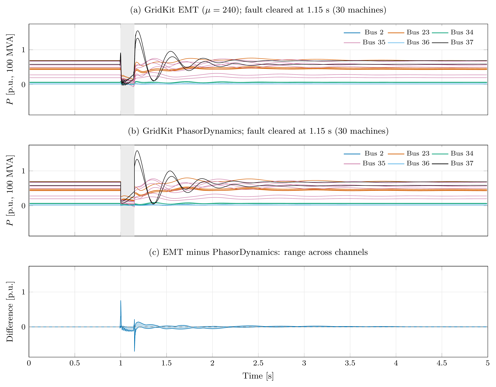
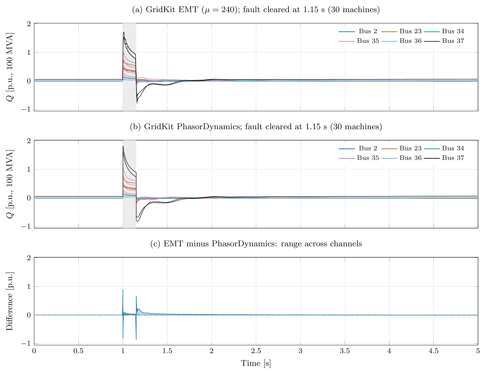

# Hawaii EMT fault study

The [case README](../../../cases/EMT/Hawaii/README.md) documents the conversion,
fabricated data, and deviations from the validated PhasorDynamics case.
The EMT and GridKit PhasorDynamics validation solvers both apply the fault
from 1.0 to 1.15 s. The plots label the actual intervals recorded by each run.

The four comparison figures contain all 37 buses or all 30 synchronous machines, followed
by the range of differences across matching channels. All three rows share
the same vertical limits within each figure. Bus voltage uses a
one-cycle positive-sequence estimate. Machine speed, active power, and reactive
power use cycle means; their colours identify the six machine buses. The time
label is the centre of the averaging window;
the approximately half-cycle transition spreading is a measurement effect.
Around the fault, averages retain the 7200 Hz monitor cadence so that residual
power ripple is drawn smoothly. This changes sampling density, not the
one-cycle averaging window.
Powers use the 100 MVA system base. Both trajectories are simulated by GridKit;
the fault impedance at 60 Hz and the event times match, while the dynamic
models retain the differences documented in the case README.

The current plots cover 0–5 s with the inductive fault cleared at 1.15 s.









The inverter plants use the same LCL Filter wiring as the GFL control example.
The generator preserves terminal dispatch and supplies frequency, Bus voltage,
and Filter grid current. EMT initialization derives the capacitor voltage,
converter current, and controller commands.
The filter and local converter-control parameters are synthetic; REPCA and REECB parameters
come from the source case, as listed in the case README.

Generate current results using the commands below. PNG/PDF plots in
`results/` and `results/mu50000/` are included in the figure allowlist.
Editable TeX/data and measured validation/comparison
statistics remain ignored; no numerical snapshot is assumed to describe a
regenerated case.

Each phase of the fault uses a 5.05158 mH inductor. At clearing, a second
switch connects a 1.9044 ohm discharge resistor while the grid switch opens.
The resistor is disconnected during the fault; afterward it dissipates the
isolated inductor energy with a 2.65258 ms time constant. The validator checks
paired switch commands, current continuity, zero current through the open grid
switch, and the analytical discharge decay. Remaining model differences include
[stator transients, saturation formulations, and replacement inverter controls](../../../cases/EMT/Hawaii/README.md#fault-and-comparison).

`results/Hawaii.{vmag,omega,p,q}.pdf` contains the four vector figures;
matching PNGs are rendered at 600 DPI. Each figure retains its editable
`.tex` source and `.csv` data. The figures remain on the TeX editing path.
`results/comparison.json` records per-channel differences against the newly
simulated PhasorDynamics run. `results/emt/metrics.json` records physical
checks, input/executable/library hashes, and accepted-step statistics.

The normal EMT workflow and CTest use `mu = 240`, `max_order = 2`,
`rel_tol = 1e-5`, and model-scaled `abs_tol = 1e-6`. The generated case supplies
fixed nominal voltage/current ratings. The separate switching check retains
`mu = 50000`, order 5, and scalar `abs_tol = 1e-6`.

The lumped lines use coupled GridWorkbench-based parameters calibrated to
the source positive sequence; see the case README for the geometry assumptions.
To compare regenerated lines against a saved case/state directory with identical
solver settings, run:

```bash
python3 examples/EMT/Hawaii/benchmark.py --baseline /path/to/saved/Hawaii
```

This uses scalar absolute tolerances and order 5 by default so older cases
without nominal ratings receive the same error weights. `--max-order 2` selects
the smoothed-study order; `--scaled-abs-tol` requires matching nominal ratings
in both cases. It runs three sequential trials per case and mu, with no intermediate monitoring
and a 0.2 s duration. `--tmax 5 --dt-monitor 0.0001388888888888889` includes
the fault and recovery with the usual output cadence. Logs, input and binary
hashes, CPU/wall timings, and IDA counters are saved below
`results/line-parameters/benchmark`. This benchmark does not regenerate plots.

`phasor.py` copies the case and validation inputs from `lukel/cases-polish-dev`
into the ignored, untracked `phasor-reference/` directory and runs the original
`DynamicSimulation Hawaii.solver.json` validation command unchanged. The
branch's recorded reference is used only by that original validation check.
The comparison run records all four quantities and applies the same
negative-`Ke` exciter adjustment as the EMT conversion. Its initial speed must match the original run.
The EMT plotter reads only these newly simulated GridKit traces.

The original copied inputs remain unchanged. Source revisions, input hashes,
timings, and output hashes are saved with the runs. The former resistive-fault
comparison is archived under `results/history/`.

`switching.py` checks all nine bridges in a separate one-cycle run sampled at
720 kHz, using the same physical case and solver tolerances. It compares the
switching functions and bridge harmonics with an independent periodic sigmoid
sum at the instantaneous duty, and checks the bridge voltage projection. `results/switching.json` records fundamental,
carrier, and sideband amplitudes. The window includes startup; these checks
establish the continuous switching equations and voltage conversion, not a
steady-state harmonic-performance specification.

From the repository root, with Enzyme and SUNDIALS KLU enabled:

```bash
python3 cases/EMT/Hawaii/convert.py
cmake --build build --target EMTDynamicSimulation DynamicSimulation -j 10
python3 cases/EMT/Hawaii/validate.py \
  --exe build/application/EMT/EMTDynamicSimulation \
  --tmax 5 --output examples/EMT/Hawaii/results/emt
python3 examples/EMT/Hawaii/phasor.py \
  --exe build/application/PhasorDynamics/DynamicSimulation
python3 examples/EMT/Hawaii/plot.py \
  --averaged examples/EMT/Hawaii/results/emt/Hawaii.averaged.csv --waveforms
python3 cases/EMT/Hawaii/validate.py \
  --exe build/application/EMT/EMTDynamicSimulation \
  --tmax 5 --mu 50000 --output examples/EMT/Hawaii/results/mu50000/emt
python3 examples/EMT/Hawaii/switching.py \
  --exe build/application/EMT/EMTDynamicSimulation \
  --output examples/EMT/Hawaii/results/mu50000/switching.json
python3 examples/EMT/Hawaii/plot.py \
  --averaged examples/EMT/Hawaii/results/mu50000/emt/Hawaii.averaged.csv \
  --output examples/EMT/Hawaii/results/mu50000 --waveforms \
  --switching examples/EMT/Hawaii/results/mu50000/switching
ctest --test-dir build -R EMTHawaiiCase --output-on-failure
```

The two 5 s fault runs differ only in `mu`; both retain order 2, scaled absolute
tolerances, and 7200 Hz monitoring. The separate startup switching detail uses
720 kHz monitoring and the settings documented above; it is not a fault-time
switching zoom.

Additional figure | Default `mu=240` | `mu=50000`
----------------- | ---------------- | ----------
Three-phase bus voltages | [Voltages](results/Hawaii.voltage-abc.png) | [Voltages](results/mu50000/Hawaii.voltage-abc.png)
Converter and grid phase currents | [Currents](results/Hawaii.current-abc.png) | [Currents](results/mu50000/Hawaii.current-abc.png)
Grid-current commands and measured dq currents, all nine plants | [Tracking](results/Hawaii.current-dq.png) | [Tracking](results/mu50000/Hawaii.current-dq.png)
Instantaneous inverter active/reactive power, all nine plants | [Power](results/Hawaii.inverter-pq.png) | [Power](results/mu50000/Hawaii.inverter-pq.png)
PLL frequency, all nine plants | [Frequency](results/Hawaii.pll.png) | [Frequency](results/mu50000/Hawaii.pll.png)
Switching functions and bridge phase voltages | — | [Startup detail](results/mu50000/Hawaii.switching.png)

These additional figures use instantaneous samples, without RMS or cycle
averaging. Phase panels retain every 7200 Hz sample in windows around fault
inception, clearing, and final recovery. Full-duration control and power plots
display every sixth sample near the fault and every 24th elsewhere; use the
separate 720 kHz detail to inspect switching edges.

The CTest study ends at 1.5 s and covers fault inception, clearing, and early
recovery. The example solver and plotting command run to 5 s; the plotter
follows the completed run duration. The copied PhasorDynamics
study always retains the validation case's ten-second duration and solver
settings. No branch checkout is needed.

Plot generation requires PGFPlots, pdfLaTeX, and Poppler. Simulation and
validation require only Python's standard library and the GridKit executables.

The nine EMT plants retain their source REPCA voltage controllers and REECB
electrical controllers. REPCA `qext` drives REECB `Qref`; active references remain
constant signals. REECB replaces Hawaii's generic OuterPowerControl, which remains
available for the standalone GFL example. InnerCurrentControl compensates the
fundamental capacitor current and retains converter-current feedback. Source
terminal-current priority and the synthetic bridge current rating are distinct.
The remaining REGCA differences are listed in the case README.
