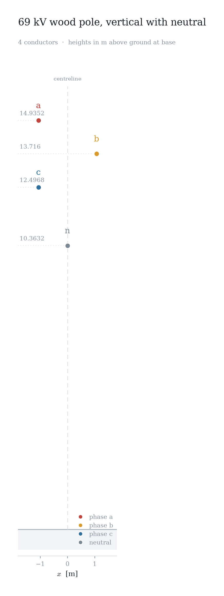
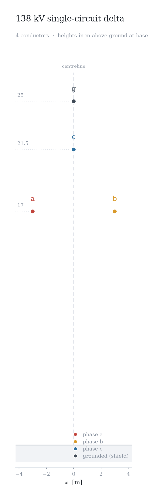
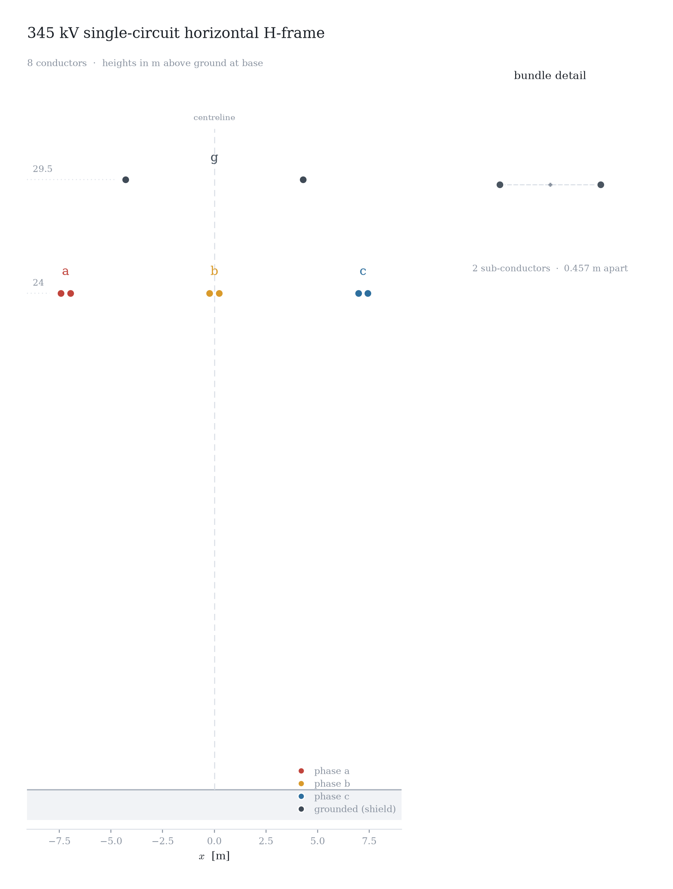
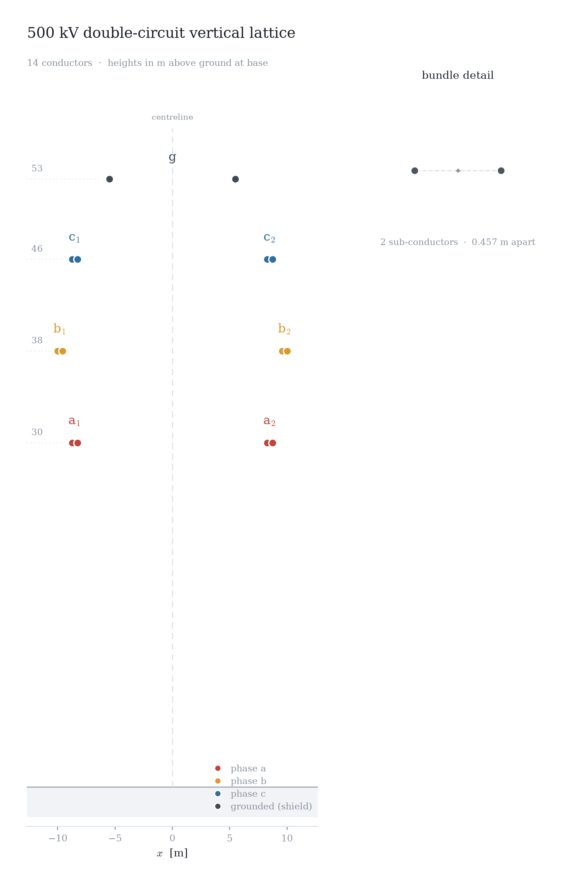
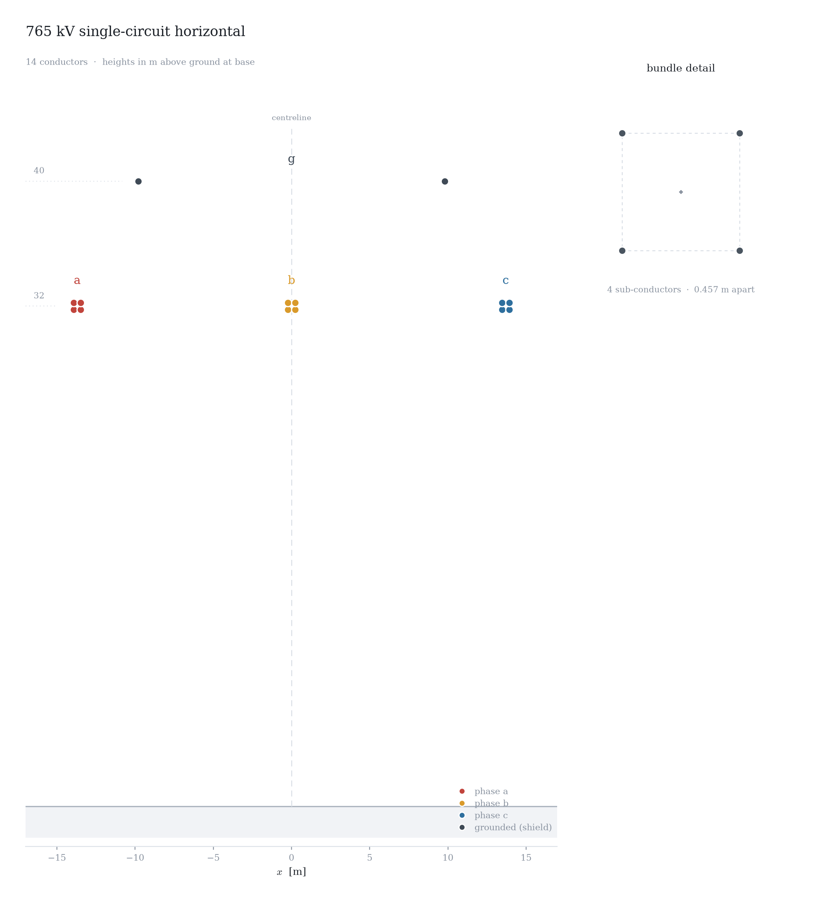

# Overhead Line Inputs

Complete overhead-line input documents in the `line` 1.0 format described
by the [overhead line schema documentation](../../../docs/models/emt/parameters/schema.md).
Each file describes one homogeneous line section: physical conductors hung
on the attachment points of a tower type, the route, and the earth return.
All values are SI. Conductor materials, tensions, and earth data are
illustrative, not normative specifications.

Conductor and tower types come from a catalog, and the examples cover both
forms: types defined in the document's own `catalog` section
(self-contained), and types shared through an included YAML catalog
([`north-american.catalog.yaml`](north-american.catalog.yaml)).

File | Structure | Types
---- | --------- | -----
[`69kv-wood-pole.line.json`](69kv-wood-pole.line.json) | Vertical wood pole with underbuilt neutral, no shield wire | document catalog
[`138kv-delta.line.json`](138kv-delta.line.json) | Single-circuit delta, one shield wire, GIS route | document catalog
[`345kv-horizontal.line.json`](345kv-horizontal.line.json) | Horizontal H-frame, twin bundles, tension supplied | included catalog
[`500kv-double-circuit.line.json`](500kv-double-circuit.line.json) | Double-circuit vertical lattice, twin bundles | included catalog
[`765kv-horizontal.line.json`](765kv-horizontal.line.json) | Horizontal, four-conductor square bundles | included catalog

## Tower Cross-Sections











## Rendering

[`render_tower.py`](render_tower.py) regenerates the cross-section figures
(requires matplotlib and PyYAML):

```sh
python render_tower.py *.line.json
```

## Validation

The repository test script validates the generated schema, every example,
catalog resolution, and a set of known-invalid documents:

```sh
python ../../../tests/Schema/validate_line_inputs.py
```

The loader additionally enforces the semantic rules listed in the schema
documentation: include resolution, unique type names, resolvable tower,
conductor, and attachment references, single-use attachment points, and a
positive minimum conductor height when tension is supplied.
