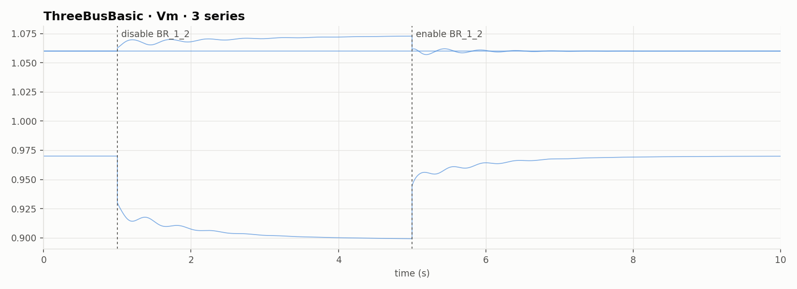
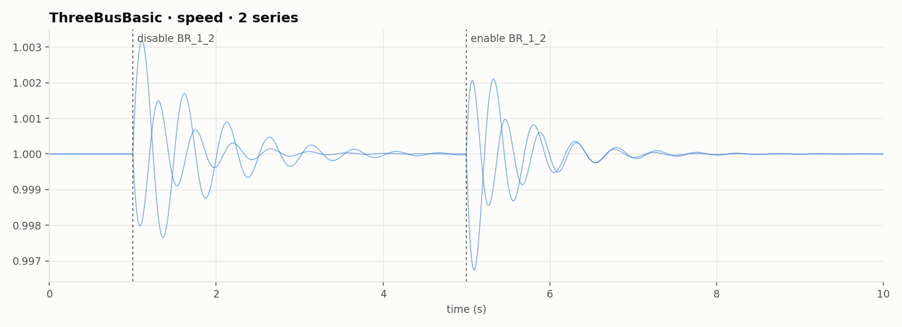

# ThreeBusBasic Line Switching

This study uses the reusable
[ThreeBusBasic case](../../../../../cases/PhasorDynamics/Toy/README.md).
Branch `BR_1_2` is taken out of service at 1 s and put back in service at 5 s.

