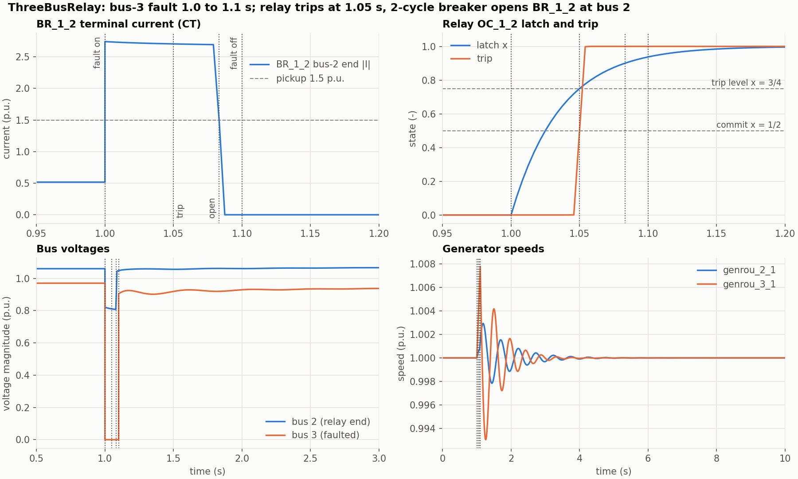

# ThreeBusRelay Line Trip

This study uses the reusable
[ThreeBusRelay case](../../../../../cases/PhasorDynamics/Toy/README.md).
A bus-3 fault from 1.0 s to 1.1 s drives the bus-2 terminal current of branch
`BR_1_2` above pickup. Relay `OC_1_2` trips at 1.05 s, and the bus-2 breaker
opens two cycles later and stays open.

