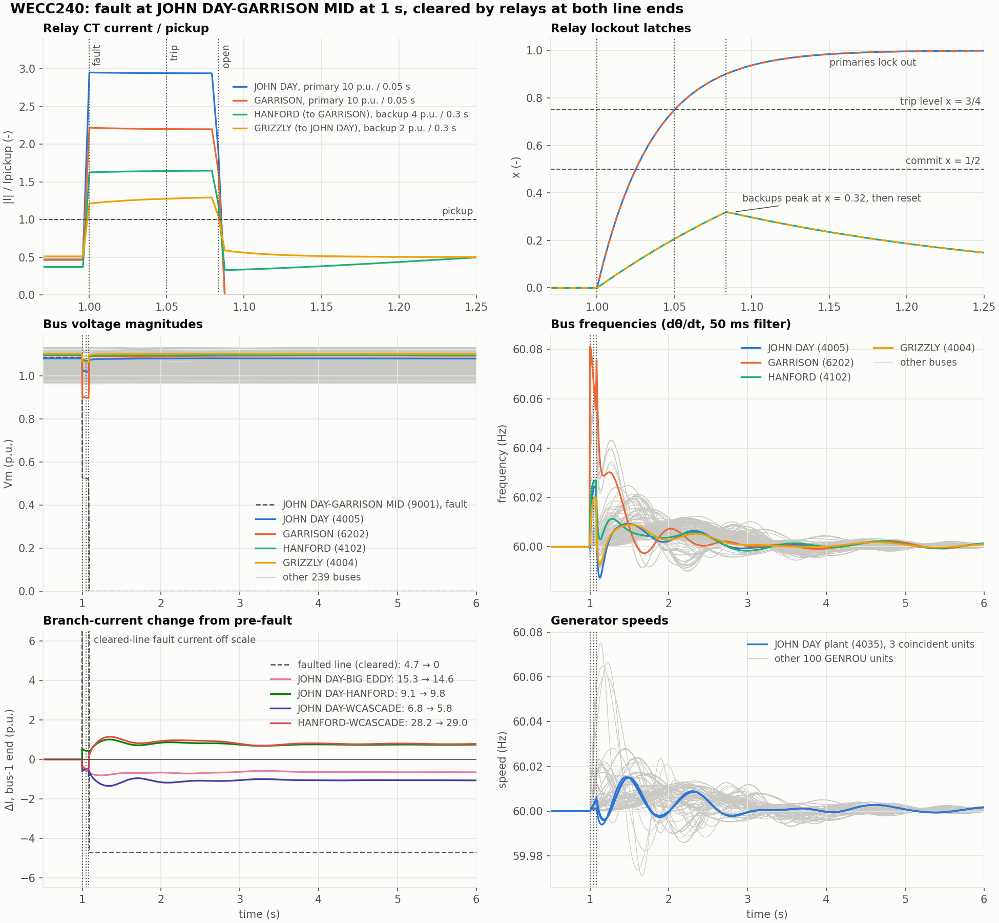

# WECC240Relay Line Trip

This study uses the
[WECC240Relay case](../../../../cases/PhasorDynamics/WECC240/README.md): the
WECC240 case with the JOHN DAY-GARRISON 500 kV line split at mid-line bus 9001
into two `BranchBreakers` sections. A permanent fault at bus 9001 starts at
1.0 s. The primary relays trip at 1.05 s, both line ends open two cycles later
and stay open, and the backup relays pick up during the fault and reset.

Relay            | CT location                      | `Ipickup` [p.u.] | `Ttrip` [s] | Role
-----------------|----------------------------------|------------------|-------------|--------
`oc_4005_9001_1` | JOHN DAY end of the faulted line | 10               | 0.05        | Primary
`oc_6202_9001_1` | GARRISON end of the faulted line | 10               | 0.05        | Primary
`oc_4102_6202_1` | HANFORD end of HANFORD-GARRISON  | 4                | 0.3         | Backup
`oc_4004_4005_1` | GRIZZLY end of GRIZZLY-JOHN DAY  | 2                | 0.3         | Backup

Regenerate the figure by running `plot.py` from the example build directory.
