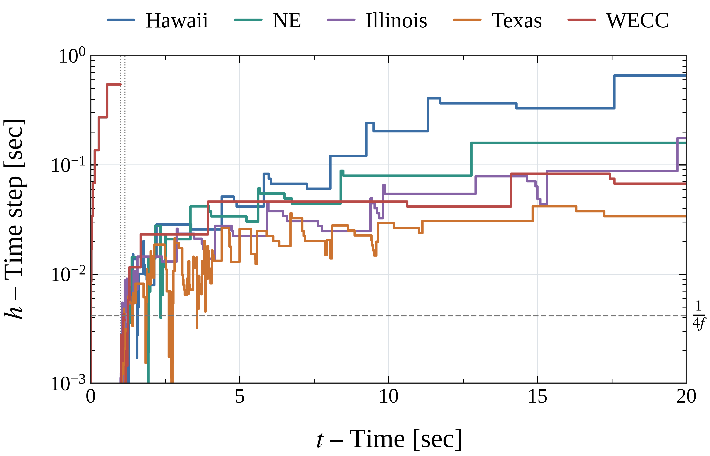
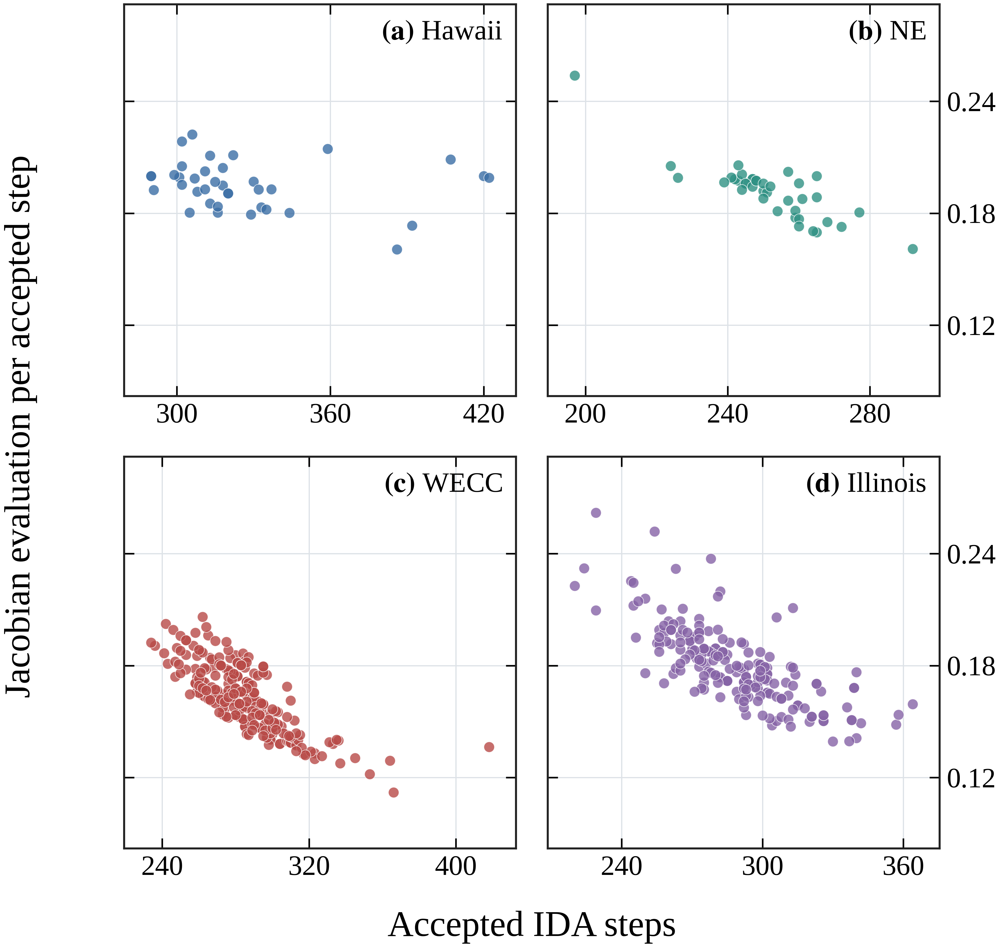
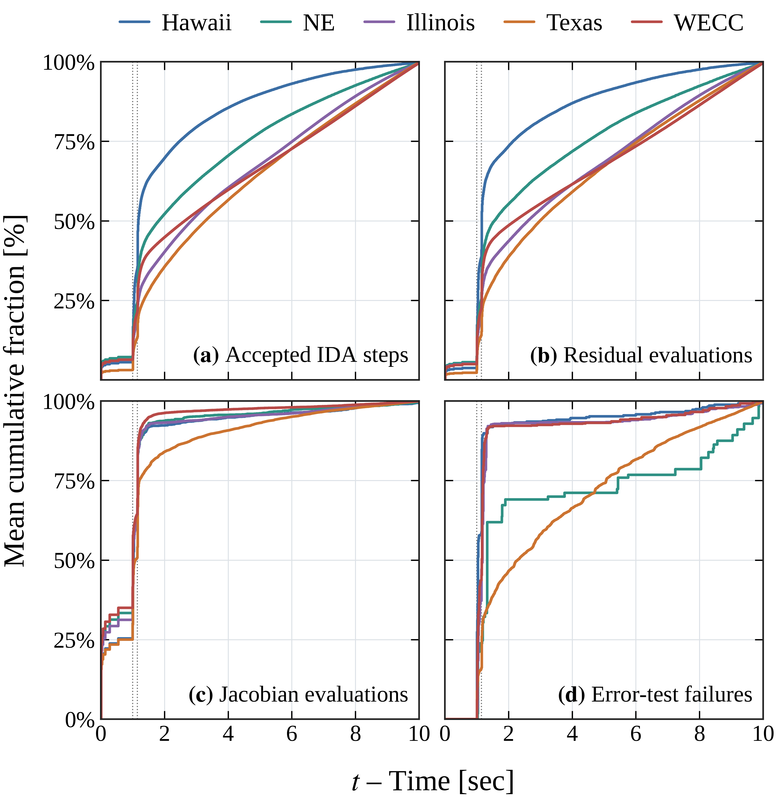
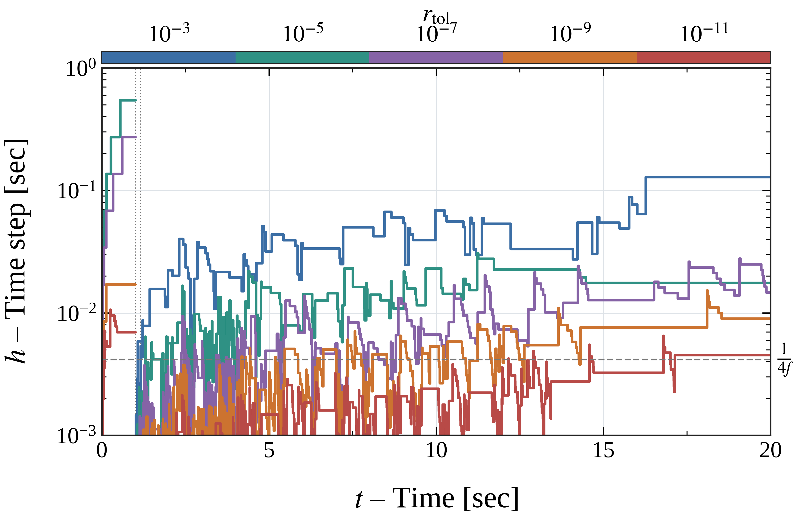
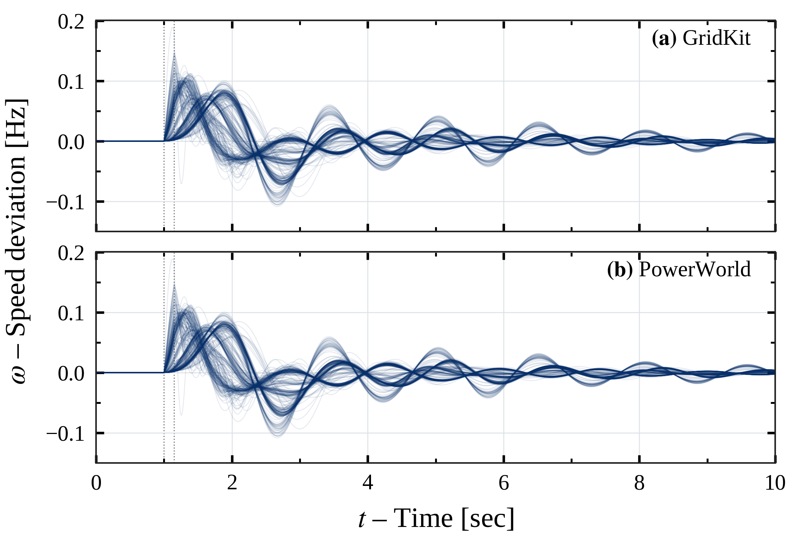
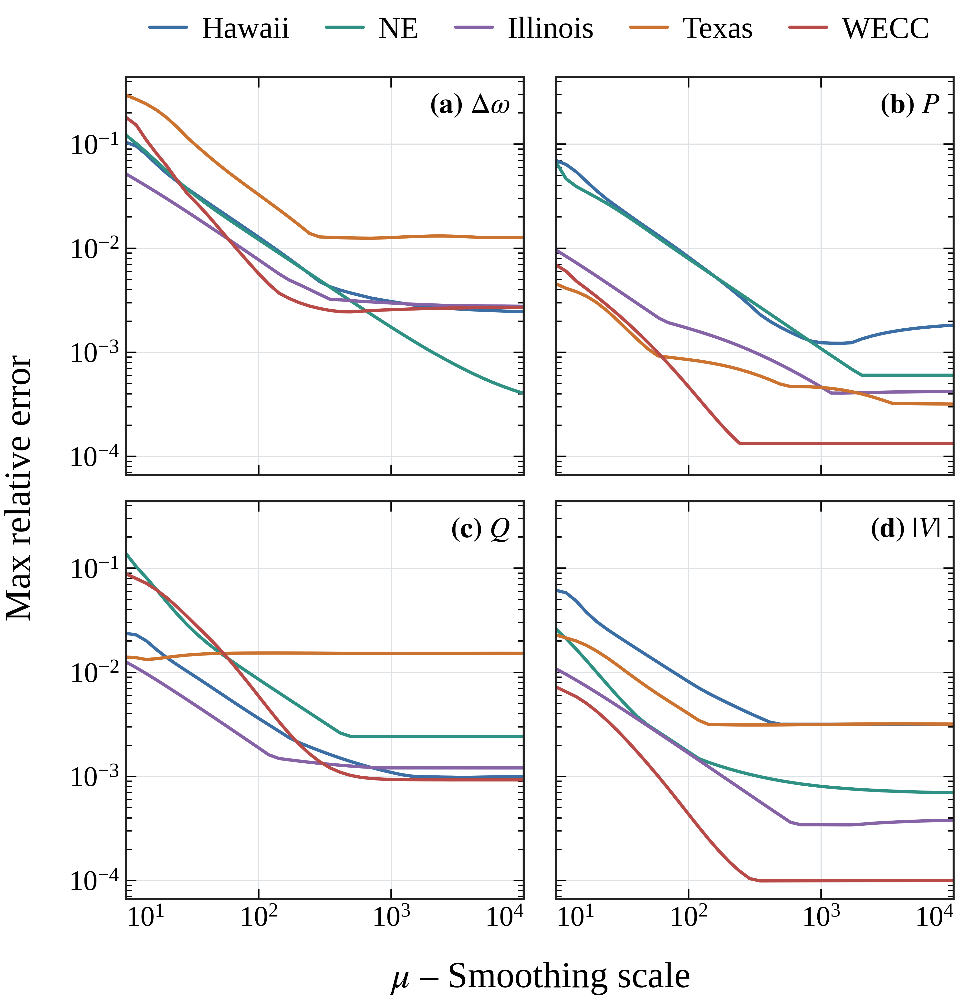
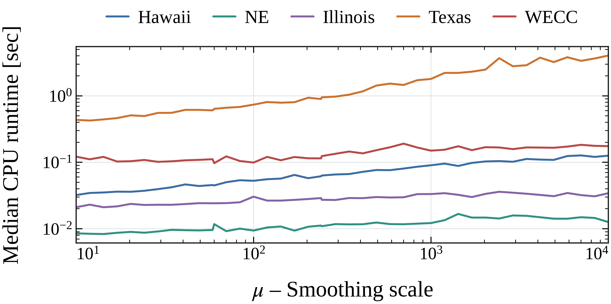

# HICSS-60

| Experiment | Figures | Contents |
| --- | --- | --- |
| [adaptive-step](adaptive-step/README.md) | Fig. 3 | Adaptive timesteps |
| [ctg-analysis](ctg-analysis/README.md) | Fig. 4 | Solver effort |
| [ida-work](ida-work/README.md) | Fig. 5 | Mean contingency work |
| [ida-tol](ida-tol/README.md) | Fig. 6 | Tolerance sensitivity |
| [validation](validation/README.md) | Fig. 7 | Signal validation |
| [mu-error-sensitivity](mu-sweep/error-sensitivity/README.md) | Fig. 8 | Errors vs. μ |
| [mu-runtime-sensitivity](mu-sweep/runtime-sensitivity/README.md) | Fig. 9 | Runtime vs. μ |
| [benchmark](benchmark/README.md) | | Runtime/error table |

## Figure 3

## Figure 4

## Figure 5

## Figure 6

## Figure 7

## Figure 8

## Figure 9

