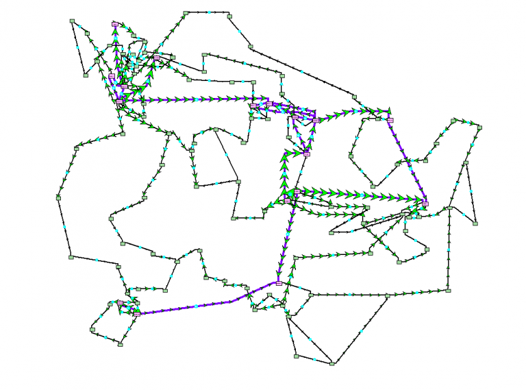

  # Synthetic Illinois (ACTIVSg200)

  ## One-Line Diagram

Figure 1: Oneline of the ACTIVSg200 Case, from Texas A&M University [Grid Repository](https://electricgrids.engr.tamu.edu/electric-grid-test-cases/activsg200/) (Updated Oneline WIP)

  ## Case Description

  Geographically located in the state of Illinois, the ACTIVSg200 case is a 200 bus power system test case that is entirely synthetic, built from public information and a statistical analysis of real power systems. It bears no relation to the actual grid in this location, except that generation and load profiles are similar. The dynamics of this case are fully modled in GridKit.

  Model | Count
  ---|---
  [Bus](../../../../GridKit/Model/PhasorDynamics/Bus/README.md) | 200
  [Branch](../../../../GridKit/Model/PhasorDynamics/Branch/README.md) | 246
  [GENROU](../../../../GridKit/Model/PhasorDynamics/SynchronousMachine/GENROUwS/README.md) | 40
  [TGOV1](../../../../GridKit/Model/PhasorDynamics/Governor/Tgov1/README.md) | 40
  [SEXS-PTI](../../../../GridKit/Model/PhasorDynamics/Exciter/SEXS-PTI/README.md) | 40
  [LoadZIP](../../../../GridKit/Model/PhasorDynamics/LoadZIP/README.md) | 164
  [SignalNode](../../../../GridKit/Model/PhasorDynamics/SignalNode/README.md) | 120

  ## Data Notes

  The reference case from the `.pwb` file had a missing machien model at `Bus 197 GIBSON CITY 1 2`, so I inserted a `GENROU` machine model. The case will not initialize in steady state without it, and its best not to add a negative impedance load.

  ## Events

  The following event types are provided for this case.

  - Bus fault

  ## Outstanding

  ### Dynamics

  None.

  ### Statics

  - Transformers
  - Switched Shunts
