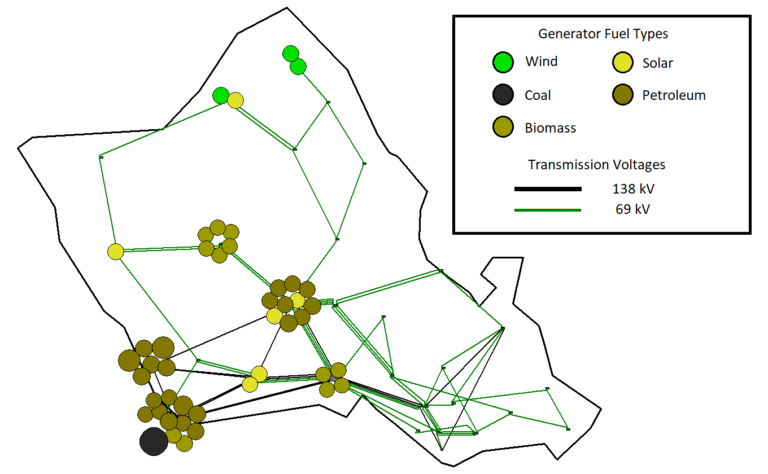

# **Synthetic Hawaii**

## One-Line Diagram

Figure 1: Oneline of the synthetic Hawaii case, courtesy of [PowerWorld](https://www.powerworld.com/WebHelp/) (WIP Updated Oneline)

## Case Description

This case is a modified version of the synthetic Hawaii case, available at the Texas A&M University [Electric Grid Test Case Repository](https://electricgrids.engr.tamu.edu/electric-grid-test-cases/). It has been modified to include GridKit-compatible generator models.

Model       | Count
------------|--------
[Bus](../../../../GridKit/Model/PhasorDynamics/Bus/README.md)         | 37
[Branch](../../../../GridKit/Model/PhasorDynamics/Branch/README.md)     | 89
[GENROU](../../../../GridKit/Model/PhasorDynamics/SynchronousMachine/GENROU/README.md)       | 39
[TGOV1](../../../../GridKit/Model/PhasorDynamics/Governor/Tgov1/README.md)        | 39
[IEEET1](../../../../GridKit/Model/PhasorDynamics/Exciter/IEEET1/README.md)  | 39
[IEEEST](../../../../GridKit/Model/PhasorDynamics/Stabilizer/IEEEST/README.md)  | 14
[LoadZIP](../../../../GridKit/Model/PhasorDynamics/Load/LoadZIP/README.md) | 28
[SignalNode](../../../../GridKit/Model/PhasorDynamics/SignalNode/README.md) | 131

## Data Notes

None.

## Events

The following event types are provided for this case.

- Bus fault

## Outstanding

### Dynamics

The following models are not implemented in GridKit and are represented using surrogate models.

- IEEEST (In GridKit, not yet added to this case)
- REGCA
- IEEEG1
- GGOV1
- ESST4B
- REECA1
- EXST1_PTI
- ESST1A

Named input events can model the following additional disturbances:
- Line Outage
- Generator Outage
- Forced Oscillations

### Statics

GridKit models Switched Shunts as [LoadZ](../../../../GridKit/Model/PhasorDynamics/Load/LoadZ/README.md) with constant impedance,but this erases information and our ability to statically re-initialze the model if initalizing at a different operating point.

- Transformers
- Switched Shunts
