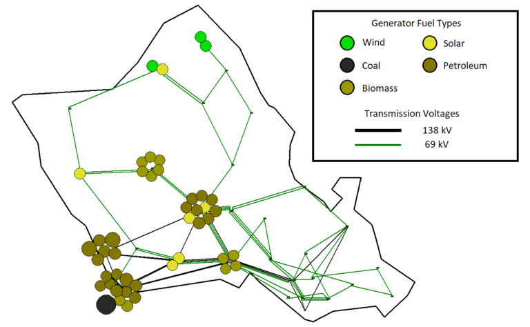

# **Synthetic Hawaii Case**

## One-Line Diagram

   
   
  Figure 1: Oneline of the synthetic Hawaii case, courtesy of [PowerWorld](https://www.powerworld.com/WebHelp/)

## Case Description

This case is a modified version of the synthetic Hawaii case, available at the Texas A&M University [Electric Grid Test Case Repository](https://electricgrids.engr.tamu.edu/electric-grid-test-cases/). It has been modified to include GridKit-compatible generator models.

Model       | Count  
------------|--------
[Bus](../../../../src/Model/PhasorDynamics/Bus/README.md)         | 37
[Branch](../../../../src/Model/PhasorDynamics/Branch/README.md)     | 89
[GENROU](../../../../src/Model/PhasorDynamics/SynchronousMachine/GENROUwS/README.md)       | 39
[TGOV1](../../../../src/Model/PhasorDynamics/Governor/Tgov1/README.md)        | 39
[IEEET1](../../../../src/Model/PhasorDynamics/Exciter/IEEET1/README.md)  | 39

## Case Events

The following examples needs to be constructed with this case. Currently the only events that have been implemented are faults. This is a practical case to use for modeling outages, or even forced oscillations.
- Bus Fault
- Line Outage
- Generator Outage
- Forced Oscillations
