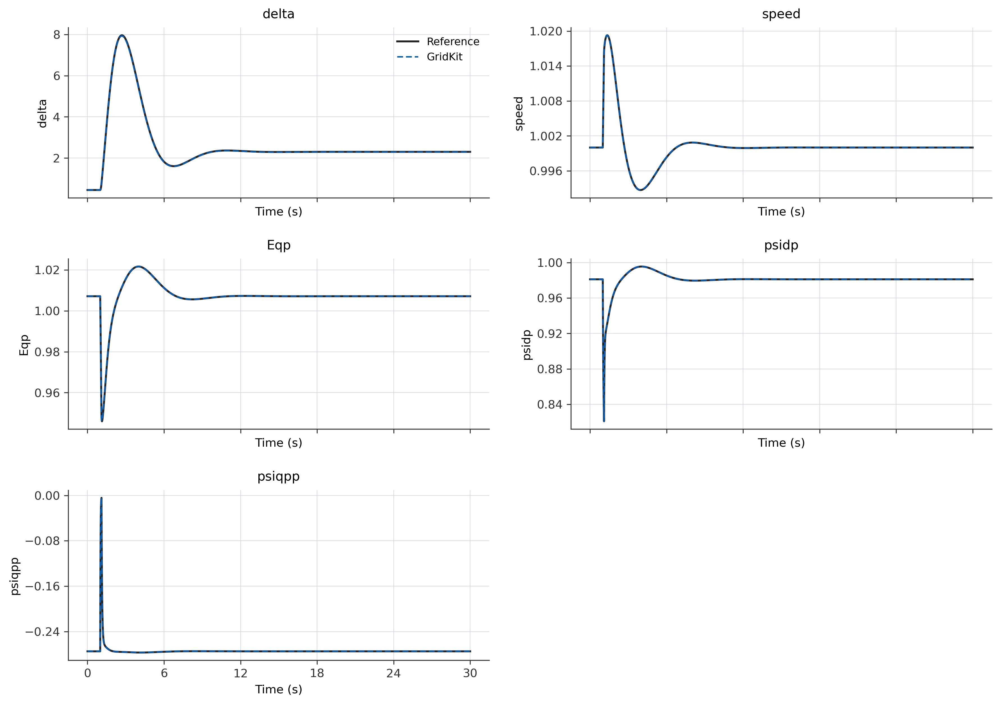
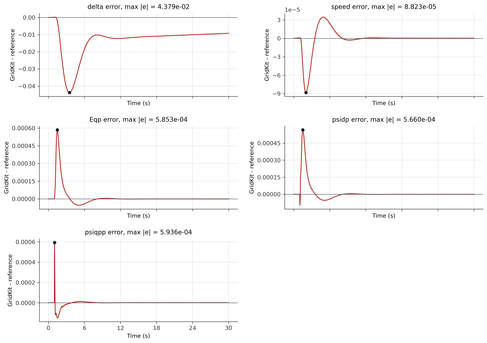

# TwoBusGensal Validation

This study uses the reusable
[TwoBusGensal case](../../../../../cases/PhasorDynamics/Toy/README.md)
to compare GridKit's GENSAL response against a PowerWorld reference.

The case contains a GENSAL machine on Bus 1, a 100 MW resistive load on Bus 2,
a lossless tie line with X = 0.1 p.u., and a temporary bus fault on Bus 2. The
monitored machine states are compared against `reference/TwoBusGensal.ref.csv`.

## Trajectory Comparison

## Error

