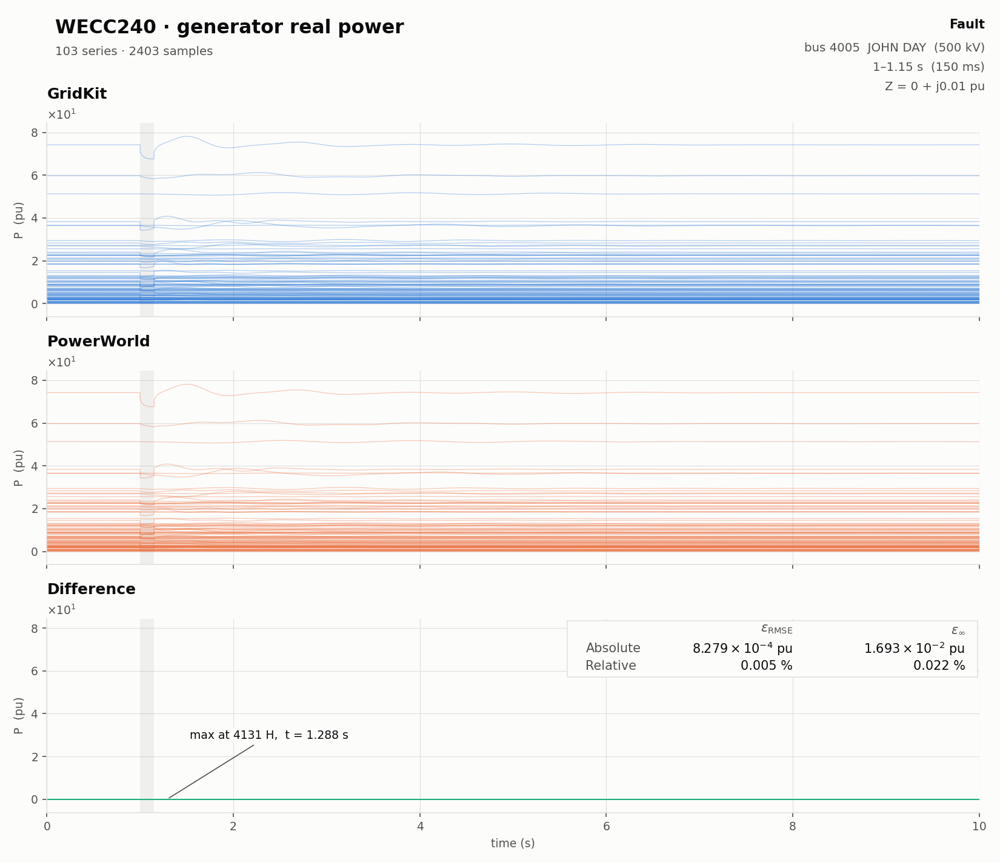
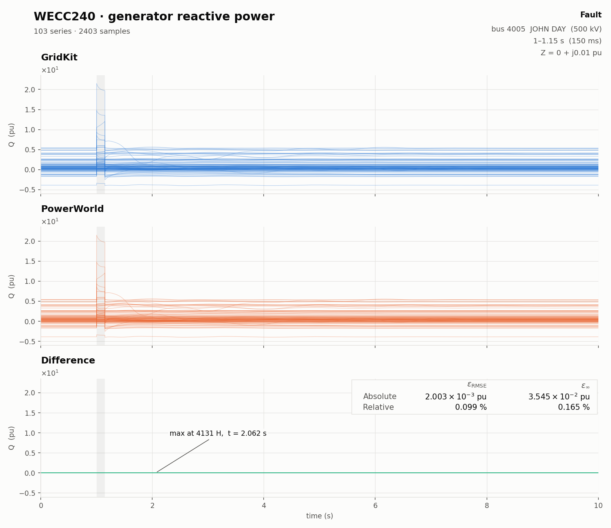
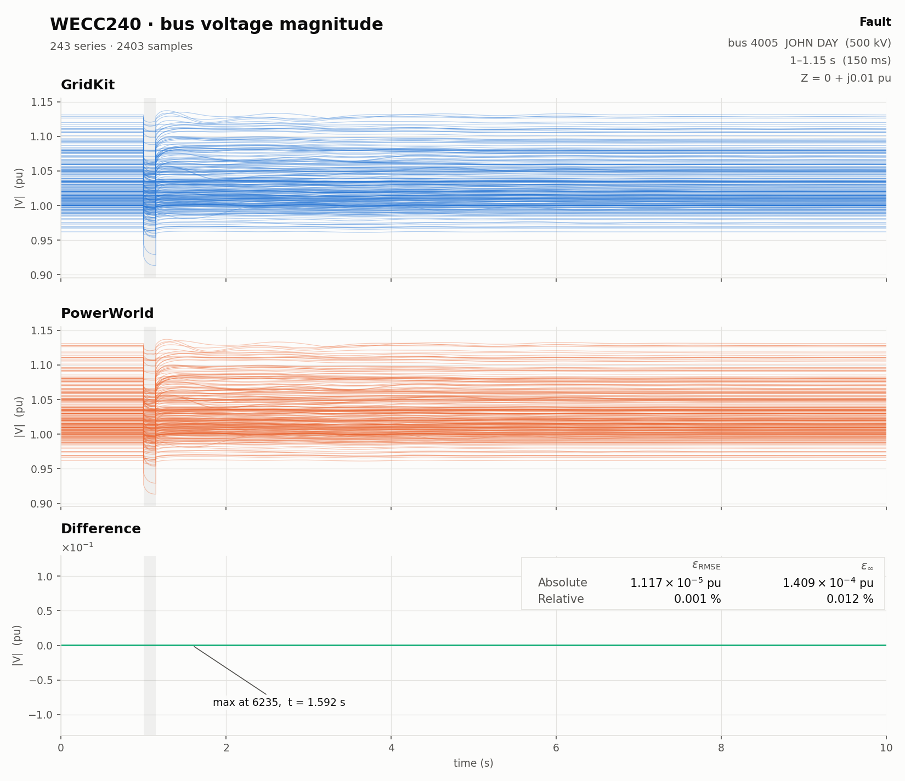

# WECC240 Validation

`WECC240.solver.json` runs the fault study used for validation against the
PowerWorld reference. `WECC240.forced-oscillation.solver.json` is a separate
30-second study that adds a 0.7 Hz mechanical-power forcing signal at
`Genrou:1032_C_genrou.pmech`; it does not alter the validated case or reference
data.

