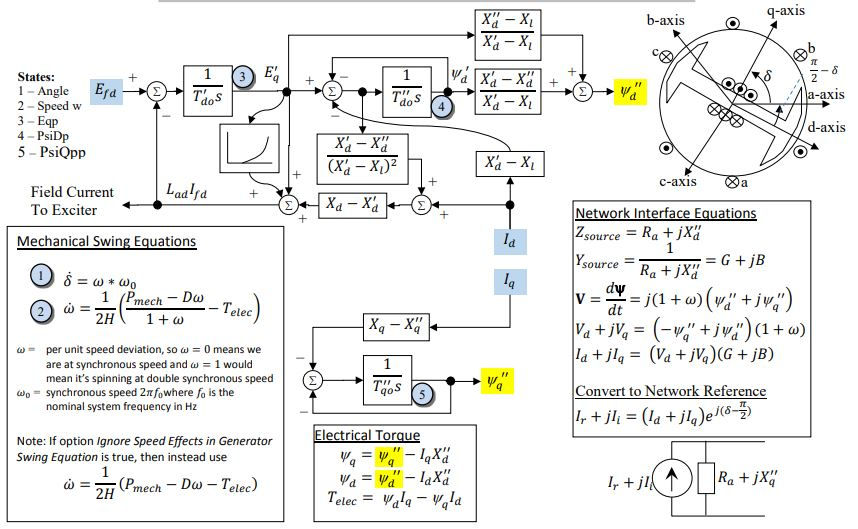

# GENSAL 

> [!NOTE]  
> This has not yet been implemented

## Block Diagram
<div align="center">
   
   
   
  Figure 2: GENSAL. Figure courtesy of [PowerWorld](https://www.powerworld.com/WebHelp/)
</div>

## Simplifications
The GENSAL model is a variation of the [General Synchronous Machine Model](../README.md)
- $`X''_{q}=X''_{d}`$
- $`X''_{d}`$ does not saturate
- Only d-axis affected by saturation
- $`X_{q}=X'_{q}`$
- $T'_{q0}$ is neglected

## Nomenclature
### Algebraic Variables
- $V_d$, $V_q$   Machine Internal Voltage on the machine d-q reference frame  
- $I_d$, $I_q$   Terminal currents on the machine d-q reference frame  
- $V_r$, $V_i$    Terminal voltages on the network reference frame
- $I_r$, $I_i$   Terminal currents on the network reference frame
- $\psi'_d$, $\psi'_q$, $E'_d$, $E'_q$  Machine Internal Flux Values
- $\psi''_q$, $\psi''_d$, $\psi''$    Machine Total Subtransient Flux
- $T_{elec}$  Electrical Torque 
- $P_{mech}$    Mechanical power from the prime mover 
- $E_{fd}$     Field winding voltage from the excitation system 
- $k_{sat}$   Saturation Coefficient 
### State Variables
- $\delta$    Machine Internal Angle
- $\omega$  Machine Relative Speed
### Parameters
- $\omega_{0}$ - Nominal Frequnecy ($2\pi 60$)
- $H$ - Intertia constant, sec (3)
- $D$ - Damping factor, pu (0)
- $R_{a}$ - Stator winding resistance, pu (0)
- $X_{\ell}$ - Stator leakage reactance, pu (0.15)
- $X_{d}$ - Direct axis synchronous reactance, (2.1)
- $X'_{d}$ - Direct axis transient reactance, (0.2)
- $X''_{d}$ - Direct axis sub-transient reactance, (0.18)
- $X_{q}$ - Quadrature axis synchronous reactance, (0.5)
- $X'_{q}$ - Quadrature axis transient reactance, (0.47619)
- $X''_{q}$ - Quadrature axis sub-transient reactance, (0.18)
- $T'_{d0}$ - Open circuit direct axis transient time const., (7)
- $T''_{d0}$ - Open circuit direct axis sub-transient time const., (0.04)
- $T'_{q0}$ - Open circuit quadrature axis transient time const., (0.75)
- $T''_{q0}$ - Open circuit quadrature axis sub-transient time const., (0.05) 
- $S_{10}$ - Saturation factor at 1.0 pu flux, (0) 
- $S_{12}$ - Saturation factor at 1.2 pu flux, (0) 

### Auxillary Parameters
Transformed parameters used during implementation and for readability.
``` math
\begin{aligned}
  G   &=\dfrac{R_a}{R_a^2+(X''_q)^2}&
  B   &=\dfrac{X''_q}{R_a^2+(X''_q)^2}\\
  S_A &= \dfrac{1.2\sqrt{S_{10}/S_{12}} +1}{\sqrt{S_{10}/S_{12}} +1} & 
  S_B &= \dfrac{1.2\sqrt{S_{10}/S_{12}} -1}{\sqrt{S_{10}/S_{12}} -1} \\
  X_{d1} &= X_d-X_d'      & X_{q1} &= X_q-X_q' \\
  X_{d2} &= X_d'-X_\ell  & X_{q2} &= X_q'-X_\ell\\
  X_{d3} &= (X_d'-X_d'')/X_{d2}^2 & X_{q3} &= (X_q'-X_q'')/X_{q2}^2 \\
  X_{d5} &= (X_d''-X_\ell)/X_{d2}    & X_{q5} &= (X_q''-X_\ell)/X_{q2}\\
  X_{qd} &= (X_q-X_\ell)/(X_d-X_\ell)
\end{aligned}
```

## Equations


### Differential Equations

``` math
\begin{aligned}
  \dot\delta      &= \omega\cdot\omega_0 \\
  \dot\omega      &= \dfrac{1}{2H}\left(\dfrac{P_{mech}-D\omega}{1+\omega}-T_{elec}\right)\\
  \dot{\psi}'_{d} &= \dfrac{1}{T''_{d0}}(E'_{q}-\psi'_{d}-X_{d2}I_{d})\\
  \dot{\psi}'_{q} &= \dfrac{1}{T''_{q0}}(E'_{d}-\psi'_{q}+X_{q2}I_{q})\\
  \dot{E}'_{d}    &= \dfrac{1}{T'_{q0}}
    \left( -E'_{d}+X_{q1}
      (I_{q}-X_{q3}(E'_{d}-\psi'_{q}+X_{q2}I_{q}))
      + X_{qd}\psi''_{q}k_{sat}
    \right) \\
  \dot{E}'_{q} &= \dfrac{1}{T'_{d0}}
    \left(
      E_{fd}-E'_{q}-X_{d1}
      (I_{d}+X_{d3}(E'_{q}-\psi'_{d}-X_{d2}I_{d}))
      -\psi''_{d}k_{sat}
    \right)\\
\end{aligned}
```

### Algebraic Equations

These algebraic equations define internal variables (7) and the algebraic Network Interface Equations (4)
These algebraic equations define internal variables (7) and the algebraic Network Interface Equations (4)
``` math
\begin{aligned}
  \psi''_{q} &= -E'_{d}X_{q5} - \psi'_{q}X_{q4} \\
  \psi''_{d} &= +E'_{q}X_{d5} + \psi'_{d}X_{d4}\\
  \psi''     &= \sqrt{(\psi''_{d})^2+(\psi''_{q})^2} \\
  V_{d}      &= -\psi''_{q}(1+\omega)\\
  V_{q}      &= +\psi''_{d}(1+\omega)\\
  T_{elec}   &= (\psi''_{d} - I_dX_d'')I_q-(\psi''_{q} - I_qX_d'')I_d \\
\end{aligned}
```
#### Network Interface equations

``` math
\begin{aligned}
  \begin{bmatrix}
    I_d \\ I_q
  \end{bmatrix}
  &=
  \begin{bmatrix}
    \sin \delta & -\cos\delta \\
    \cos\delta  &  \sin\delta
  \end{bmatrix}

  \begin{bmatrix}
    I_r \\ I_i
  \end{bmatrix}\\

  \begin{bmatrix}
    I_r \\ I_i
  \end{bmatrix}
  &=
  
  \begin{bmatrix}
    G & -B \\
    B & G
  \end{bmatrix}

  \left(
    \begin{bmatrix}
      \sin \delta & \cos\delta \\
      -\cos\delta & \sin\delta
    \end{bmatrix}
    \begin{bmatrix}
      V_d \\ V_q
    \end{bmatrix}
    -  
    \begin{bmatrix}
      V_r \\V_i
    \end{bmatrix}
  \right)
\end{aligned}
```
