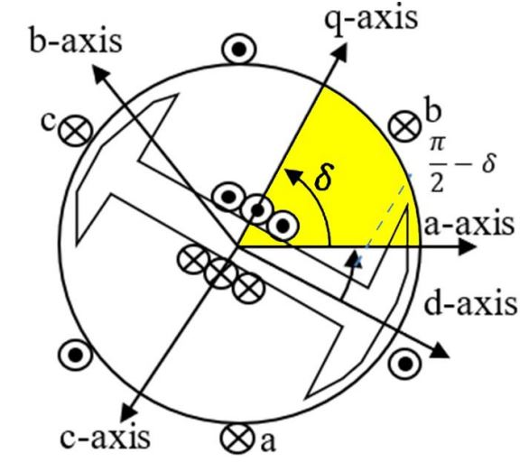

# **General Synchronous Machine Model**

> [!NOTE]  
> Only the GENROU model has been implemented.

## Convention


<div align="center">
   
   
   
  Figure 1: Synchronous Machine. Figure courtesy of [PowerWorld](https://www.powerworld.com/files/Synchronous-Machines.pdf)
</div>

The following conventians are used for the d-q reference frame.
- The q-axis leads the d-axis
- The Rotor angle is w.r.t. to q-axis

## Types

There are two main variations 

- Round Rotor (See [GENROU](GENROUwS/README.md))
- Salient Rotor/Pole (See [GENSAL](GENSALwS/README.md))

## Nomenclature
### Algebraic Variables
- $V_d$, $V_q$   Machine Internal Voltage on the machine d-q reference frame  
- $I_d$, $I_q$   Terminal currents on the machine d-q reference frame  
- $V_r$, $V_i$    Terminal voltages on the network reference frame
- $I_r$, $I_i$   Terminal currents on the network reference frame
- $T_{elec}$  Electrical Torque 
- $P_{mech}$    Mechanical power from the prime mover 
- $E_{fd}$     Field winding voltage from the excitation system 
- $k_{sat}$   Saturation Coefficient 
### State Variables
- $\delta$    Machine Internal Angle
- $\omega$  Machine Relative Speed
- $\psi^{'}_d$, $\psi^{'}_q$, $E^{'}_d$, $E^{'}_q$  Machine Internal Flux Values
- $\psi^{''}_q$, $\psi^{''}_d$, $\psi^{''}$    Machine Total Subtransient Flux
### Parameters
- $\omega_{0}$ - Nominal Frequnecy ($2\pi 60$)
- $H$ - Intertia constant, sec (3)
- $D$ - Damping factor, pu (0)
- $R_{a}$ - Stator winding resistance, pu (0)
- $X_{l}$ - Stator leakage reactance, pu (0.15)
- $X_{d}$ - Direct axis synchronous reactance, (2.1)
- $X'_{d}$ - Direct axis transient reactance, (0.2)
- $X''_{d}$ - Direct axis sub-transient reactance, (0.18)
- $X_{q}$ - Quadrature axis synchronous reactance, (0.5)
- $X'_{q}$ - Quadrature axis transient reactance, (0.47619)
- $X''_{q}$ - Quadrature axis sub-transient reactance, (0.18)
- $T'_{d0}$ - Open circuit direct axis transient time const., (7)
- $T''_{d0}$ - Open circuit direct axis sub-transient time const., (0.04)
- $T'_{q0}$ - Open circuit quadrature axis transient time const., (0.75)
- $T''_{q0}$ - Open circuit quadrature axis sub-transient time const., (0.05) 
- $S_{10}$ - Saturation factor at 1.0 pu flux, (0) 
- $S_{12}$ - Saturation factor at 1.2 pu flux, (0) 

### Auxillary Parameters
Transformed parameters used during implementation and for readability.
``` math
\begin{aligned}
 S_A &= \dfrac{1.2\sqrt{S_{10}/S_{12}} +1}{\sqrt{S_{10}/S_{12}} +1} & S_B &= \dfrac{1.2\sqrt{S_{10}/S_{12}} -1}{\sqrt{S_{10}/S_{12}} -1} \\
 X_{d1} &= X_d-X_d{'}      & X_{q1} &= X_q-X_q{'} \\
 X_{d2} &= X_d^{'}-X_\ell  & X_{q2} &= X_q^{'}-X_\ell\\
 X_{d3} &= (X_d^{'}-X_d^{''})/X_{d2}^2 & X_{q3} &= (X_q^{'}-X_q^{''})/X_{q2}^2 \\
X_{d5} &= (X_d^{''}-X_\ell)/X_{d2}    & X_{q5} &= (X_q^{''}-X_\ell)/X_{q2}\\
 X_{qd} &= (X_q-X_\ell)/(X_d-X_\ell)
 \end{aligned}
```

## Equations


### Differential Equations

``` math
\begin{aligned}
  \dot\delta&=\omega\cdot\omega_0 \\
  \dot\omega&=\dfrac{1}{2H}\left(\dfrac{P_{mech}-D\omega}{1+\omega}-T_{elec}\right)\\
  \dot{\psi}^{'}_{d} &= \dfrac{1}{T''_{d0}}(E'_{q}-\psi'_{d}-X_{d2}I_{d})\\
  \dot{\psi}^{'}_{q} &= \dfrac{1}{T''_{q0}}(E'_{d}-\psi'_{q}+X_{q2}I_{q})\\


  \dot{E}^{'}_{d} &= \dfrac{1}{T'_{q0}}
  \left(  -E'_{d}+X_{q1}
    (I_{q}-X_{q3}(E'_{d}-\psi'_{q}+X_{q2}I_{q}))
    + X_{qd}\psi''_{q}k_{sat}
  \right) \\

  \dot{E}^{'}_{q} &= \dfrac{1}{T'_{d0}}
  \left(
    E_{fd}-E'_{q}-X_{d1}
    (I_{d}+X_{d3}(E'_{q}-\psi'_{d}-X_{d2}I_{d}))
    -\psi''_{d}k_{sat}
  \right)\\
\end{aligned}
```

### Algebraic Equations

These algebraic equations define internal variables (7) and the algebraic Network Interface Equations (4)
``` math
\begin{aligned}
  \psi''_{q} &= -E'_{d}X_{q5}
                -\psi'_{q}X_{q4} \\
  \psi''_{d}  &= +E'_{q}X_{d5}
                +\psi'_{d}X_{d4}\\
  \psi^{''}   &= \sqrt{(\psi''_{d})^2+(\psi''_{q})^2} \\
  V_{d}       &= -\psi''_{q}(1+\omega)\\
  V_{q}       &= +\psi''_{d}(1+\omega)\\
  T_{elec}    &= (\psi''_{d} - I_dX_d^{''})I_q-(\psi''_{q} - I_qX_d^{''})I_d \\
  I_d &= I_r \sin\delta - I_i\cos\delta \\
  I_q &= I_r \cos\delta + I_i\sin\delta \\
  V_d &= V_r \sin\delta - V_i\cos\delta + I_d R_a - I_q X^{''}_q\\
  V_q &= V_r \cos\delta + V_i\sin\delta + I_d X^{''}_q + I_q R_a\\
\end{aligned}
```

#### Saturation

Saturation means increasingly large amounts of current are needed to increase the flux density. There are various methods to include the saturation (it is not standardized yet). We are going to use the approach implemented in PTI PSS/E and PowerWorld Simulator (scaled quadratic). 

``` math
\begin{aligned}
k_{sat}= \begin{cases}
   S_B(\psi^{''}-S_A)^2 &\text{if } \psi^{''}>S_A \\
   0 &\text{if } \psi^{''}\leq S_A
\end{cases}
\end{aligned}
```

