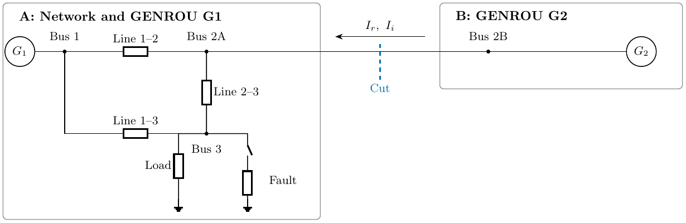
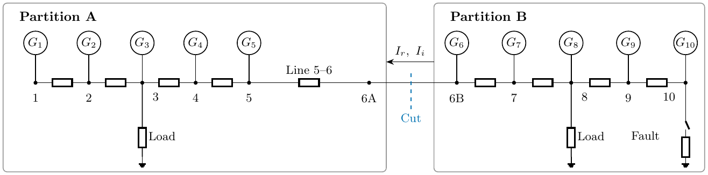

# Partitioned integration

`PhasorDynamicsPartitionedIntegrationTest` reads the three `ThreeBusPartitioned*.case.json`
fixtures. A contains G1 and the network; B contains G2. Both generators are GENROU.
At bus 2, equal-and-opposite real/imaginary currents are iterated until the two
terminal voltages agree. Both partitions restart from saved states on each trial.
The test checks fault transitions, KCL, and step refinement against the intact circuit.

Line charging is retained in the cases but omitted from the drawing.
[Editable source](../../../docs/Figures/PhasorDynamics/PartitionedIntegration/diagram.tex).

`PhasorDynamicsTenGenPartitionedIntegrationTest` reads `TenGenPartitioned*.case.json`.
A owns G1-G5, the bus-3 load and line 5-6; B owns G6-G10, the bus-8 load and bus-10
fault. Bus 6 is the shared terminal. All buses are ordinary buses; both areas have
finite dynamic generation. Initial transfer from A to B is about 0.304 pu on 100 MVA.

Both tests require Enzyme/KLU, verify that the partitions reconstruct the intact case,
and compare all bus voltages and GENROU states under step refinement. A rejected
trial must reproduce a clean half-step from the saved starting state. Current is held
constant within each communication interval, so coupling is first order. The ten-machine
study runs for 10 s with communication steps of 0.5, 0.25 and 0.125 ms. Higher-order
coupling and separate-process execution remain future work.

[Editable source](../../../docs/Figures/PhasorDynamics/TenGenPartitioned/diagram.tex).
